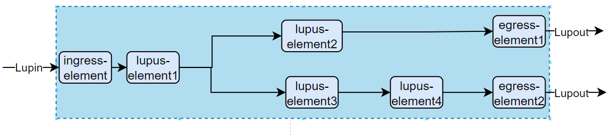
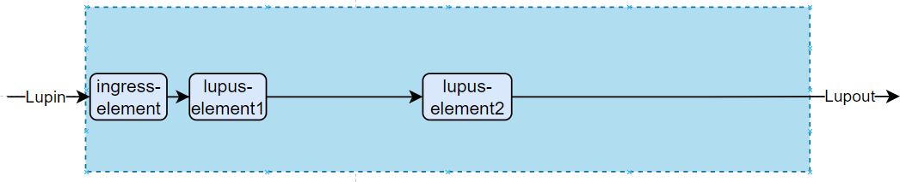
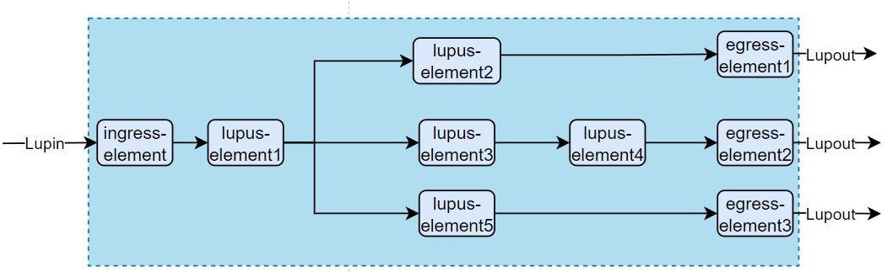
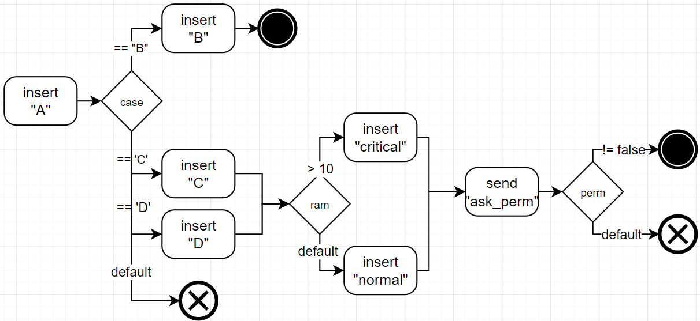
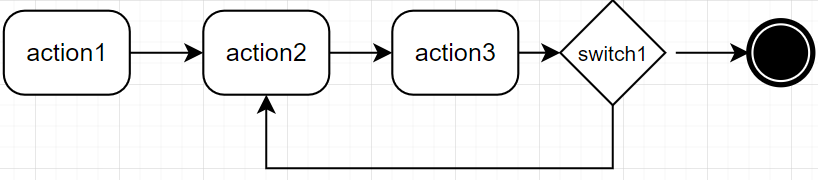

# 2 Workflows

[Workflow](defs.md#workflow) is defined as a sequence of connected nodes, sometimes conditionally dependent, that achieve a specific goal. 

In Lupus, we can distinguish a [loop-workflow](defs.md#loop-workflow) and an [actions-workflow](defs.md#actions-workflow).

Both [loop-workflow](defs.md#loop-workflow) and actions-workflow are [workflows](defs.md#workflow), but with some differences resulting from their implementation specifics.
- [loop-workflow](defs.md#loop-workflow) is a [workflow](defs.md#workflow) of [lupus-elements](defs.md#lupus-element). They communicate via triggers of their [controllers](defs.md#controller). 
- [actions-workflow](defs.md#actions-workflow) is a [workflow](defs.md#workflow) of [actions](defs.md#action). They communicate via RAM memory allocated by a single [lupus-element](defs.md#lupus-element) [controller](defs.md#controller). 

By the differences in communication between the nodes of both [workflows] there is a difference what kind of [flow-control](defs.md#flow-control) can be developed.

## Loop-workflow

A loop workflow needs to be linear. Forks are possible (meaning that one element is connected to two next elements), but there is not possiblity to join the flows later. Such join would violate the [data] integration. This is because elements can work in pararell and it could mean that one elements is triggered more than once in single loop-iteration. Technically of course it is possible but such configuration would only hinder the work of [loop-designer]. Therefore we adopt the principle that each flow after fork has to be forked again or to end with the [lupin-interface](defs.md#lupin-interface).

This is ok:

This is ok:

This is ok:

But, this is not ok:

## Actions-workflow

On the other hand, actions workflow is processed in a single thread manner, one action at a time. This let's us to define special action type of `switch`. Switch acts as a well-known switch from programming languges such as C++ or Java. Switch evaluates its conditions agains [data-fields](defs.md#data-field). Such approach lets user to create joins or even loops inside a loop. 

Since loop-workflow has reduced set of control-flow features it is recommended to delegate swtiches and joins to actions-workflow.

An exemplary actions workflow that utilizes the switches can be seen below:

An exemplacy actions-workflow that has loop can be seen below:

