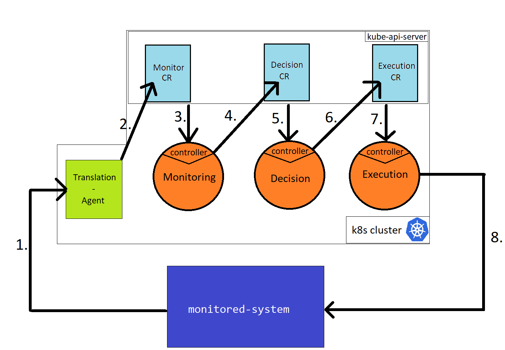

# Communication between Lupus elements

This was the first idea that arosed during Lupus development. 

## Intro

Kuberentes inherently implements the [control loops](https://kubernetes.io/docs/concepts/architecture/controller/) on its own. 

Each API Object that expresses the state of cluster has a controller which reconcilates it. When an API Object like Pod, Deployment or Service is changed (including created or deleted) the controller for this Object get notified and performs its reconciliation. Reconciliation involves comparing the desired-state (spec) with current-state (status) and performing actions that bring those two closer together. 

For example: user changes the spec of some ReplicaSet in a YAML Manifest file (e.g. changes number of Replicas from 2 to 3). Kubectl sends such info to the `kube-api-server`.  `kube-api-server` notifies the ReplicaSet controller about this change. ReplicaSet controller sees a new desired-state and its mission is to make it actually happen. It perfoms the reconciliation logic which in this case means to spawn a new pod, so it sends a request to `kube-api-server` to create a new pod for this replicaset. 

This is how Kubernetes works. Every built in resource has its controller. 

This atrribute of Kubernetes, when developing operators for custom resources can serve as a way of communication between lupus-elements. Nothing preents the controller of custom-resource to update the status of the next custom-resource, which will trigger its controller (actually it will be the same controller but triggered for different object). Such approach can be repreated multiple times to create a chain of calls. 

