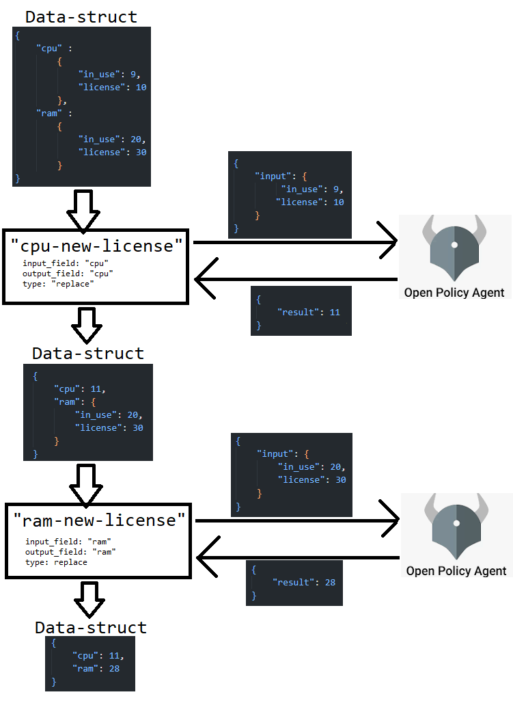
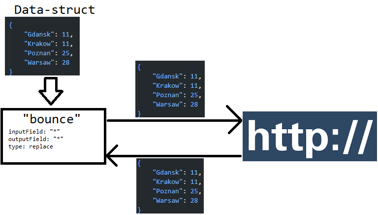
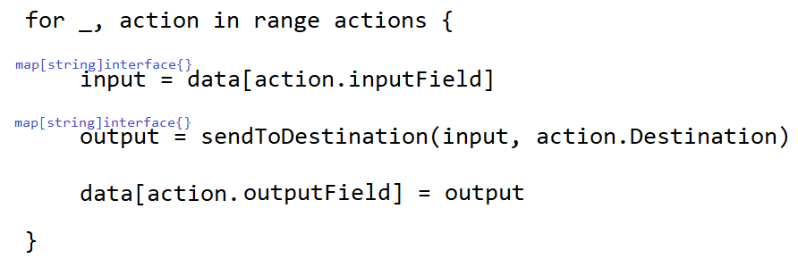
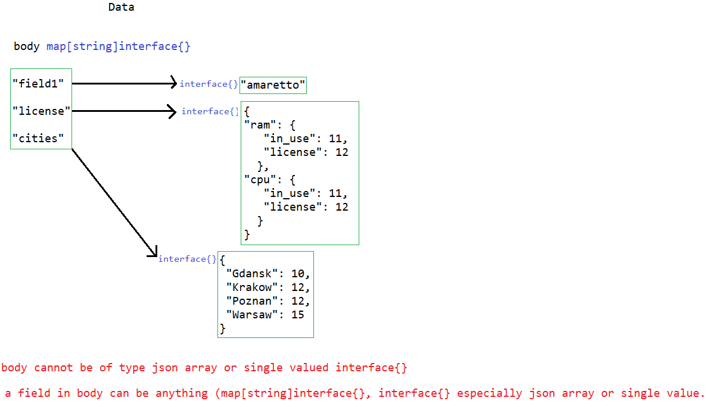
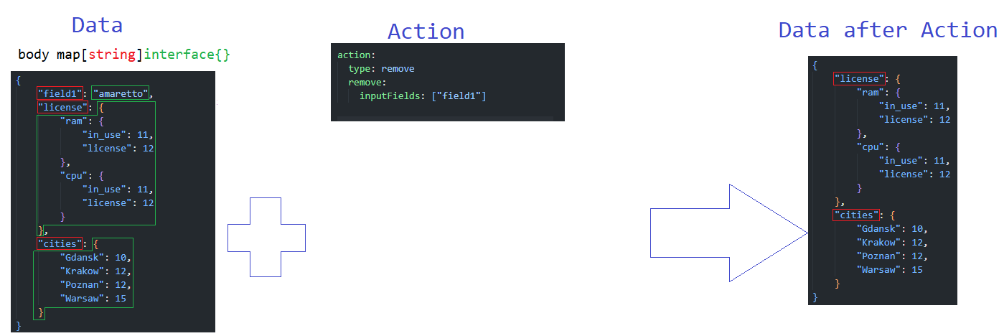
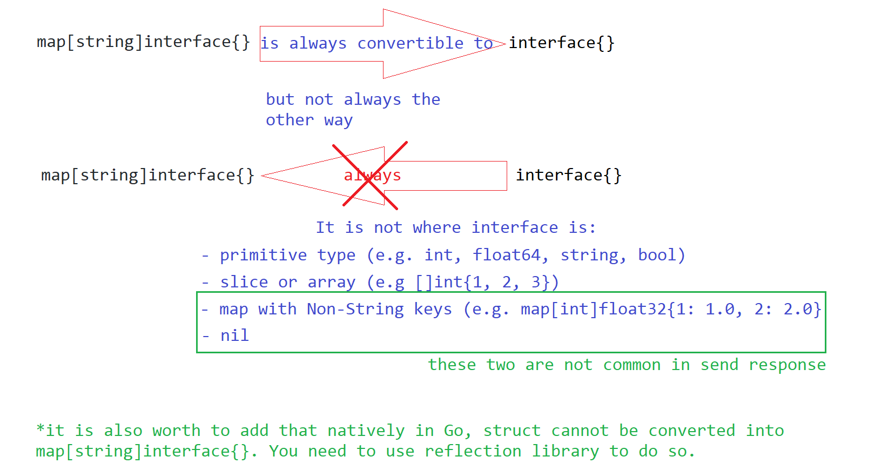

# Data concept

Our Lupus loop is assumed to be data-driven. No logic realted to reconcillation in controller's code. Everything should be expressed by user in external sources like some http servers, Open Policy Agents, etc..

When input comes to Lupus in a form of json object, it has various root fields. We would like to provide a mechanisms to manipulate on this json. Let's call this json a `Data` (since we want to have "data-driven kręciołek").


For such cause a concept of "Action" had risen up. Action is something that can take some root field of Data, send it somewhere as input, receive the response and save it in `Data` root object with the same name as the input was, or rename it or create additional field.

Let's take such managed-system state json as example:
```json
{
    "cpu" :
        {
            "in_use": 9,
            "license": 10
        },
    "ram" :
        {
            "in_use": 20,
            "license": 30
        }
}
```
> As for now we are discussing the case when whole input of Observe CR goes to Decide CR. So we are in the scope of Decide CR.

Decide controller creates object Data. It has two root fields "ram" and "cpu".

Now we define such actions:
```yaml
actions:
  - name: "cpu-new-license"
    input_field: "cpu"
    destination: ////
    output_field: "cpu"
  - name: "ram-new-license:
    input_field: "ram"
    destination: ////
    output_field: "ram"
```  

This means that action:
- "cpu-new-license" - will take root field "cpu" send it somewhere, and save its response as field "cpu", replacing this field in Data structure.
- "ram-new-license" - will take root field "ram" send it somewhere, and save its response as field "ram", replacing this field in Data structure.


For example the Desination can be Opa server and the whole action looks like this:



> *Take in mind that the wrapping in input and result are specific to Opa. Normally non such action takes place




Now the logic works like this:



- Each action defines which root field** to take as an input.
- Where to send it
- How to name the output, a new root field will appear in data*

>* When some field is taken as `inputField` it gets deleted
>** Which root field has its wildcard - "*" which means take the whole data, or save as whole data

In the future a more complicated engine for json Data can be developed. Where e.g. 
- user chooses the input field to be deleted or kept (now it gets deleted everytime)
- Now we work on root fields, but maybe deeper dive can be thought of.
- Concatenation of many root fields can be done to form a single input (now inputField can be one string, in future - multiple)
- Concat action is needed to concatenate multiple input fields and form one final (e.g. ram and cpu fields can form a commands field)





## Actions

As for now we will distinghush 4 types of actions:
- send
- concat
- remove
- rename
- duplicate

Every action has an InputField and performs something on that InputField, typically resulting in some outputField. Each takes its inputField and:
- send - sends it as input to some external block (HTTP or Opa) and save the response in OutputField
- remove - removes it
- concat - here we have list of InputFields instead of one. Action makes one OutputField by concatenating them
- rename - renames it
- duplicate - duplicates with new name

### Send

### Concat

### Remove

### Rename

### Duplicate 


# Rules for loop design regarding to the Data

- When using send Action. Response needs to be convertible to `interface{}` so it can be anything. It will be simply placed in a field specified by `outputField`. But, the problems can occur when you use "*" as outputField. In this case response needs to be convertible to `map[string]interface{}` so it cannot be a single value or json array.* 
- In the final form of Data a field called "commands" must be present. It is required by the lupout interface. Other fields can be present there, e.g. Decide can send them to some Learn/Store element. But Decide needs to push "commands" to the Execute element. 

*In general:



Let's junxtapose each type of action:

