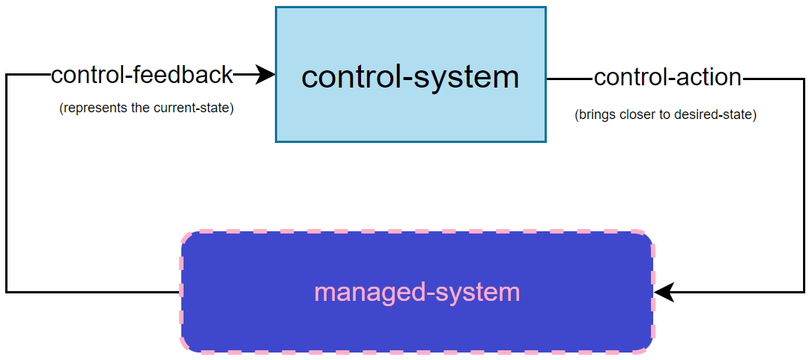

# managed-system
A system that is a candidate to be managed by Lupus in a [Closed Control Loop](#closed-control-loop) manner. Lupus primarily targets systems in the telecommunications and mobile networks industries.

# control-loop
In [ICS](https://en.wikipedia.org/wiki/Industrial_control_system) a control loop is fundamental building block of [control-systems](#control-system) that manages, commands, directs, or regulates the behavior of other devices or systems in industrial control systems.

Control loops are categorized based on whether they incorporate feedback mechanisms
- **Open Control Loops**: The control action (input to the managed system) is independent of the managed system's output.
- **Closed Control Loops**: The output of the managed system is "fed back" to the [control-system](#control-system) and influences the control action.

# current-state
The observed, real-time state of a [managed-system](#managed-system). This contrasts with the abstract [desired-state](#desired-state).

# desired-state
The target state of a [managed-system](#managed-system) that the [control-system](#control-system) aims to achieve. Typically, it is derived from the [management-problem](#management-problem).

# closed-control-loop
In Kubernetes, every control-loop is of type closed loop and Kubernetes names them simply - "control loops". In Lupus, we adapt terminology from [Overview of Prominent Control Loop Architectures](https://www.etsi.org/deliver/etsi_gr/ENI/001_099/017/02.01.01_60/gr_ENI017v020101p.pdf), but in mix with [ICS](https://en.wikipedia.org/wiki/Industrial_control_system) one.

Hence in Lupus we define "Closed control loop" as a loop with architecture as below:

and definition of "A non-terminating loop that regulates the state of a system by iteratively bringing the [current-state](#current-state) of a [managed-system](#managed-system) closer to the [desired-state](#desired-state).".

# control-system
The brain of a closed-control-loop. It reads the [control-feedback](#control-feedback) and determines the [control-action](#control-action) required to address the [management-problem](#management-problem).

Lupus aspires to function as control-system.

# control-feedback
A representation of the [current-state](#current-state) sent from the [managed-system](#managed-system) to the [control-system](#control-system).

# control-action
An action sent to or performed on a [managed-system](#managed-system) by the [control-system](#control-system) to bring it closer to the [desired-state](#desired-state).

# reconciliation
The process of bringing the [current-state](#current-state) of a [managed-system](#managed-system) closer to the [desired-state](#desired-state).

# translation-agent
An intermediary that integrates a [managed-system](#managed-system) with Lupus. This is especially useful when the [user](#user) cannot modify the managed system. 

We have two types for translation agents:
- [ingress-agent](#ingress-agent) - for translation of [control-feedback](#control-feedback)
- [egress-agent](#egress-agent) - for translation of [control-action](#control-action)

# ingress-agent
A [translation-agent](#translation-agent) at the ingress of Lupus. It it responsible for translating [control-feedback](#control-feedback) from the [managed-system](#managed-system).

Typical responsibilities of an ingress-agent include:
- Receiving or gathering information from the [managed-system](#managed-system).
- Monitoring changes in the [managed-system](#managed-system).
- Translating managed system data into Lupus-compatible nomenclature.

The communication between the ingress-agent and the [managed-system](#managed-system) is case-specific and must be implemented by the [user](#user). Communication between the ingress-agent and Lupus is standardized via the [lupin-interface](#lupin-interface).

# egress-agent
A [translation-agent](#translation-agent) at the egress of Lupus.
It translates the [control-action](#control-action) from Lupus into actions performed on the [managed-system](#managed-system).

The egress agent receives the [control-action](#control-action) as [final-data](#final-data) in JSON format from Lupus via the [lupout-interface](#lupout-interface) and performs the corresponding actions on the [managed-system](#managed-system).

# reconciliation-logic
The operations required to achieve [reconciliation](#reconciliation).

# loop-logic
Similar to [reconciliation-logic](#reconciliation-logic), but while reconciliation logic describes what needs to be done in a single iteration, loop-logic is more of a general attribute of the loop.

We can divide loop-logic in two parts:
- [computing-part](#computing-part) responsible form performing the actual calculations, while
- [loop-workflow](#loop-workflow) expresses the sequence of these calculations and the data passed to and from them.

# computing-part
The component of the [loop-logic](#loop-logic) responsible for performing calculations required for [reconciliation](#reconciliation). 

Since Lupus is [data-driven](#data-driven), this part is handled by [external-elements](#external-element), not [lupus-elements](#lupus-element).

# loop-workflow
A [workflow](#workflow) performed during one iteration of a control loop. A loop workflow delivers the [loop-logic](#loop-logic) and is composed of [loop-elements](#loop-element).

In Lupus, the loop workflow is expressed in [LupN](#lupn).

# loop-element
A building block of the [loop-workflow](#loop-workflow). Loop elements can be either [lupus-elements](#lupus-element) or references to [external-elements](#external-element).

# lupus-element
A [loop-element](#loop-element) that runs in a Kubernetes cluster. Its purpose is to express the [loop-workflow](#loop-workflow) and delegate the [computing-part](#computing-part) to [external-elements](#external-element). 

A lupus element is implemented as a [custom-resource](#custom-resources).

# external-element
A [loop-element](#loop-element) that operates outside the Kubernetes cluster, performing the [computing-part](#computing-part) of the [loop-logic](#loop-logic).

Supported types include:
- HTTP servers
- Open Policy Agent (a subtype of HTTP server)
- [user-functions](#user-functions)

# destination
A Go object which represents reference to [external-element](#external-element). It typically unambiguously (explicitly) describes the HTTP query to be performed by [lupus-element](#lupus-element), by indiation of the url and HTTP method.

# user-functions
A lightweight alternative to deploying HTTP servers for simple computations. User functions act as [external-elements](#external-element) but are executed within the Kubernetes cluster.

# lupin-interface
The interface through which the [ingress-agent](#ingress-agent) sends [control-feedback](#control-feedback) to Lupus.

# lupout-interface
The interface through which Lupus sends [control-action](#control-action) to the [egress-agent](#egress-agent).

# management-problem
A problem occurring in a [managed-system](#managed-system) that the [control-system](#control-system) aims to solve.

> **Example**: Maintaining a constant, desired room temperature.

# user
An individual or organization using Lupus for automating the management of [managed-systems](#managed-system). This term includes software developers who handle development of [ingress](#ingress-agent) and [egress agents](#egress-agent) and [external-elements](#external-element).

# designer
An individual responsible for designing the [loop-workflow](#loop-workflow) in [LupN](#lupn). Designers typically rely on software engineers to handle system integrations.

# lupus-controllers
A collective term for the controllers of [lupus-master](#lupus-master) and [lupus-elements](#lupus-element).

# data
The carrier of information in JSON format, used throughout a loop iteration inside a single [lupus-element](#lupus-element).

Data evolves as follows:
- Initial form: Derived from [current-state](#current-state) via the [lupin-interface](#lupin-interface).
- Intermediate forms: Modified by [actions](#action) of [loop-element](#loop-element).
- Final form: Sent to the [lupout-interface](#lupout-interface) as [final-data](#final-data).

# data-field
[Data](#data) is a key-value type storage that can be expressed as json. We adopt the term of "field" from json and apply it here.

# ingress-element
A [lupus-element](#loop-element) that terminates the [lupin-interface](#lupin-interface) and initiates the [loop-workflow](#loop-workflow).

# egress-element
A [lupus-element](#loop-element) that sends the  [final-data](#final-data) to the [lupout-interface](#lupout-interface).

# lupus-master
A type of [custom-resource](#custom-resources) named `masters.lupus.gawor.io`. The master is responsible for spawning [lupus-elements](#lupus-element). Its YAML manifest file includes the [LupN](#lupn) notation. Its [controller](#controller) spawns and destroy and is owner of [lupus-element](#lupus-element).

# lupn
A YAML-based notation for defining [loop-workflows](#loop-workflow) in Lupus. LupN supports sequential workflows, flow control, and immediate exits, as well as [actions](#action) for data manipulation.

# lupn-file

# lupn-object

# action
An operation defined in LupN that modifies [data](#data) during a [loop-iteration](#loop-iteration). Do not confuse with [control-action].

# loop-iteration
A single run of a [loop-workflow](#loop-workflow). 

# final-data
The state of [data](#data) at the end of a loop iteration (at the end of [egress-element](#egress-element)), representing its final form before being sent on the [lupout-interface](#lupout-interface). [Egress-Agent](#egress-agent) will translate it into a [control-action](#control-action). 

# workflow
A sequence of connected actions, sometimes conditionally dependent, that achieve a specific goal.

# data-driven
A design principle where Lupus elements express the [loop-workflow](#loop-workflow) but delegate [computing-part of loop-lofic](#computing-part) to [external-elements](#external-element).

Only in this way it is possible to propose a framework that can run **ANY** loop. The [controller](#controller) of loop element in Kubernetes can't have any of the [loop-logic](#loop-logic), the logic has to be delegated somehwere else, but still belong to the loop. We divide [loop-elements](#loop-element) into two groups:
- [lupus-element](#lupus-element) - These run in Kubernetes cluster, they serve to express loop workflow and delegate actual computing to [external-elements]
- [external-element](#external-element) - These run outside of Kubernetes cluster, typically as HTTP servers (especially [Open Policy Agent](#open-policy-agent))

# yaml-manifest-file
A Kubernetes term: https://kubernetes.io/docs/concepts/overview/working-with-objects/#describing-a-kubernetes-object

This is a file that conveys the object spec. Objects can be created from such files with the program [kubectl](https://kubernetes.io/docs/reference/kubectl/) and its `apply` command.

# custom-resources
A Kubernetes term: https://kubernetes.io/docs/concepts/extend-kubernetes/api-extension/custom-resources/

Custom resources extend Kubernetes' built-in resource types to manage complex application configurations or stateful applications.

Sometimes built-in (default) resources like Pods, Deployments, Services are not sufficient for our goals. We can define a new resource type and register it in a Cluster. Typically these are created for managemenet of complex application configurations or automated deployment of stateful applications. To register a new resource kind in cluster you need to define it with [Custom Resource Definition file](#crd) and apply it.

# crd
A Kubernetes term: https://kubernetes.io/docs/tasks/extend-kubernetes/custom-resources/custom-resource-definitions/

It is a file that defines new [custom-resource](#custom-resources) type and enables its registration in a Kubernetes cluster.

# controller
A Kubernetes term: https://kubernetes.io/docs/concepts/architecture/controller/

Controllers run control loops for Kubernetes resources, reconciling their [current state](#current-state) with the [desired state](#desired-state). Lupus leverages [controllers](#controller) to manage its [custom resources](#custom-resources), including the [lupus-master](#lupus-master) and [elemenet](#lupus-element).

# operator-pattern
This is a Kubernetes term: https://kubernetes.io/docs/concepts/extend-kubernetes/operator/

This is a mechanism of extending Kubernetes. When we create [Custom Resources](#custom-resources), we can also implement [controllers](#controller) for them to apply a [control-loop](#closed-control-loop) for them. Such behavior is named "operator-pattern". Sometimes we simply call such controllers "operators". The name "operator" has its genesis in the meaning that such controller typically replaces real human operator of some application (which deployment required custom resource to be defined).

# operator
This is a Kubernetes term: https://www.cncf.io/blog/2022/06/15/kubernetes-operators-what-are-they-some-examples/

Colloqually a [controller](#controller) for [custom-resources](#custom-resources) is called an "operator".

# etcd
This is a Kubernetes term: https://kubernetes.io/docs/concepts/architecture/#etcd

This is a database that stores the current state of a cluster.

# status
This is a Kubernetes term: https://kubernetes.io/docs/concepts/overview/working-with-objects/#object-spec-and-status

The status describes the current state of the object, supplied and updated by the Kubernetes system and its components. The Kubernetes control plane continually and actively manages every object's actual state to match the desired state you supplied.

# Rawextension
This is a Kubernetes term: https://github.com/kubernetes/apimachinery/blob/master/pkg/runtime/types.go

It is a struct defined within a Kubernetes runtime package able to carry any data, thus it was chosen to represents the [status](#status) of [lupus-element](#lupus-element). 

# API object
This is a Kubernetes term: https://kubernetes.io/docs/concepts/overview/working-with-objects/

# Lupus-deploment

An act where [user](#user), utilizes Lupus to solve his [management-problem](#management-problem).