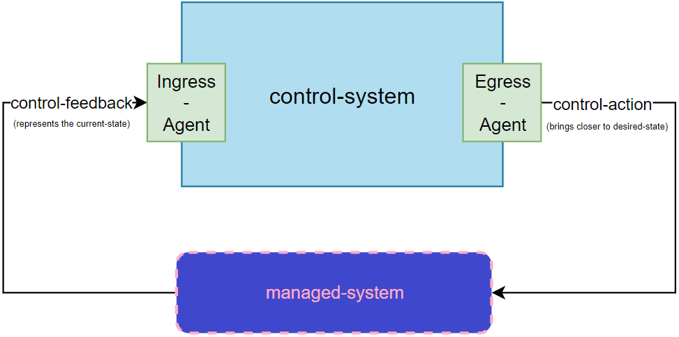
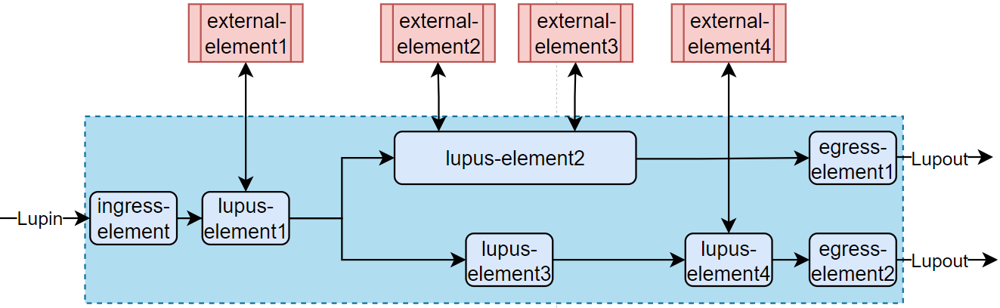

# Lupus - detailed docs (The Lupus book)

This document describes Lupus in a story-like manner. It explains Lupus concepts (sometimes containing links to a discussion about taken decisions or change history), contains links to specifications but at the same time follows an example, so the explained&specified concepts can be related to an example.

## 1. Management problem

The first thing that have to be described is [management-problem](defs.md#management-problem) and [managed-system](defs.md#managed-system). 

In a real word, we continuosly encounter a situations when it would be nice if the work of some system could be contantly regulated. For example:
- we would like a feature in cars that would regulate the work of engine in order to keep steady velocity
- it would be nice if the refiregerator could keep a cool but not below-zero temperature regardless of how often the door is opened or what the outside temperature is on a given day
- it would be nice if cloud server could quarantee that an application with sufficient resources to cover users needs will be up and running

The problems listed above can be regarded as [management-problem](defs.md#management-problem). There are no technical limitations to achieve these goals, all of the systems above have the proper equipment e.g. we can add more gas to the engine or deliver more power to the compressor in refrigerator. The issue lies in actual doing it in a appropriate moments. E.g. adding more gas, when car slows down or delivering more power when the temperature in refrigerator goes up. Thus, this is the problem of pure management. 

And the system that we aim to manage is [managed-system](defs.md#managed-system). 

## 2. Control System

A [control-system](defs.md#control-system) is a system that regulates the work of [managed-system](defs.md#managed-system).
For example:
- a Cruising Control System regulates the work of engine in order to keep steady pace,
- refiregerator who controls the work of compressor to maintain a cool temperature,
- Kubernetes that keeps an eye if the desired number of Pods is running

In other words, it solves the [management-problem](defs.md#management-problem). 

But how? What is the general architecture to approach each such problem?

A reply to this question first arosed in Robotics and Automation for [Industrial Process Control](https://en.wikipedia.org/wiki/Industrial_process_control). The answer is to use [control loops](defs.md#control-loop).

## 3. Control loop

In robotics and automation a control-loop consists of the:
- process sensor, 
- the controller function, 
- and final control element (FCE) which controls the process necessary to automaically adjust the value of a measured process variable (PV) to equal the value of a deisred set-point. 

Control loops are categorized based on whether they incorporate feedback mechanisms:
- **Open Control Loops**: The control action (input to the managed system) is independent of the managed system's output.
- **Closed Control Loops**: The output of the managed system is "fed back" to the [control-system](defs.md#control-system) and influences the control action.

In Lupus we focus only on the [closed-control-loops](defs.md#closed-control-loop). 

## 4. Closed control loop

This is the starting point for our reference architecture:

and definitions as such:
- [control-system](defs.md#control-system) - A system that solves the [management-problem](defs.md#management-problem) of a [managed-system](defs.md#managed-system) by the means of [closed-control-loop](defs.md#closed-control-loop). In each iteration of such loop, [control-system] inspects the [control-feedback](defs.md#control-feedback) and comes up with a [control-action](defs.md#control-action)
- [closed-control-loop](defs.md#closed-control-loop) - A non-terminating loop that regulates the state of a [managed-system](defs.md#managed-system) by iteratively bringing the [current-state](defs.md#current-state) closer to the [desired-state](defs.md#desired-state).
- [control-action](defs.md#control-action) - An action sent to or performed on a [managed-system](defs.md#managed-system) that brings it closer to the [desired-state](defs.md#desired-state).
- [control-feedback](defs.md#control-feedback) - A representation of the [current-state](defs.md#current-state) sent from [managed-system](defs.md#managed-system). 

In the architecture above Lupus acts as a [control-system]. 

//TODO a good example will explain it really good

## 5. Translation Agents
Since any system without any modifications can be considered as [managed-system](defs.md#managed-system), we need some integration layer between [managed-system](defs.md#managed-system) and Lupus, similar to the concept of "API Broker" in [ENI acrhitecture](https://www.etsi.org/images/articles/High_level_functional_architecturetechno_page_2021.png). Here is where the concept of [Translation Agents](defs.md#translation-agent) was born.

In each [Lupus-deployment](defs.md#lupus-deployment), [translation-agents](defs.md#translation-agent) need to be developed by the [user](defs.md#user).

From communication points of view, we can divide each translation-agent into two parts:
- the one communicating with [managed-system](defs.md#managed-system): This part is external to Lupus and is not a subject to any specification.
- the one communicating with Lupus: This part have to be compliant with one of the Lupus interfaces: [Lupin](defs.md#lupin-interface) or [Lupout](defs.md#lupout-interface).

We have two translation agents, one for [ingress](defs.md#ingress-agent) and one for [egress](defs.md#egress-agent) communication. 

In each [loop-iteration](defs.md#loop-iteration) the mission of [Ingress-Agent](defs.md#ingress-agent) is to receive/gather [control-feedback](defs.md#control-feedback) from [managed-system](defs.md#managed-system) and translated it to Lupus via [lupin-interface](defs.md#lupin-interface). As for the [Egress-Agent](defs.md#egress-agent), the mission is to receive [final-data](defs.md#final-data) via [lupout-interface](defs.md#lupout-interface) and translate it to [control-action](defs.md#control-action) that can be later sent to (performed on) the [managed-system](defs.md#managed-system). 

The architecture with introduction of Translation Agents looks like this:

Specifiation of the Lupin and Lupout interfaces [can be found here](spec/lupin-lupout.md).

## 6. Loop workflow

When Lupus receives the [control-feedback](defs.md#control-feedback) it triggers the [loop-workflow](defs.md#loop-workflow). Loop workflow has to deliver the [loop-logic](defs.md#loop-logic) and is composed of [loop-elements](defs.md#loop-element). Where a [loop-element](defs.md#loop-element) can be either:
- a [lupus-element](defs.md#lupus-element) which runs in Kubernetes and its mission is to perform [loop-workflow](defs.md#loop-workflow)
- a reference to [external-element](defs.md#external-element) which runs outside of Kubernetes and its mission is to perform [computation](defs.md#computing-part) need by the [loop-logic](defs.md#loop-logic).

A Loop Workflow is expressed in [LupN](defs.md#lupn) a special notation for expressing loop workflows.

An exemplary Loop Workflow can look like this:

Blue rounded rects are the [lupus-element](defs.md#lupus-element) while, the red rects represent [external-elements](defs.md#external-element). The blue area determined by the stripped line indicates elements running in Kubernetes cluster. We have distinguished ingress and egress [lupus-elements](defs.md#lupus-element). 

[External-elements](defs.md#external-element) are typically HTTP servers (especially the [Open Policy Agent](defs.md#opa) servers).

As it can be seen, one [lupus-element](defs.md#lupus-element) can communicate with zero, one or multiple [external-elements](defs.md#external-element) (this number can even vary in each [loop-iteration](defs.md#loop-iteration)). 

[Lupus elements](defs.md#lupus-element) are implemented as [custom-resources](defs.md#custom-resources) and communication between them is done via their [kubernetes controllers](defs.md#controller). [Controller](defs.md#controller) of one [lupus-element](defs.md#lupus-element) modifies the [status](defs.md#status) of the next lupus-element, which triggers its [controller](defs.md#controller). Mission of the lupus-element controller is to deliver the [reconciliation-logic](defs.md#reconciliation-logic). 

A specification of [LupN](defs.md#lupn) can be [found here](spec/lupn.md).

## 7. Data and actions

Let's dive now into a [lupus-element](defs.md#lupus-element). It was said before that it is triggered (in some way this is where the lupus-element is summoned or wakes up) by the modification of lupus-element [status](defs.md#status) by the previous element. But how exactly? With what data? It is up to [designer](defs.md#designer) what kind of data will be sent here, but we call it ... [data](defs.md#data). It can be any json*. In Kubernetes cluster it is represented by [RawExtension](defs.md#rawextension) and in [controller's](defs.md#controller) of [lupus-element](defs.md#lupus-element) golang code as `map[string]interface{}`. 

[Data](defs.md#data) is an information carrier within a [loop-iteration](defs.md#loop-iteration). At the entry point of [ingress-element](defs.md#ingress-element) it represents the [current-state](defs.md#current-state) of [managed-system](defs.md#managed-system). Then, througout the [loop-iteration](defs.md#loop-iteration) it is a [designer](defs.md#designer) decision what information it carries** but at the end, in its [final form](defs.md#final-data) while sent as json to the [egress-agent](defs.md#egress-agent) it has to represent the [control-action](defs.md#control-action).

But how do we work (operate) on [data](defs.md#data)? This is done by [actions](defs.md#action). Each [lupus-element](defs.md#lupus-element) has a [workflow](defs.md#workflow) of [actions](defs.md#action). An [action](defs.md#action) simply performs some operation on [data](defs.md#data), that results in its modification. Action can be of several types, but the most important is type "send" via which [lupus-elemenet](defs.md#lupus-element) can communicate with [external-element](defs.md#external-element). 

- [specification of Data](spec/data.md)
- [specification od actions](spec/actions.md)

>* Nearly any, see [data spec](spec/data.md) for more information.

>** Typically it carries the information related to [reconciliation-logic](defs.md#reconciliation-logic), inputs to [external-elements](defs.md#external-element), their responses
