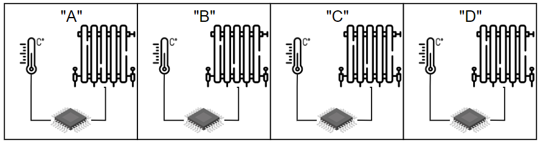
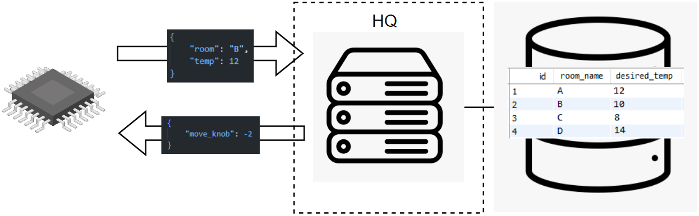

# Getting started

## Target audience
Lupus is a platform targeted for automated management of [systems](defs.md#managed-system) in mobile networks industry, but it can be used with any system that exposes API for its observation of current state and for management or control actions.

## Initial development requirements and assumptions
- Targeted for telco industry, especially Mobile Networks
- Enables to design and run any closed control loop architecture (workflow), especially the ones proposed in [Overview of Prominent Control Loop Architectures](https://www.etsi.org/deliver/etsi_gr/ENI/001_099/017/02.01.01_60/gr_ENI017v020101p.pdf).
- Processes managed by Lupus will be non-realtime.
- Implemented on top of Kubernetes, leveraging its controller pattern.
- Actual processing components of Lupus loop are external to it (e.g. These are some HTTP Servers, especially [Open Policy Agents](https://www.openpolicyagent.org))

## What problems Lupus can solve

They example provided below will not apply to telco/mobile systems. Instead it will be a simple management-problem that every engineer should understand. For more advanced and close to the real world examples explore the [examples](../examples/) directory.

Imagine you are monitoring the temperature in four office rooms named "A," "B," "C," and "D." Each room has a radiator with a knob that can be controlled remotely. 

A database stores the desired temperature for each room, and the building administrator periodically updates these values based on the current season, weather conditions and time of day.
In your headquarters, there is an HTTP server with an endpoint. You can send the room name and its current temperature to this endpoint, and it will respond with instructions on how to adjust the radiator knob to bring the temperature closer to the desired level.

Currently, each room is equipped with a microcontroller connected to a thermometer and the radiator.

Your goal is to maintain the desired temperature in each room.

Currently, the microcontroller in each room periodically queries the HTTP server in the headquarters. While this simple setup works for now, the reconciliation logic is handled locally by the microcontroller. This approach can lead to several issues:
- Updating reconciliation logic: If the logic changes, you'll need to reinstall the program on every microcontroller.
- Complex logic: For more complex logic, it may be difficult to implement in the microcontroller's native language, or the microcontroller might lack the necessary computing power to handle it.
- Scalability: In a company where "temperature management" is just one of thousands of management tasks, having a single centralized system for automated management would be far more efficient.

It would be better that microcontroller's program serves only as interface between its devices and external world, and that the loop workflow is expressed somewhere else.

**Here is where the Lupus comes into play!**

First, let's deprive microcontrollers of the reconciliaton logic. We will reprogram them so they only:
- can be queried for the current temperature
- can be instructed how to move radiator's knob

Next, let's assume that you have some server with available computing power and a running Kubernetes cluster. We can use this to deploy a Closed Control Loop for rooms temperature management.

New architecture would look like this:
