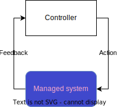

# Spec of Lupin and Lupout interfaces

## Intro

It is impossible to develop Lupus in way that it can be plugged into any managed system as it is (en soi) and ready to go without any integration effort.

To adjust any of plethora of managed-systems the concept of Ingress and Egress Agent was born. Both of them work as translation agents. They translate communication from one system (Lupus) to another (managed-system) and vice versa. 

According to the image above:
- Lupin interface is the interface of Feedback, any signal at this interface will trigger an iteration of closed control loop.
- Lupout interafce is the interface of Action, Lupus transmits signals at this interface to trigger changes in managed-system.

Any piece of software that implements Lupin interface can be named Ingress Agent.

Any piece of software that implements Lupout interface can be named Egress Agent.

## General architecture of Lupus as Controller

## Lupin interface

Designer can define lots of Lupus elements interconnected in multiple intricate ways. But he has to decide which one of them is triggered by the Ingress-Agent. Such element can be named **Ingress Element**. It is in the designer decision how many Ingress Element are present in Lupus controller.

If Ingress Agent wants to indicate that a new state of managed-system can be observed (that a new interation of Closed Control Loop has to be triggered), it has to modify the Ingress Element CR Status field `input`. The value placed in this field will represent the new observed state.

The `Status.Input` field of Entry Element CR is of type [RawExtension](https://github.com/kubernetes/apimachinery/blob/829ed199f4e0454344a5bc5ef7859a01ef9b8e22/pkg/runtime/types.go#L94) which can receive any json object.

The json send here will stand as [Data](defs.md#data) for this element.

Ingress Agent implements the Lupin interface if at some point of its code it sends a HTTP request to the kube-api-server that updates the status of Entry Element CR. More precisely the `input` field. The value has to be json object that represent current observed state of a managed-system.

## Lupout interface

The exit point of Lupus Controller is the last element of loop workflow. Last element (**Egress Element**) sends its Data (or part of it) to the Egress Agent. Egress Agent has to translate this input into action performed directly on the managed-system.

Egress Agent implement the Lupout interface if it implement HTTP Server that accepts json input, and translates it into action performed on managed-system.