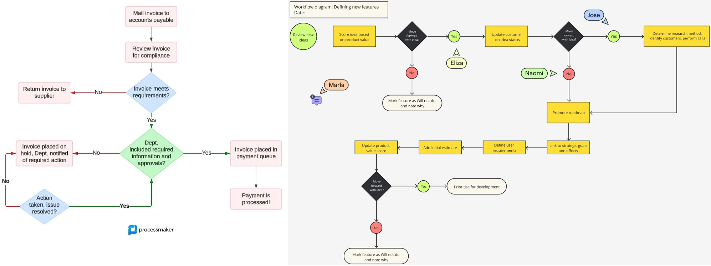

# LupN
LupN (Loop Notation) - is a language to design/express any loop workflow.

## What is workflow?

As we can see Workflow is a chain of single-direction connected actions. Sometimes the next node (action) of chain results from condition expression.

Actually, the actions are only instructions for the people, what to do on external sources. In our case the external source is [Data](data-concept.md). Action specifies what to do with data. Each Action of Lupus is some Data modification. Also as you can see condition statements rely on external sources and again in our case we will rely/define conditions on Data contents. 

At the end Workflow provies some result. In our case the "result" will be "coded" in Data. Also sometimes workflow ends in "no result" state. In our case it means no reconciliation in this loop iteration.

We will use BPMN 2.0 to visually express our workflows (loops - as in this case it is "tożsame")

## Single-path Loop

Expression of single execution path Loop (workflow) in LupN is easy and already developed. Just list the actions in yaml file. Order of Actions execution will be determined by order on the list.

## Multi-path loop

Single execution paths means that loop in each iteration will execute exact same set of Actions. In contrary, multi-path loop means that set of executed action can differ accross loop iterations. In order words, loop at some point can select from multiple path continuations or immediately halt the execution.

Here, we will design in BPMN as many test cases as possible, to see the big picture and later based on https://www.learncpp.com/cpp-tutorial/control-flow-introduction/ come up with some LupN sytnax proposition.

### BPMN examples