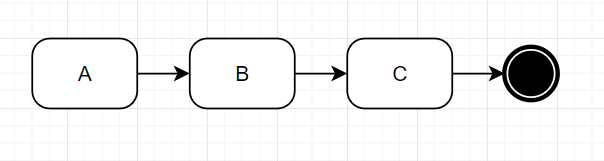

# LupN
LupN (Loop Notation) - is a language to design/express any loop workflow.

## What is workflow?


As we can see Workflow is a chain of single-direction connected actions. Sometimes the next node (action) of chain results from condition expression.

Actually, the actions are only instructions for the people, what to do on external sources. In our case the external source is [Data](data-concept.md). Action specifies what to do with data. Each Action of Lupus is some Data modification. Also as you can see condition statements rely on external sources and again in our case we will rely/define conditions on Data contents. 

At the end Workflow provides some result. In our case the "result" will be "coded" in Data. Also sometimes workflow ends in "no result" state. In our case it means no reconciliation in this loop iteration. So no Data will be passed to Execute.

We will use BPMN 2.0 to visually express our workflows (loops - as in this case it is "tożsame")

## Single-path Loop

Expression of single execution path Loop (workflow) in LupN is easy and already developed. Just list the actions in yaml file. Order of Actions execution will be determined by order on the list.

## Multi-path loop

Single execution paths means that loop in each iteration will execute exact same set of Actions. In contrary, multi-path loop means that set of executed action can differ accross loop iterations. In order words, loop at some point can select from multiple path continuations or immediately halt the execution.

Here, we will design in BPMN as many test cases as possible, to see the big picture and later based on https://www.learncpp.com/cpp-tutorial/control-flow-introduction/ come up with some LupN sytnax proposition.

### BPMN examples
#### Single Path


Possible paths:
```sh
1. A, B, C
```
#### Two paths


Possible paths:
```sh
1. A, B, C
2. A, D, E
```
#### Multiple paths


Possible paths:
```sh
1. A, B, C
2. A, D, E
3. A, F, G
4. A, H, I
```

#### Termination


Possible paths:
```sh
1. A, B, C
2. A
```

#### Additional step


Possible paths:
```sh
1. A, B, C
2. A, D, B, C
```

#### Converging paths


Possible paths:
```sh
1. A, B, C
2. A, D, C
```

#### Loop in loop
We do not allow such functionality.

#### Mixing it all


Possible paths:
```sh
1. A
2. A, B, F
3. A, B, G, H
4. A, C, D, H
5. A, C, E, D, H
```

## Attemps of Syntax creation
### Flow
#### 1.
```yaml
actions:
  - name: A
    spec: AAA
  - xor: after-A
      cond1: B
      cond2: C
      cond3: exit
  - name: B
    spec: BBB
  - xor: after-B
      cond1: F
      cond2: G
  - name: C
    spec: CCC
  - xor: after-C
      cond1: D
      cond2: E
  - name: E
    spec: EEE
  - name: D
    spec: DDD
  - name: H
    spec: HHH
  - name: exit
  - name: F
    spec: FFF
```
The idea where flow is inferred from sequence here fails in my opiniion. Better to explicitly state in each action what is the next element.

#### 2.
```yaml
actions:
  - name: A
    type: regular
    spec: AAA
    next: xor-A
  - name: xor-A
    type: xor
    spec:
      - cond1: B
      - cond2: C
      - cond3: exit
  - name: B
    type: regular
    spec: BBB
    next: xor-B
  - name: xor-B
    type: xor
    spec:
      - cond1: F
      - cond2: G
  - name: C
    type: regular
    spec: CCC
    next: xor-C
  - name: xor-C
    type: xor
    spec: 
      - cond1: D
      - cond2: E
  - name: F
    type: regular
    spec: FFF
    next: exit
  - name: G
    type: regular
    spec: GGG
    next: H
  - name: D
    type: regular
    spec: DDD
    next: H
  - name: E
    type: regular
    spec: EEE
    next: D
  - name: H
    type: regular
    spec: HHH
    next: exit
```

`regular` means action like `Nest`, `Rename` etc. the ones that actually modify the Data.
`xor` special type of Action that actully controls the flow instead modifies the Data.

in `xor` type next field will just be omitempy'ied.

One thing of syntax is to express flow. This is what we've done above. The next thing is to express the condition itself. Few remarks:
- I think it will have 3 fields: Data key, operator and value. E.g.
- Interpreter will check each condition one by one if it is true. If yes jump to indicated Action. If not check the next condition. At the end the default says where to go if no condition returned true.
- It is designer role to design it properly, we only give tool.
- If there is type mismatch between field and value just return error.


### Conditions

Come up with some examples like checking the value of field `authorized` if false exiting the loop. checking the field `next_act` if A, go to action A, if B, go to B etc.. If field ram gt (greater than) 10 go to action critical-situation etc...

