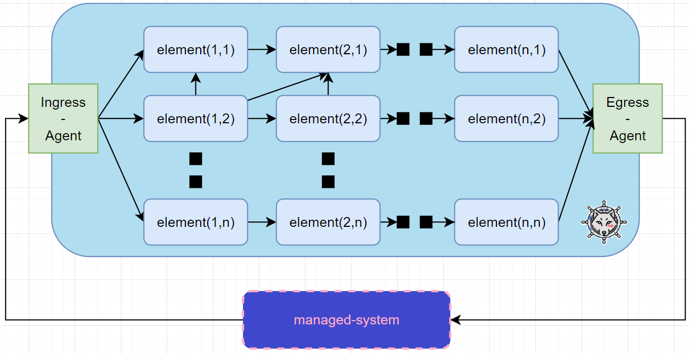
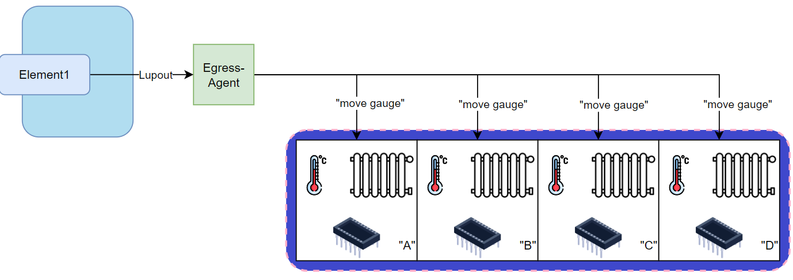

## More detailed example

### 1. Develop Ingress Agent

General architecture of Lupus as controller looks like this:



Ingress and Egress Agents are input and output points to the Lupus system. They are external to Kubernetes cluster and have to be developed by [designer](defs.md#designer). The only requirement for them is to be compatible with [Lupin and Lupout interfaces specification](lupin-lupout-if.md). 

Our loop will have only one [Lupus Element](defs.md#lupus-element), thus it will be both the [Ingress](defs.md#ingress-element) and [Egress](defs.md#egress-element) Element.

[Ingress Agent](defs.md#ingress-agent) on one side has to communicate with [managed-system](defs.md#managed-system), and on the other it has to implement [Lupin interface](lupin-lupout-if.md).


On the left side it will act as a MQTT Broker and will gather temperature measurement from microcontrollers. On the right side (the one implemeting Lupin interface) it will change the Status of [Ingress Element](defs.md#ingress-element) CR* (i na a periodical manner) with such json input:

```json
{
    "A": {
        "room": "A"
        "temp": 12
    },
    "B": {
        "room": "B"
        "temp": 10
    },
    "C": {
        "room": "C"
        "temp": 8
    },
    "D": {
        "room": "D"
        "temp": 14
    },
}
```

> *Python offers great library for interworking with kube-api-server

### 2. Design the Lupus Elements

Ok, we've received [current-state](defs.md#current-state), now we have to come up with Loop workflow. What has to be done in each loop iteration?

Looking back at how it was done previously, we need to query HTTP server in HQ for each room.

How to express such logic in Lupus?

We need to prepare YAML config file for Kubernetes Object [`masters.lupus.gawor.io`](defs.md#masterslupusgaworio). The spec of this object expresses the loop workflow.

```yaml
apiVersion: lupus.gawor.io/v1
kind: Master
metadata:
  labels:
    app.kubernetes.io/name: lupus
    app.kubernetes.io/managed-by: kustomize
  name: Temp
spec:
  name: Temp
  elements:
    - name: "Main"
      descr: "Queries HQ Server for each room"
      actions:
        - name: "room A"
          type: send
          inputKey: "A"
          outputKey: "A"
          destination:
            type: http
            http: 
              path: "http://hq.server.corpnet/administration/rooms/temp"
              method: GET
          next: "room B"
        - name: "room B"
          type: send
          inputKey: "B"
          outputKey: "B"
          destination:
            type: http
            http: 
              path: "http://hq.server.corpnet/administration/rooms/temp"
              method: GET
          next: "room C"
        - name: "room C"
          type: send
          inputKey: "C"
          outputKey: "C"
          destination:
            type: http
            http: 
              path: "http://hq.server.corpnet/administration/rooms/temp"
              method: GET
          next: "room D"
        - name: "room D"
          type: send
          inputKey: "D"
          outputKey: "D"
          destination:
            type: http
            http: 
              path: "http://hq.server.corpnet/administration/rooms/temp"
              method: GET
          next: final
      next: 
        - type: destination
          destination:
            type: http
            http:
              path: "http://hq.server.corpnet/lupus/temp/egress-agent"  
              method: POST
            keys: ["*"]
```

The general structure of YAML config file for Kubernetes resources is assumed to be known by reader.

One [Master](defs.md#master) API Object corresponds to one management loop. Let's focus on its `spec`.

`spec` of Master is expressed in [LupN](defs.md#lupn). LupN notation will be interpreted by Master [operator](defs.md#operator). Loop workflow is based on [Data-Concept](defs.md#data). This is the information carrier for single loop-iteration. Iteration at any time can retrieve or save operational information in [Data](defs.md#data). Data is simply an information coded in Json format. In each iteration its initial form is exact the same json that [Ingress Element](defs.md#ingress-element) has got from [Ingress-Agent](defs.md#ingress-agent).

Notation above compiles to the following loop:

1. Retrieve "A" field from Data.
2. Send its content to HQ Server.
3. Save response in "A" field in Data.
4. Retrieve "B" field from Data.
5. nd its content to HQ Server.
6. Save response in "B" field in Data.
7. Retrieve "C" field from Data.
8. Send its content to HQ Server.
9. Save response in "C" field in Data.
10. Retrieve "D" field from Data.
11. Send its content to HQ Server.
12. Save response in "D" field in Data.
13. Send resulted Data to the Egress-Agent.

Which converts to such Diagram:


> Solid line means that one entity sends something to another, while stripped line shows only the sequence of execution.

Let's examine the [Master's](defs.md#master) spec. Full documentation of LupN is [here](lupn.md). Master has 2 fields in its spec:
- `name` - used to uniquely identify the loop and its elements (elements are prefixed with loop name). In our example the name is "Temp", which will tell us that from among of plethora of Closed Control Loops, this one is responsible for automated management of Temperature.
- `elements` - list of loops elements. Element is the first level of logical division of loop. In case of [OODA loop](https://www.etsi.org/deliver/etsi_gr/ENI/001_099/017/02.01.01_60/gr_ENI017v020101p.pdf) elements could be: {"Observe", "Orient", "Decide", "Act"}. In our simple example we have only one element - "Main".

Element spec contains:
- `name` that uniquely identifies the element in scope of its loop. In our example we have only one element hence the name "Main".
- `descr` - description of element e.g. its goal or summary of its logic. It is for faciliation of [desginer's](defs.md#designer) work. In our example it simply describes its operation as this may be what desinger assumed as convention.
- `actions` - [Action](defs.md#action) is the second level of logical division of loop. Actually, actions are performed on the [Data](defs.md#data) object. Action can be of several types. Each actions takes one field from Data (identified by `inputKey`), performs action dependable on its type, and, if applicable, saves the result in field indicated by `outputKey`. In our example we can see only actions of type `send`. This action takes some Data field, sends it as input to indicated [destination](defs.md#destination) (e.g. HTTP Endpoint) and saves received json response in Data field indicated by `outputKey`. Full list of available actions types and their documentation is [here](actions.md). <br>Each action defines the next action in the workflow* as the `next` field. Special keyword `final` exists to terminate the actions chain.
- `next` - next specifies the next [element](defs.md#loop-element) in loop workflow and resulting Data fields that has to be sent there. It can be any [destination](defs.md#destination) or a [lupus-element](defs.md#lupus-element). 

> *Control Flow with conditions (if expression) or sudden exits are possible.

At the end of the loop iteration we have such [Resulting data](defs.md#resulting-data):
```json
{
    "A": {
        "move_gauge": 1
    },
    "B": {
        "move_gauge": 0
    },
    "C": {
        "move_gauge": 2
    },
    "D": {
        "move_gauge": -2
    }
}
```
Note that these are the response from HQ Server for each room. Instead of Data representing the [current-state](defs.md#current-state) we have now Data that represents the [management-action](defs.md#management-action).

We send such Data to Egress-Agent. It will be his mission to translate it to [Management-Action] and execute such action.

To run our loop workflow in Kubernetes just apply the Custom Resource `masters.lupus.gawor.io` by:
```sh
kubectl apply -f <filename.yaml>
```

You can watch applied resources with:
```sh
kubectl get masters
kubectl get elements
```

### 3. Design the Egress-Agent

[Egress-Agent](defs.md#egress-agent) has to implement [Lupout interface](defs.md#lupout-interface) on its left side. It can be HTTP server (as it is in our case). Then, on the right side it has to perform [Management-Action](defs.md#management-action), which is out of scope of Lupus specification and specific to [managed-system](defs.md#managed-system). 



In our case Egress-Agent exposes endpoint "http://hq.server.corpnet/lupus/temp/egress-agent, which accepts json in the same format as resulting data above. Then it translates this json to 4 separate management-actions. Each involves sending "move gauge" instruction to respective microcontroller. Exact way of communication here is not relevant and out of scope of this tutorial.

### 4. Closing word

Now the loop is ready. Its workflow runs in Kubernetes as Master CR and Element CR, and its logic runs in HQ Server.

## Summary

This was just quick walktrhrough. To go further explore:
- detailed documentation of Lupus -> [detailed-doc.md](detailed-doc.md) to dive into specific topis, or
- examples directory -> [examples](/examples/) to see Lupus application in various examples


