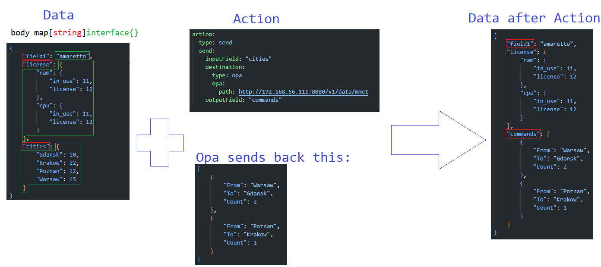
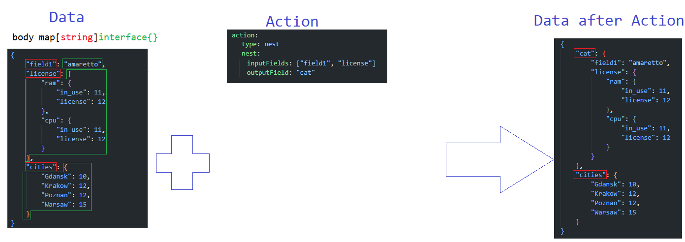
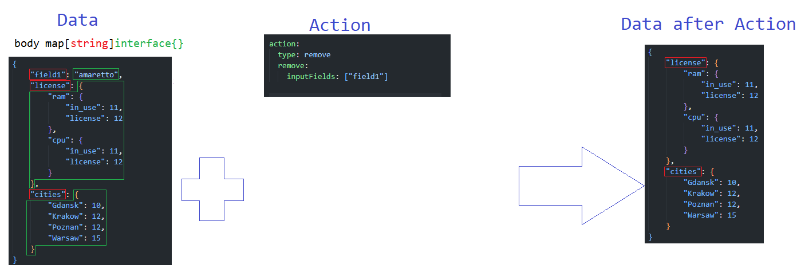
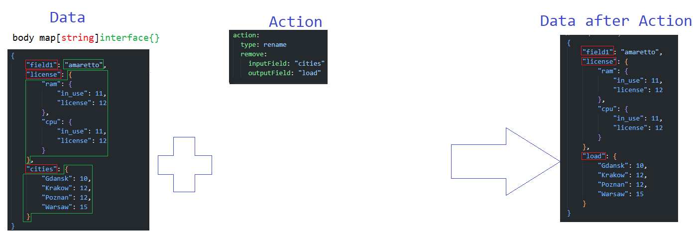
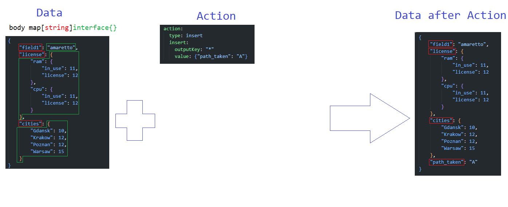

# Actions
Detailed specification of actions (especially their notation in LupN) is present in [lupn specifcation](lupn.md). This document presents some examples of how actions work.

Actions were developed as the most atomic operations that when combined in the appropriate manner will deliver a tool to that will let the [loop-designer](../defs.md#designer) to fully operate on [data](../defs.md#data).

Sometimes some opeartion that seems to be atomic at the first glance will require usage of two actions combined. On the other hand, sometimes an operation that seems to be atomic at the first glance, appears to be a specific case of more general operation. A good example here is an extinct action of concat. This action was designed to merge two fields into one, but it turned out that it is a specific case of nest, where the `InputKey` list has only 2 elements. 

## General division

We have 8 types of actions:
- Send
- Nest
- Remove
- Rename
- Duplicate
- Insert
- Print
- Swtich

From which we can distinguish:
- 6 that can be used for modification of [data](../defs.md#data) - {Send, Next, Remove, Rename, Duplicate, Insert}
- 1 that can be used for communication with [external-elements](../defs.md#external-element) - {Send}
- 2 that can be used for debugging - {Insert, Print}
- 1 that can be used for logging - {Print}
- 1 that can be used for the [flow-control](../defs.md#flow-control) of [actions-workflow](../defs.md#actions-workflow) - {Switch}

## Examples
This section will present exemplary usage of the 6 actions that can modify [data](../defs.md#data).

Each example will provide
- a json representation of [data](../defs.md#data) state before the action modifications
- a [Lupn](../defs.md#lupn) notation of applied action
- a json representation of [data](../defs.md#data) state after the action modifications

### Send

### Nest

### Remove

### Rename

### Duplicate 

### Insert

