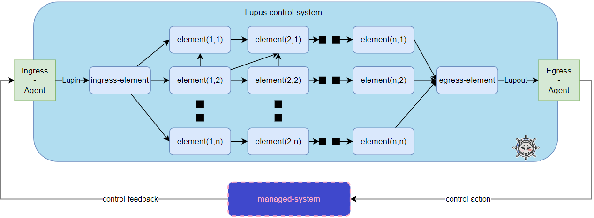

# Spec of Lupin and Lupout interfaces
## Architecture

## Lupin interface

Designer can define lots of [Lupus elements](../defs.md#lupus-element) interconnected in multiple intricate ways. But he has to decide which one of them is triggered by the [Ingress-Agent](../defs.md#ingress-agent). Such element can be named as [**Ingress Element**](../defs.md#ingress-element). Lupus recommends to have just one [ingress-element](../defs.md#ingress-element).

If [Ingress Agent](../defs.md#ingress-agent) wants to indicate that a new state of [managed-system](../defs.md#managed-system) can be observed (that a new interation of [Closed Control Loop](../defs.md#closed-control-loop) has to be triggered), it has to modify the Ingress Element CR Status field `input`. The value placed in this field will represent the new observed state.

The `Status.Input` field of Ingress Element CR is of type [RawExtension](https://github.com/kubernetes/apimachinery/blob/829ed199f4e0454344a5bc5ef7859a01ef9b8e22/pkg/runtime/types.go#L94) which falls under the [specification of data](data.md).

The json send here will stand as [Data](defs.md#data) for this element.

A software implements the Lupin interface if at some point of its code it sends a HTTP request to the kube-api-server that updates the status of [Ingress Element](../defs.md#ingress-element) more precisely the `input` field. The value has to be json object that represent current observed state of a managed-system.

## Lupout interface

The exit point of [Lupus Control-system](../defs.md#control-system) is the last element of loop workflow (the [egress-element](../defs.md#egress-element). It sends its [final-data](../defs.md#final-data) (or part of it) to the [Egress Agent](../defs.md#egress-agent). [Egress Agent](../defs.md#egress-agent) has to translate this input into [control-action](../defs.md#control-action) performed directly on the [managed-system](../defs.md#managed-system).

A software implements the Lupout interface if it implements a HTTP Server that accepts json input, and translates it into [control-action](../defs.md#control-action) performed the [managed-system](../defs.md#managed-system).