# LupN
## Foreword
LupN (for Lup (Loop) Notation) is a language/notation to express a [loop-workflow](../defs.md#loop-workflow). It lacks the description of [computing-part](../defs.md#computing-part) of the [loop-logic](../defs.md#loop-logic). [Computing-part](../defs.md#computing-part) is specified outside of Lupus, in [external-elements](../defs.md#external-element).

LupN specifies then:
- [workflow](../defs.md#workflow) of [lupus-elements](../defs.md#loop-element) withing a loop,
- references to [external-elements](../defs.md#external-element) expressed as [destinations](../defs.md#destination),
- [workflow](../defs.md#worokflow) of [actions](../defs.md#action) within a [lupus-element](../defs.md#lupus-element),
- reference (or references) to [egress-agent](../defs.md#egress-agent) as [destination](../defs.md#destination).

As you can note LupN expresses some workflow on 2 levels. One global (a [workflow of lupus-elements](../defs.md#loop-workflow)) and one inside a lupus-element (a [workflow of actions](../defs.md#actions-workflow)). The capabilities of both are close to each other, but ultimately divergent. This document will also cover this issue.

From the implementation point of view a [LupN file](../defs.md#lupn-file) is actually a [YAML manifest file](../defs.md#yaml-manifest-file) of [Lupus-Master CR](../defs.md#lupus-master). Once [applied](../defs.md#yaml-manifest-file), a [Lupus-Master controller](../defs.md#lupus-master) spawns [lupus-elements](../defs.md#lupus-element) that deliver the expressed [loop-workflow](../defs.md#loop-workflow).

[LupN](../defs.md#lupn) expresses [loop-workflow](../defs.md#loop-workflow) by the specification of various objects in [YAML notation](https://yaml.org). Let's call these object a [LupN objects](../defs.md#lupn-object). This document will specify these objects and relation between them. Also it will indicate what usage of each one will mean in the [loop-workflow](../defs.md#loop-workflow) and how [lupus-element](../defs.md#lupus-element) [controller](../defs.md#controller) will interpret them during runtime.

It happends to be, that YAML objects inside [YAML manifest files](../defs.md#yaml-manifest-file) are derived from Golang structs (Golang types), therefore we can describe [lupn-objects](../defs.md#lupn-object) based on these Golang structs.

It is mandatory to be familiar with [YAML](https://yaml.org) first. This document does not cover the translation between golang strucst to YAML object representations. The serialization is done by [controller-gen](https://github.com/kubernetes-sigs/controller-tools) and described [here, in kubebuilder book](https://book.kubebuilder.io/reference/generating-crd). Such translation can be easily observed and learned by reader during examination of [examples](../../examples/)

## Specification

A [LupN file](../defs.md#lupn-file) has 4 top root yaml fields: `apiVersion`, `kind`, `metadata` and `spec`.

```yaml
apiVersion: lupus.gawor.io/v1
kind: Master
metadata:
  labels:
    app.kubernetes.io/name: lupus
    app.kubernetes.io/managed-by: kustomize
  name: lola
spec:
	<lupn-objects>
```

Every root has to be set as in the snippet above except the `metadata.name`, it diffrienties loop instances within a Kubernetes cluster.

It does not matter wheter we consider `apiVersion`, `kind` and `metadata` as LupN or not. In some way it specifies the loop (e.g. metadata has object name), in some it does not (name is anyway repeated later in `spec`). But as for sure the the [Lupn objecst](../defs.md#lupn-object) under `spec` state as a Loop description.

### LupN Objects tree
As we will traverse through [LupN objects](../defs.md#lupn-object) specifications it will be helpful to know actual postion on the objects dependency tree. The full dependency tree of [Lupn-objcest](../defs.md#lupn-object) is present down below.

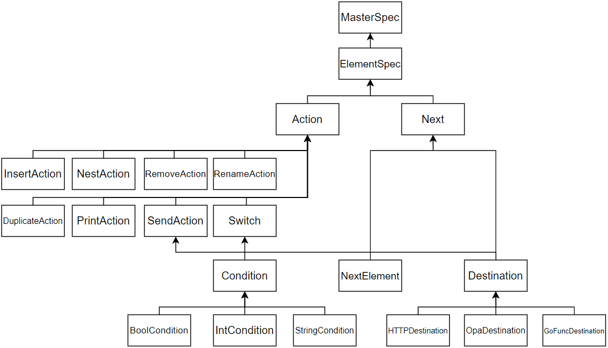

Arrows here mean that one Lupn-object is used as a field value in the other one (compisition).

### MasterSpec
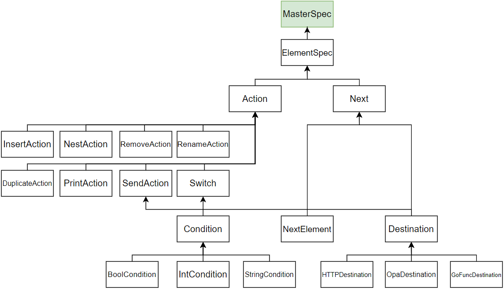

```go
// MasterSpec defines the desired state of Master
type MasterSpec struct {
	// Name of the Master CR (indicating the name of the loop)
	Name string `json:"name"`
	// Elements is a list of Lupus-Elements
	Elements []*ElementSpec `json:"elements"`
}
```

Each element of the `Elements` list will trigger [Lupus-Master](../defs.md#lupus-master) [controller](../defs.md#controller) to spawn an [API object](../defs.md#api-object) of type [lupus-element](../defs.md#lupus-element) with the given spec. 


### ElementSpec
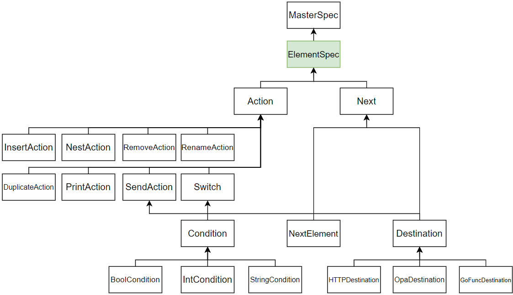

```go
// ElementSpec defines the desired state of Element
type ElementSpec struct {
	// Name is the name of the element, its distinct from Kubernetes API Object name, but rather serves ease of managemenet aspect for loop-designer
	Name string `json:"name"`
	// Descr is the description of the lupus-element, same as Name is serves as ease of management aspect for loop-designer
	Descr string `json:"descr"`
	// Actions is a list of Actions that lupus-element has to perform
	Actions []Action `json:"actions,omitempty"`
	// Next is a list of next objects (can be lupus-element or external-element) to which send the final-data
	Next []Next `json:"next,omitempty"`
	// Name of master element (used as prefix for lupus-element name)
	Master string `json:"master,omitempty"`
}
```

### Next
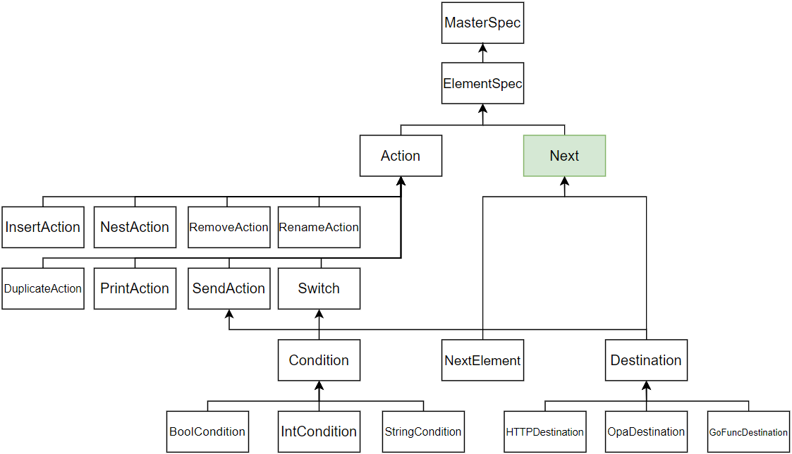

```go
// Next specifies the of next loop-element in a loop workflow, it may be either lupus-element or reference to an external-element
// It allows to forward the whole final-data, but also parts of it
type Next struct {
	// Type specifies the type of next loop-element, lupus-element (element) or external-element (destination)
	Type string `json:"type" kubebuilder:"validation:Enum=element,destination"`
	// List of input keys (Data fields) that have to be forwarded
	// Pass array with single element '*' to forward the whole input
	Keys []string `json:"keys"`
	// One of the fields below is not null
	Element     *NextElement `json:"element,omitempty" kubebuilder:"validation:Optional"`
	Destination *Destination `json:"destination,omitempty" kubebuilder:"validation:Optional"`
}
```

With the help of `next` objects, we can arrange the sequence of [lupus-elements](../defs.md#lupus-element) execution (i.e. define the [workflow](../defs.md#workflow) of [lupus-elements](../defs.md#lupus-element)).

It is not mandatory, that whole [data](../defs.md#data) will be passed to the next loop-element. With `Keys`, we can pass only the selected subset of [data-fields](../defs.md#data-field).

Here we can see the design principle of [Go-Style Polymorphism with Pointers](../go-style-polymorphism.md).

#### NextElement
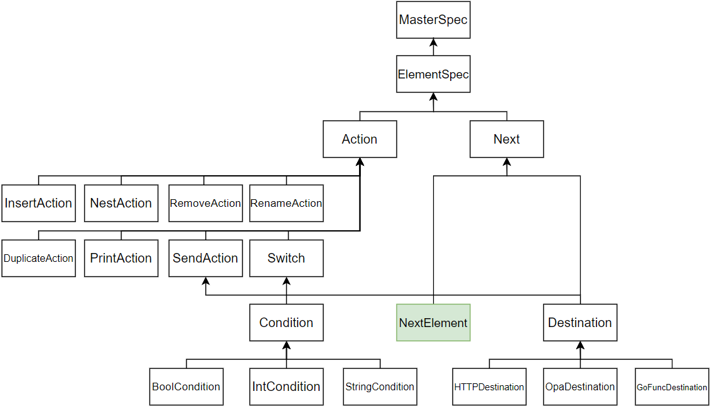

```go
// NextElement indicates the next loop-element in loop-workflow of type lupus-element
type NextElement struct {
	// Name is the lupus-name of lupus-element (the one specified in Element struct)
	Name string `json:"name"`
}
```

#### Destination
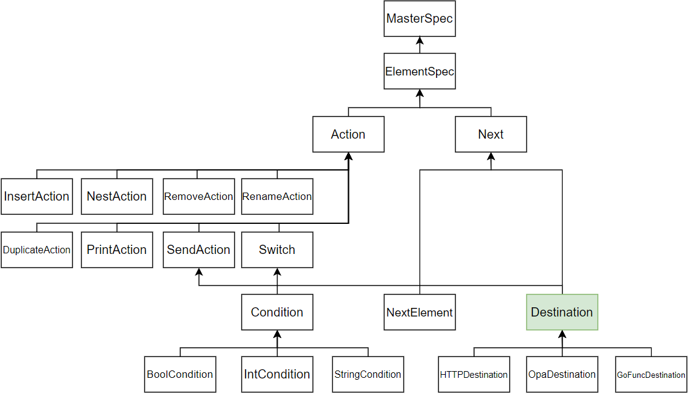

```go
// Destination represents an external-element
// It holds all the info needed to make a call to an external-element
// It supports calls to HTTP server, Open Policy Agent or user-functions
type Destination struct {
	// Type specifies if the external element is: a HTTP server in gerneral, a special kind of HTTP server like Open Policy Agent or internal, a user-function
	Type string `json:"type" kubebuilder:"validation:Enum=http;opa;gofunc"`
	// One of these fields is not null depending on a Type
	HTTP   *HTTPDestination   `json:"http,omitempty" kubebuilder:"validation:Optional"`
	Opa    *OpaDestination    `json:"opa,omitempty" kubebuilder:"validation:Optional"`
	GoFunc *GoFuncDestination `json:"gofunc,omitempty" kubebuilder:"validation:Optional"`
}
```

##### HTTPDestination
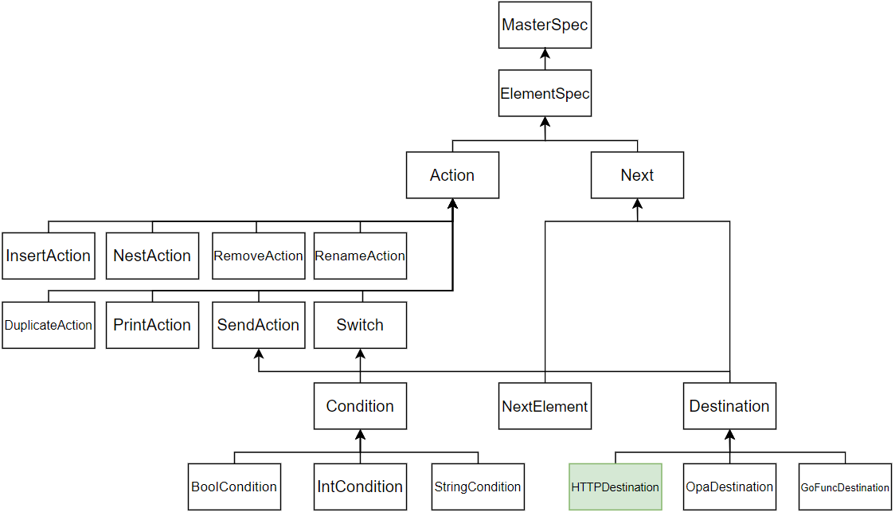

```go
// HTTPDestination defines fields specific to a HTTP type
// This is information needed to make a HTTP request
type HTTPDestination struct {
	// Path specifies HTTP URI
	Path string `json:"path"`
	// Method specifies HTTP method
	Method string `json:"method"`
}
```

##### OpaDestination
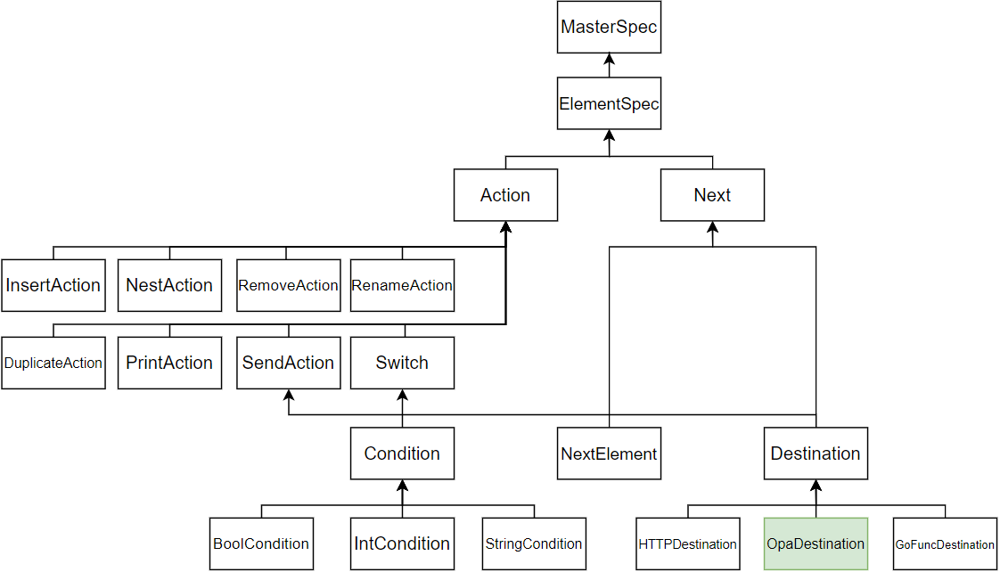

```go
// OpaDestination defines fields specific to Open Policy Agent type
// This is information needed to make an Open Policy Agent request
// Call to Opa is actually a special type of HTTP call
type OpaDestination struct {
	// Path specifies HTTP URI, since method is known
	Path string `json:"path"`
}
```

##### GoFuncDestination
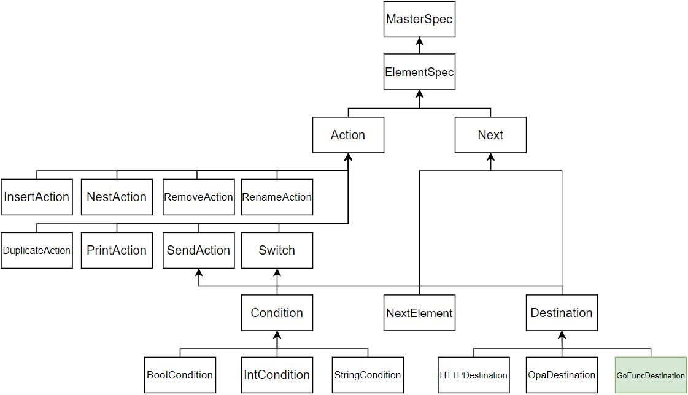

```go
// GoFuncDestination defines fields specific to GoFunc type
// This is information needed to call an user-function
type GoFuncDestination struct {
	// Name specifies the name of the function
	Name string `json:"name"`
}
```

### Action
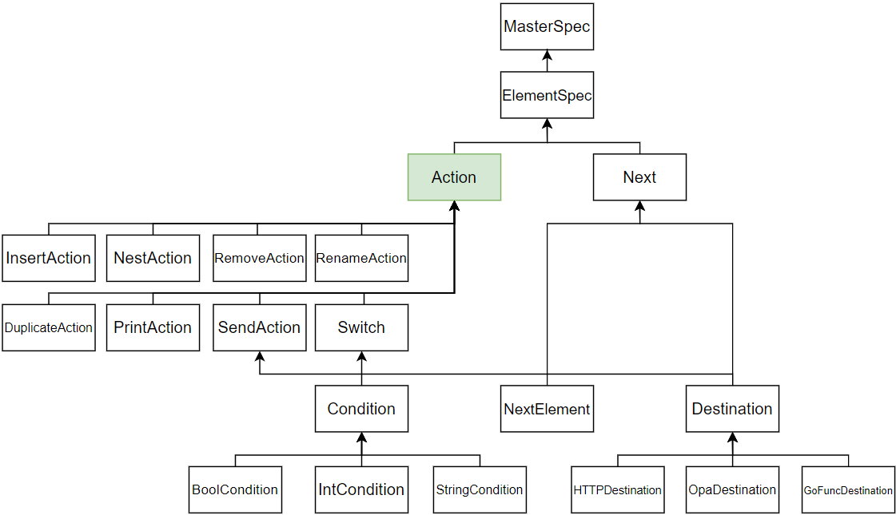

```go
// Action represents operation that is performed on Data
// Action is used in Element spec. Element has a list of Actions and executes them in a chain
// In general, each action has an input and output keys that define which Data fields it has to work on
// Each action indicates the name of the next Action in Action Chain
// There is special type - Switch. Actually, it does not perform any operation on Data, but rather controls the flow of Actions chain
type Action struct {
	// Name of the Action, it is for designer to ease the management of the Loop
	Name string `json:"name"`
	// Type of Action
	Type string `json:"type" kubebuilder:"validation:Enum=send,nest,remove,rename,duplicate,print,insert,switch"`
	// One of these fields is not null depending on a Type.
	Send      *SendAction      `json:"send,omitempty" kubebuilder:"validation:Optional"`
	Nest      *NestAction      `json:"nest,omitempty" kubebuilder:"validation:Optional"`
	Remove    *RemoveAction    `json:"remove,omitempty" kubebuilder:"validation:Optional"`
	Rename    *RenameAction    `json:"rename,omitempty" kubebuilder:"validation:Optional"`
	Duplicate *DuplicateAction `json:"duplicate,omitempty" kubebuilder:"validation:Optional"`
	Print     *PrintAction     `json:"print,omitempty" kubebuilder:"validation:Optional"`
	Insert    *InsertAction    `json:"insert,omitempty" kubebuilder:"validation:Optional"`
	Switch    *Switch          `json:"switch,omitempty" kubebuilder:"validation:Optional"`
	// Next is the name of the next action to execute, in the case of Switch-type action it stands as a default branch
	Next string `json:"next"`
}
```

As it was said before [LupN] specified [workflow] on 2 levels, the first one was via [elements] and their `next` attribute.

`next` field here has two keywords defined: `final` and `exit`L
- `final` indicates that data after this action is marked as [final](../defs.md#final-data) and has to be forwarded to the `next` object of the parent `element`
- `exit` indicates that loop terminates here and no [control-action](../defs.md#control-action) will be sent in this [loop-iteration](../defs.md#loop-iteration) (typically due to an error or satifying [current-state](../defs.md#current-state))

#### SendAction
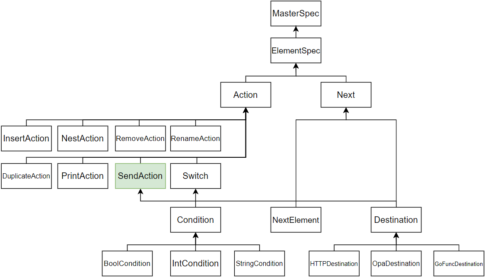

```go
// SendAction is used to make call to external-element
// Element's controller obtains a data field using InputKey,
// and attaches it as a json body when perfoming a call to destination.
// Respnse is saved in data under an OutputKey
type SendAction struct {
	InputKey    string      `json:"inputKey"`
	Destination Destination `json:"destination"`
	OutputKey   string      `json:"outputKey"`
}
```

#### InsertAction
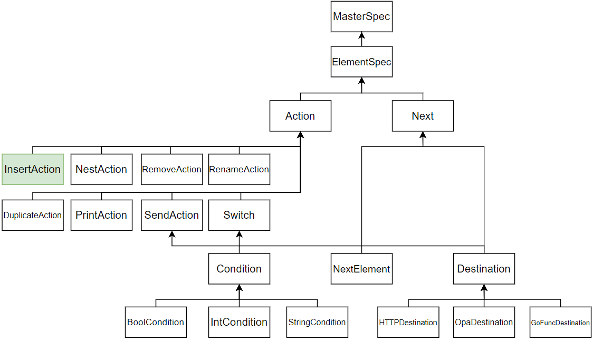

```go
// InsertAction is used to make a new field and insert value to it
// Normally new fields are created as an outcome of other types of actions
// It is useful in debugging or loggin, e.g. can idicate the path taken by the actions workflow
type InsertAction struct {
	OutputKey string               `json:"outputKey"`
	Value     runtime.RawExtension `json:"value"`
}
```

#### NestAction
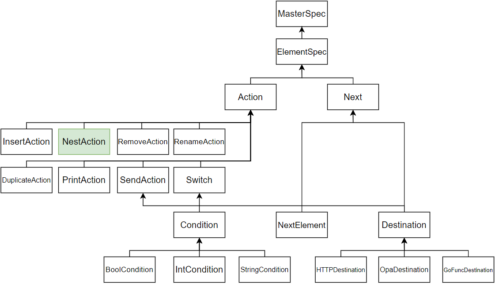

```go
// NestAction is used to group a number of data-fields together.
// Element's controllers gathers fields indicates by InputKeys list
// and nests them in a new field under an OutputKey.
type NestAction struct {
	InputKeys []string `json:"inputKeys"`
	OutputKey string   `json:"outputKey"`
}
```

#### RemoveAction
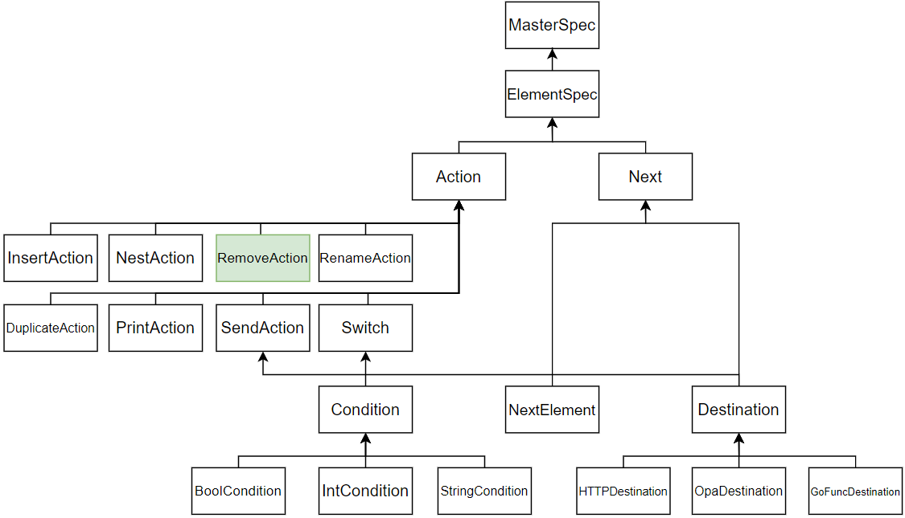

```go
// RemoveAction is used to delete a data-field.
// Elements's controllers removes fields indicated by the list InputKeys
type RemoveAction struct {
	InputKeys []string `json:"inputKeys"`
}
```

#### RenameAction
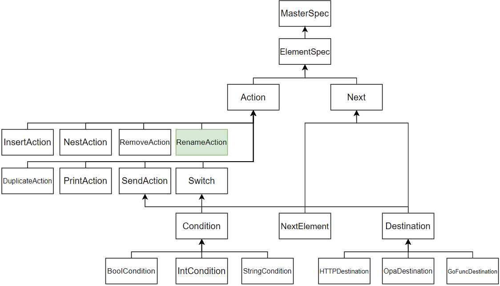

```go
// RenameAction is used to change name of a data-field.
// InputKey indicates a field to be renamed
// OutputKey is the new field name.
type RenameAction struct {
	InputKey  string `json:"inputKey"`
	OutputKey string `json:"outputKey"`
}
```

#### DuplicateAction
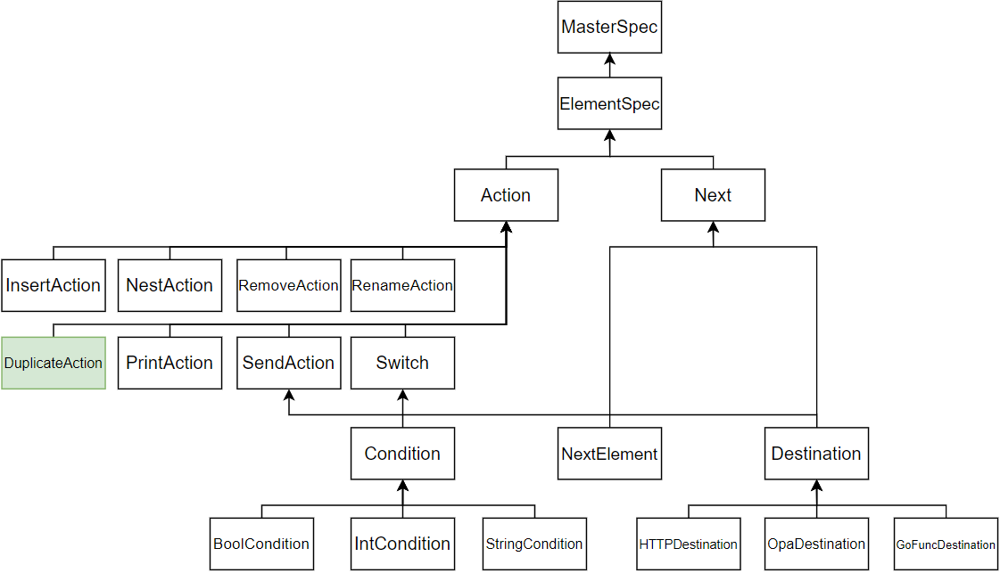

```go
// DuplicateAction is used to make a copy of data-field.
// InputKey indicates the field of which value has to be copied.
// OutputKey indicates the field to which values has to be pasted in.
type DuplicateAction struct {
	InputKey  string `json:"inputKey"`
	OutputKey string `json:"outputKey"`
}
```

#### PrintAction
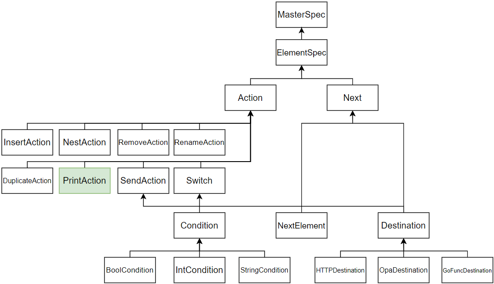

```go
// PrintAction is used to print value of each field indicated by InputKeys in a controller's console.
// It is useful in debugging or logging
type PrintAction struct {
	InputKeys []string `json:"inputKeys"`
}
```

#### Switch
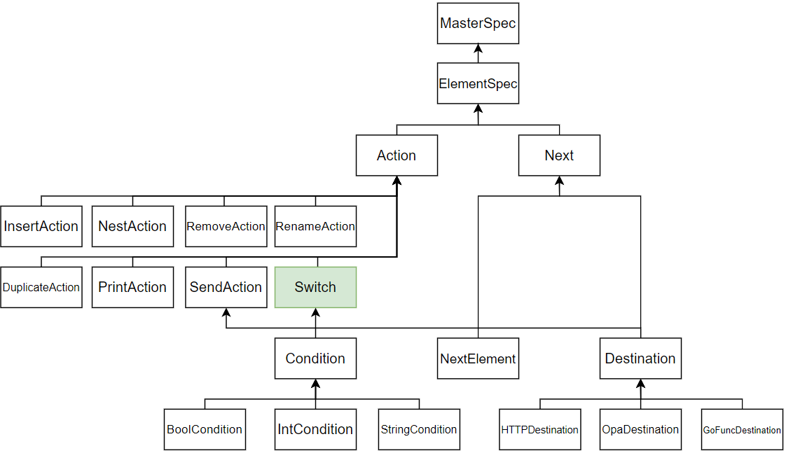

```go
// Switch is a special type of action used for flow-control
// When Element's controller encounters switch action on the chain
// it emulates the work of switch known in other programming languages
type Switch struct {
	Conditions []Condition `json:"conditions"`
}
```

##### Condition
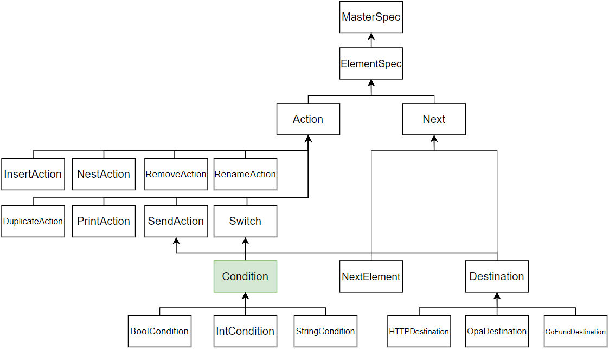

```go
// Condition represents signle condition present in Switch action
// It defines on which Data field it has to be performed, actual condition to be evaluated and next Action if evaluation returns true
type Condition struct {
	// Key indicates the Data field that has to be retrieved
	Key string `json:"key"`
	// Operator defines the comparison operation, e.g. eq, ne, gt, lt
	Operator string `json:"operator" kubebuilder:"validation:Enum=eq,ne,gt,lt"`
	// Type specifies the type of the value: string, int, float, bool
	Type string `json:"type" kubebuilder:"validation:Enum=string,int,float,bool"`
	// One of these fields is not null depending on a Type.
	BoolCondition   *BoolCondition   `json:"bool,omitempty" kubebuilder:"validation:Optional"`
	IntCondition    *IntCondition    `json:"int,omitempty" kubebuilder:"validation:Optional"`
	StringCondition *StringCondition `json:"string,omitempty" kubebuilder:"validation:Optional"`
	// Next specifies the name of the next action to execute if evalution returns true
	Next string `json:"next"`
}
```

###### BoolCondition
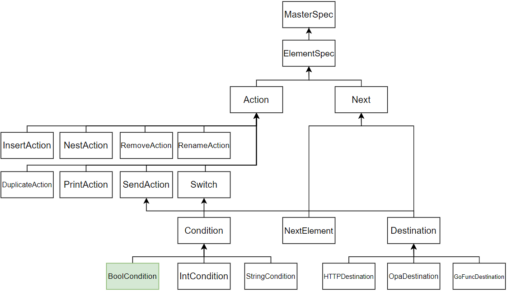

```go
// BoolCondition defines a boolean-specific condition
type BoolCondition struct {
	Value bool `json:"value"`
}
```

###### IntCondition
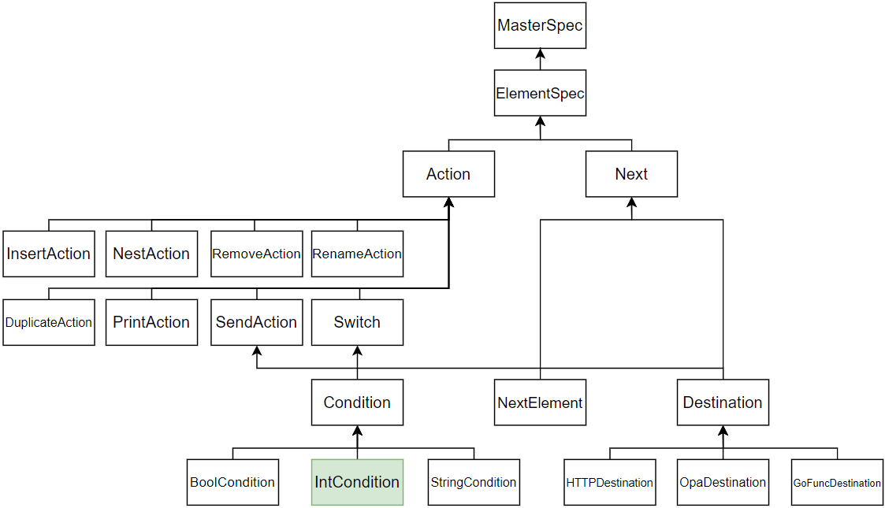

```go
// IntCondition defines an integer-specific condition
type IntCondition struct {
	Value int `json:"value"`
}
```

###### StringCondition
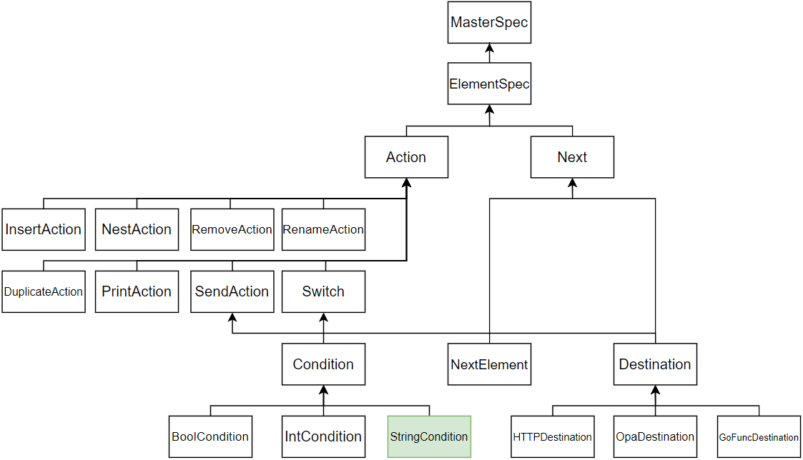

```go
// StringCondition defines a string-specific condition
type StringCondition struct {
	Value string `json:"value"`
}
```