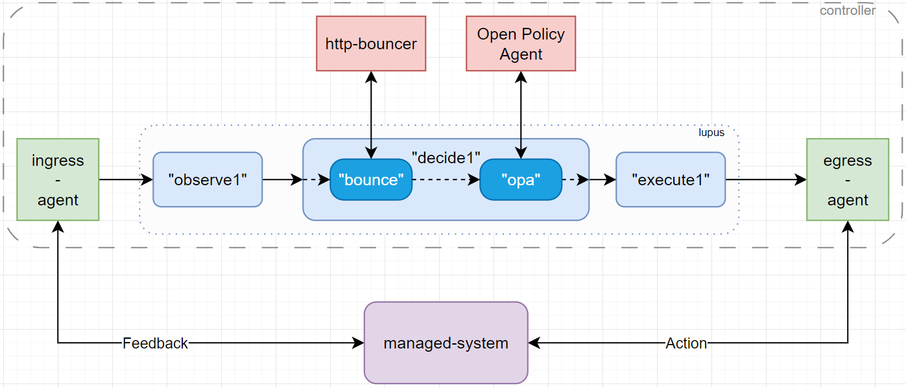
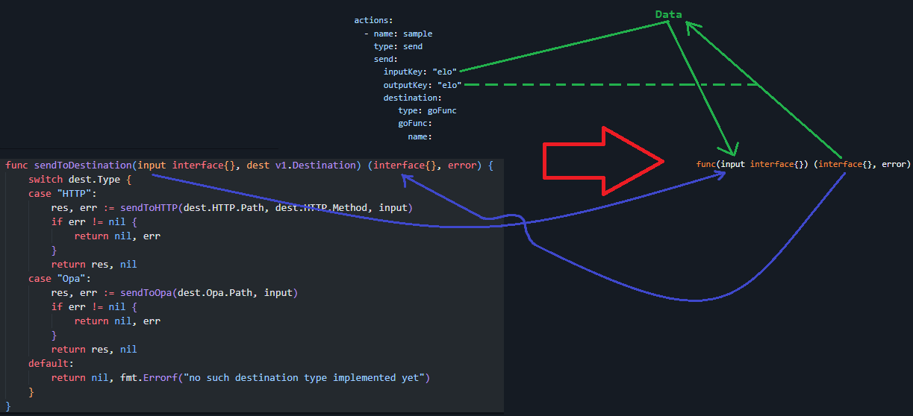

# User-defined, internal Go functions

The whole Lupus framework allows us to create loop workflows. The information in loop runtime is encoded in Data. We have set of Actions that manipulate Data and hence determine the loop workflow. Especially we have Action type Send, that can send somewhere part of our Data and insert received response as other (or the same) part of Data. 

We have two problems that arise here:
- What if the given framework is not sufficient? Any framework should be extensible. We should give some mechanism of extension to our users.
- What if someone needs to perform small and simple operation on Data (like addition of two fields) and it is uneconomic to deploy a special HTTP server for that and use Send Action?

Fot this two reasons we are deploying a feature called "User-defined, internal Go functions" or shortly - "User functions".

But some introduction first.

## Loop elements



At the top level of division we have managed-system (purple color) and controller along with Feedback and Action arrows.

The controller is built within the help of our Lupus platform, but we recognize only the k8s objects as Lupus entities in full (color blue).

External system (color red) such as http-bouncer or Open Policy Agent are also a Loop nodes, but they're not a Lupus elements. 

Ingress/Egress Agents are not loop nodes, but they are a part of controller (because of Feedback and Action interfaces). They act as a proxy between Lupus Loop and managed-system.

The input of the first Lupus element (also the first node of the loop) is the first incarnation of the Data object in a given iteration of the loop.

Ok, but todays topic is about external-systems (entities in red).

Because user-functions will emulate them.

## User functions

User function will act as an external-system, but actually will be implemented in operator' code.

It will be available as one of Destination types.

How to define such action first?

We need to come up with signature:



User has to be ready to work with anything that can be present under given key in Data, but since user designs also Data itself, he knows what to expect.

He'll just need to convert interface{} to his expected type/structure, so the minimal Go knowledge of user will be required.

Ok, but where do user "writes" its functions?

In [lupus/internal/controller/user-functions.go](../lupus/internal/controller/user-functions.go).

This file already contains one func that states as an example.

```go
// Exemplary user-function. It just returns the input
func (UserFunctions) Echo(input interface{}) (interface{}, error) {
	return input, nil
}
```

What is `UserFunctions` here? It is a struct, that will gather user-functions as its methods.

```go
// UserFunctions struct for user-defined, internal functions
type UserFunctions struct{}
```

But how we will convert string representing the function name from the Destination spec to a given user-defined function?

Fortunately in Go func can be treated as a type and referred as value, thus it can be a value in key-value map. We will simply make aforementioned strings a keys.

```go
// A global map to store function references
var FunctionRegistry = map[string]func(input interface{}) (interface{}, error){}
```

Now we will use the `reflect` library to fill the `FuntionRegistry` map.

```go
// RegisterFunctions dynamically registers user-defined functions
func RegisterFunctions(target interface{}) {
	t := reflect.TypeOf(target)
	v := reflect.ValueOf(target)

	for i := 0; i < t.NumMethod(); i++ {
		method := t.Method(i)

		// Ensure the method matches the required signature
		if method.Type.NumIn() == 2 && // Receiver + input
			method.Type.NumOut() == 2 && // Output + error
			method.Type.In(1).Kind() == reflect.Interface && // Input: interface{}
			method.Type.Out(0).Kind() == reflect.Interface && // Output: interface{}
			method.Type.Out(1).Implements(reflect.TypeOf((*error)(nil)).Elem()) { // Second output: error

			funcName := method.Name
			FunctionRegistry[funcName] = func(input interface{}) (interface{}, error) {
				// Call the user-defined function
				result := method.Func.Call([]reflect.Value{v, reflect.ValueOf(input)})

				// Handle result[1] (error) being nil
				var err error
				if !result[1].IsNil() {
					err = result[1].Interface().(error)
				}

				return result[0].Interface(), err
			}
		}
	}
}
```

And such function will be called at the initialization of the `controller` package and with `UserFunctions{}` strcut as input.

```go
func init() {
    // Fill in the FunctionRegistry map with functions defined as a method of UserFunctions{}
	RegisterFunctions(UserFunctions{})
}
```

All of the code can be found in:
- [lupus/internal/controller/user-functions.go](lupus/internal/controller/user-functions.go)
- [lupus/internal/controller/init.go](lupus/internal/controller/init.go)


And from now on, we have a map that has functions names as keys and functions itself as values. Map is initialized at the start of operator runtime.

Now, we just simply need to call apropriate function based on the func name from the spec.


```go
func sendToGoFunc(funcName string, body interface{}) (interface{}, error) {
	if fn, exists := FunctionRegistry[funcName]; exists {
		return fn(body)
	} else {
		return nil, fmt.Errorf("no such UserFunction defined")
	}
}
```