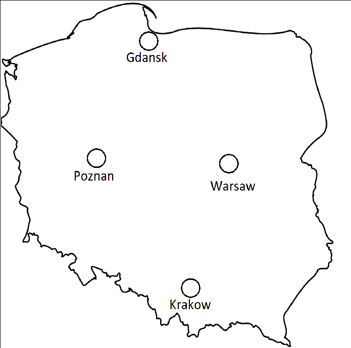
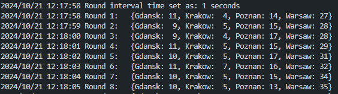
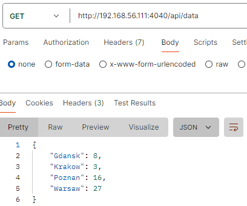
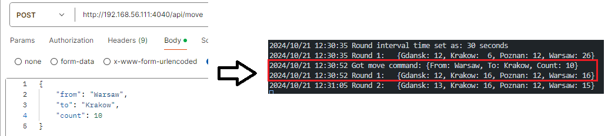

# upf-net
## Descr

The managed system here, is a network of User Plane Function nodes of some 5G system.

The nodes are present in 4 cities, hence the node names.

Program emulates the number  of PDN sessions handled by each node (in milions). 

Each round the distribution of load (a number of sessions handled) changes randomly. For each node a number between -2 and 2 is added. 

## Management problem

Random changes of load lead to uneven distribution, underutilization of node, overload of the node etc..

## Exposed API

### `api/data`

### `api/move`

## Closed control loop mission

The mission of control loop would be to keep the system at even distribution of load between the nodes using the `api/move` as Action and `api/data` as Feedback.

