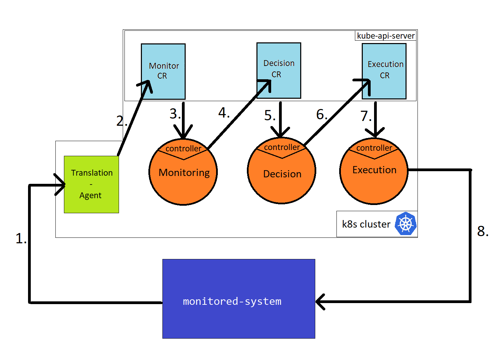
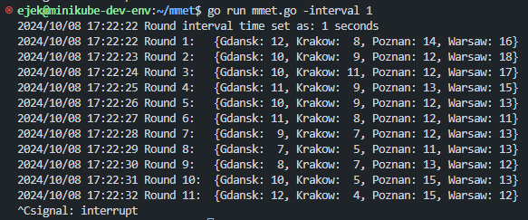
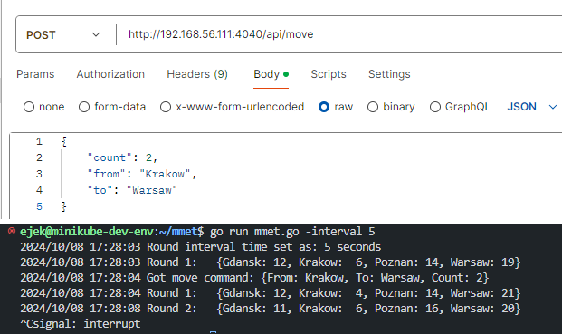
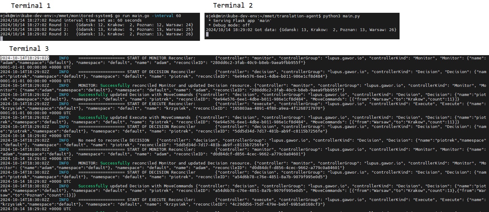
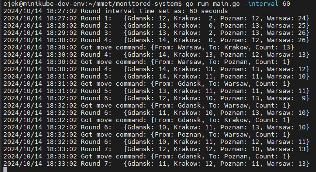
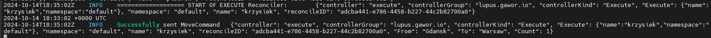
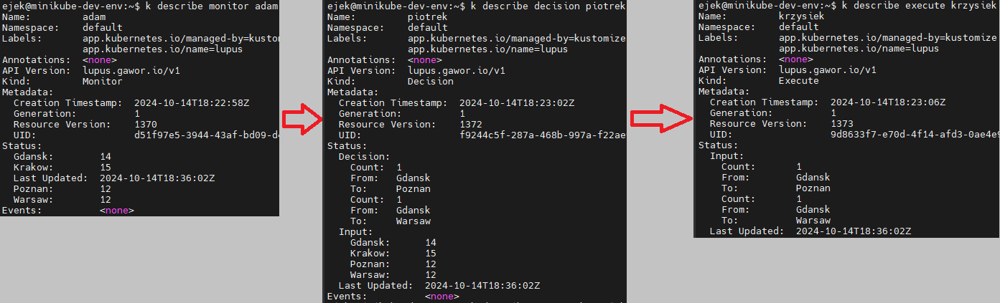
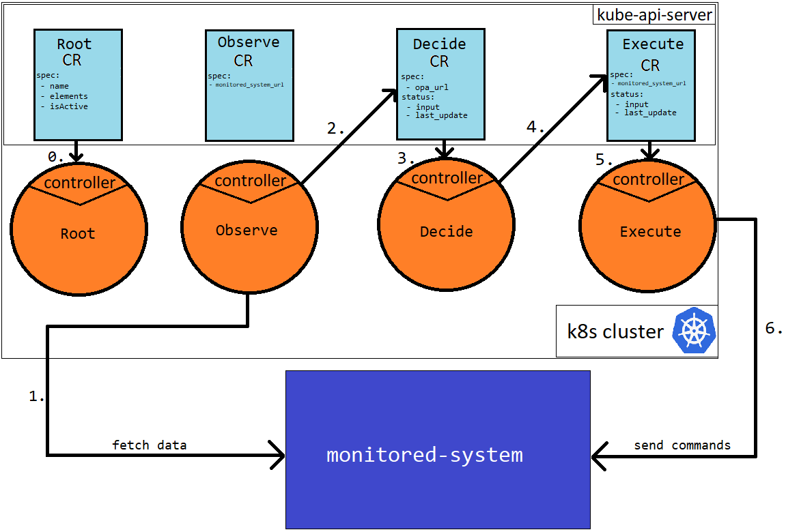

# 1st Sprint
## Achitecture


### Monitored-System
 - a go application, linux process that runs on the host, external to Lupus. It generates monitored data and pushes it periodically to `translation-agent`.



Also it has an endpoint that can move some load between the cities:



### Tranlation-Agent
 - a pythhon application, linnx process that runs on the host, part of Lupus. It obtains monitored data and modifies status of `Monitor CR object` (which triggers the loop). 

### Monitor CR 
 - a kubernetes object. Part of Lupus.
```go
// MonitorStatus defines the observed state of Managed-System
type MonitorStatus struct {
	// Number of sessions in Gdansk node
	Gdansk int `json:"gdansk,omitempty"`

	// Number of sessions in Krakow node
	Krakow int `json:"krakow,omitempty"`

	// Number of sessions in Poznan node
	Poznan int `json:"poznan,omitempty"`

	// Number of sessions in Warsaw node
	Warsaw int `json:"warsaw,omitempty"`

	// Timestamp of the last update
	LastUpdated metav1.Time `json:"lastUpdated,omitempty"`
}
```

Its controller:
```go
func (r *MonitorReconciler) Reconcile(ctx context.Context, req ctrl.Request) (ctrl.Result, error) {
	// Fetch the Monitor instance

	// Extract Gdansk, Krakow, Poznan, and Warsaw values from the Monitor's status

	// Fetch the Decision resource with name "piotrek" in the "default" namespace

	// Set the fields in the Decision resource's status

	// Update the existing Decision resource

	return ctrl.Result{}, nil
}
```

### Decision CR
 - a kubernetes object. Part of Lupus.

```go
// Input defines the 4 integer fields for different locations
type Input struct {
	Gdansk int `json:"gdansk"`
	Krakow int `json:"krakow"`
	Poznan int `json:"poznan"`
	Warsaw int `json:"warsaw"`
}

// MoveCommand represents a move command with source, destination, and count
type MoveCommand struct {
	From  string `json:"from"`  // Source location
	To    string `json:"to"`    // Destination location
	Count int    `json:"count"` // Number of items to move
}

// DecisionStatus defines the observed state of Decision
type DecisionStatus struct {
	// Holds the input object with 4 city fields
	Input Input `json:"input"`
	// List of MoveCommand objects
	Decision []MoveCommand `json:"decision,omitempty"`
	// Timestamp of the last update
	LastUpdated metav1.Time `json:"lastUpdated"`
}
```

It's controller:
```go
func (r *DecisionReconciler) Reconcile(ctx context.Context, req ctrl.Request) (ctrl.Result, error) {
	// Fetch the Decision instance

	// Extract the Input field from Decision's status

	// Pass the Input to the distributeLoad function, which returns a list of MoveCommands

	// Update the status of the Decision resource with the generated MoveCommands

	// Update the status of the Decision in the cluster

	// Fetch Execute resource with name "krzysiek" in the "default" namespace

    // Update the Status.Input of Execture "krzysiek" with moveCommands

	return ctrl.Result{}, nil
}
```

### Execute CR
 - a kubernetes object. Part of Lupus.

```go
// ExecuteStatus defines the observed state of Execute
type ExecuteStatus struct {
	Input []MoveCommand `json:"input"`
	// Timestamp of the last update
	LastUpdated metav1.Time `json:"lastUpdated"`
}
```

It's controller:
```go
func (r *ExecuteReconciler) Reconcile(ctx context.Context, req ctrl.Request) (ctrl.Result, error) {
	// Fetch the Execute instance

	// Extract the input list of MoveCommand from Execute's status

	// Iterate over each MoveCommand and send an HTTP request to monitored-system
	return ctrl.Result{}, nil
}
```

## Live demo

### Preps
Open 3 terminals, in each of the go to:
1. `cd monitored-system`
2. `cd translation-agent`
3. `cd lupus`

### Steps
All the steps have to be performed on clear minikube cluster.

> If you were using it run `minikube delete` then `minikube start`).

#### 1. Run Lupus
In 3rd terminal
```sh
make generate
make install
```

Deploy the loop by:
```sh
k apply -f config/samples/monitor-adam.yaml
k apply -f config/samples/decision-piotrek.yaml
k apply -f config/samples/execute-krzysiek.yaml
```
#### 2. Run monitored-system
In 1st terminal:

```sh
go run main.go -interval 60
```
> 60s interval will give enough time for observations

### 3. Run translation-agent
In 2nd terminal:

```sh
python3 main.py
```

### 4. Observe

When the interval passes you will observer the action.



After several rounds we will be able to see that `monitored-system` keep the even distribution.



It is done by Lupus sending move commands



Also let's take a look at Lupus's Custom Resources statuses during runtime:



## What to improve

Recommendations for the next sprint/iteration/version.

- Introduce Root CR 
- One name for all object belonging to one loop
- Get rid of translation agent
- Monitored-System should rather be queried than pushing data itself
- Fix names of loop elements
- Abstract the data 
- (last step) employ the OPA

### Details

- Introduce Root CR 
	- Instead of manually applying all loop elements, let the Root CR instantiate and manage them
	- User writes just `k apply -f config/sample/root-adam.yaml`
	- Spec of Root CR includes spec of Loop Elements
	- Controller of Root CR instantiates the loop elements
- One name for all object belonging to one loop
	- It will be obtained by root CR spec, each child element will inherit the name from loop name
- Get rid of translation agent
	- It just forwards what it gets, if any normalisation, extraction etc. has to take place, it should be in `Monitor CR`
- Monitored-System should rather be queried than pushing data itself 
	- It is more close-to-the-real-life approach, lots of network elements expose their api for OSS systems
- Fix names of loop elements
	- Now the names "Monitor", "Decision", "Execute" are noun-vs-verb non-consistent
	- Names should be either verbs or nouns
	- Also let's rethink if ODA should not be used here: Observe, Decide, Act
- Abstract the data 
	- Now the controllers are ready for single case, what if the second one arises?
	- Create the second monitored system same as in https://github.com/dbursztynowski/cloopdemo1
- (last step) employ the OPA
	- Instead of the controller has the logic/function of reconcllation move it to the OPA
	- Go to Notion->Magisterka->23-10-14


# 2nd Sprint
## Blueprints of what to improve
### Abstract the data 
- Now the controllers are ready for single case, what if the second one arises?
- Create the second monitored system same as in https://github.com/dbursztynowski/cloopdemo1

I don't see the application of the example given there. Need to come up with some new one. Maybe let's monitor some app. Tha app runs on some cloud server. It uses its resource as disk as cpu and ram. Since this is cloud server we can freely allocate as much resources as we are using. 

Let the monitored system to report resources in use, and reserved capacity (license).
```json
{
	"cpu": {
		"in_use": 12,
		"license": 20
	}
	"ram": {
		"in_use": 8,
		"license": 8
	}
}
```
As you can see above. cpu is underused in contrast to bought license. We are overpaying much more that is needed. On the other hand, we are barely sticking with the ram. In case of accidental growth of client number, an inaccessibility can occur. 

`in_use` part changes randomly, `license` is something that we, operators of the system have under control.

Our loop will ensure that `license` has always a 20% cap above the `in_use`.

`monitored-system` here is able to receive a command that sets a license for cpu or ram.

### Fix names of loop elements
- Now the names "Monitor", "Decision", "Execute" are noun-vs-verb non-consistent
- Names should be either verbs or nouns
- Also let's rethink if ODA should not be used here: Observe, Decide, Act

Let's apply ODA naming (Observe, Decide, Act), but "Act" is to short in comparion to "Decide" and "Observe" so let's change it to "Execute".


### Introduce Root CR && One name for all object belonging to one loop
- Instead of manually applying all loop elements, let the Root CR instantiate and manage them
- User writes just `k apply -f config/sample/root-adam.yaml`
- Spec of Root CR includes spec of Loop Elements
- Controller of Root CR instantiates the loop elements

- One name for all object belonging to one loop
	- It will be obtained by root CR spec, each child element will inherit the name from loop name

Spec of Root is this:
```go
//all elements of loop and root itself will have this name
Name string 
// Loop elements (e.g. "Observe", "Decide", "Execute"). Root Controller will instantiate them one by one.
// Sequence matters here as the each element will have reference to the next elements on the list as its nextElement.
// Element is a struct that has two fields: Element kind and url that has to be written in spec.
Elements []Element  
// Active flag. If set to true, the loop elements are running, if not the controller will instantiate them
IsActive bool
```

### Get rid of translation agent
- It just forwards what it gets, if any normalisation, extraction etc. has to take place, it should be in `Observe CR`.

Observe CR in its spec has to have url where to hit periodically to fetch the data.
Also Execute CR in its spec has url where to send commands.

### Abstract the data 
- Now the controllers are ready for single case, what if the second one arises?
- Create the second monitored system same as in https://github.com/dbursztynowski/cloopdemo1

The Data field in Status should be of Go type:
```go
var data map[string]interface{}
```

Wait with creation of second monitored system as it can take a lot of time.

Make it the last step.

## New Architecture


0. User applies Root CR and its controller instantiates all loop elements.
1. Observe controller periodically fetches data from `monitored-system`. Its reconcillation function always returns "reconcile again in one minute". The endpoints that has to be hit is in Observe CR spec. Controller have to ready for any kind of json response. 
2. Observe controller writes the response it got to Decide CR status as `input`. 
3. Decide controller wakes up, it takes the input and sends it to `opa_url` endoint. 
4. Decide controller receives response from opa and writes it to Execute CR status as `input`. 
5. Execute controller wakes up
6. Execute controller takes the input from status and sends it to `monitored-system`. The url is not the same as it was in Observe CR spec.

> url has to be struct of url and http method

## Steps in this sprint

1. [ ] Make monitored-system to expose API for fetching data
2. [ ] Prepare CRD of Observe CR.
3. [ ] Write controller of Observe CR. Integrate it with monitored-system.
4. [ ] Prepare CRD of Decide CR.
5. [ ] Write controller of Decide Cr (Do not call OPA at this point). Integrate it with Observe CR.
6. [ ] Prepare CRD of Execute CR.
7. [ ] Write controller of Execute CR. Intergrate it with monitored-system.
8. [ ] Prepare CRD of Root CR (name it Loop CR).
9. [ ] Write controller of Loop CR. Make it possible to instantiate Loop with one kubectl apply.
10. [ ] Integrate Loop with OPA.
11. [ ] Prepare second monitored system.
12. [ ] Prepare OPA for second monitored system. Run second loop instance.

Let's GO!
