# Journal.md

Step by step description of my accomplishements.

Toc:
- [Sprint 1](#1st-sprint)
- [Sprint 2](#2nd-sprint)
- [Sprint 3](#3rd-sprint)
- [Commands for the start of new sprint](#worth--to-add)

# 1st Sprint
## Achitecture
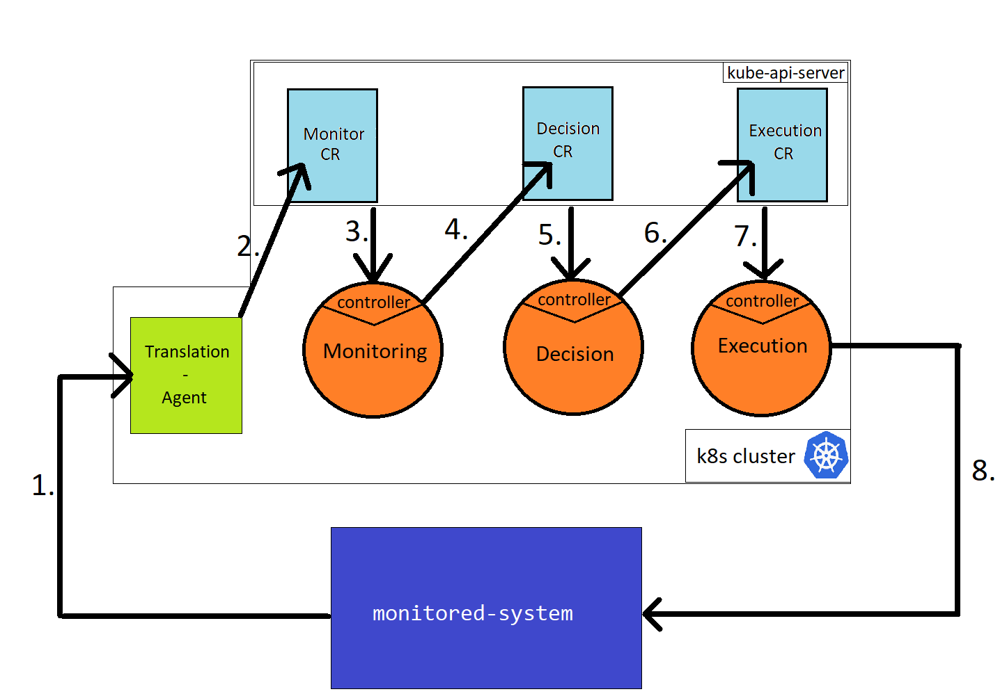

### Monitored-System
 - a go application, linux process that runs on the host, external to Lupus. It generates monitored data and pushes it periodically to `translation-agent`.

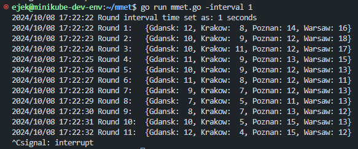

Also it has an endpoint that can move some load between the cities:

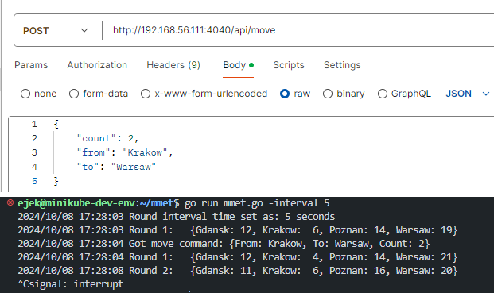

### Tranlation-Agent
 - a pythhon application, linnx process that runs on the host, part of Lupus. It obtains monitored data and modifies status of `Monitor CR object` (which triggers the loop). 

### Monitor CR 
 - a kubernetes object. Part of Lupus.
```go
// MonitorStatus defines the observed state of Managed-System
type MonitorStatus struct {
	// Number of sessions in Gdansk node
	Gdansk int `json:"gdansk,omitempty"`

	// Number of sessions in Krakow node
	Krakow int `json:"krakow,omitempty"`

	// Number of sessions in Poznan node
	Poznan int `json:"poznan,omitempty"`

	// Number of sessions in Warsaw node
	Warsaw int `json:"warsaw,omitempty"`

	// Timestamp of the last update
	LastUpdated metav1.Time `json:"lastUpdated,omitempty"`
}
```

Its controller:
```go
func (r *MonitorReconciler) Reconcile(ctx context.Context, req ctrl.Request) (ctrl.Result, error) {
	// Fetch the Monitor instance

	// Extract Gdansk, Krakow, Poznan, and Warsaw values from the Monitor's status

	// Fetch the Decision resource with name "piotrek" in the "default" namespace

	// Set the fields in the Decision resource's status

	// Update the existing Decision resource

	return ctrl.Result{}, nil
}
```

### Decision CR
 - a kubernetes object. Part of Lupus.

```go
// Input defines the 4 integer fields for different locations
type Input struct {
	Gdansk int `json:"gdansk"`
	Krakow int `json:"krakow"`
	Poznan int `json:"poznan"`
	Warsaw int `json:"warsaw"`
}

// MoveCommand represents a move command with source, destination, and count
type MoveCommand struct {
	From  string `json:"from"`  // Source location
	To    string `json:"to"`    // Destination location
	Count int    `json:"count"` // Number of items to move
}

// DecisionStatus defines the observed state of Decision
type DecisionStatus struct {
	// Holds the input object with 4 city fields
	Input Input `json:"input"`
	// List of MoveCommand objects
	Decision []MoveCommand `json:"decision,omitempty"`
	// Timestamp of the last update
	LastUpdated metav1.Time `json:"lastUpdated"`
}
```

It's controller:
```go
func (r *DecisionReconciler) Reconcile(ctx context.Context, req ctrl.Request) (ctrl.Result, error) {
	// Fetch the Decision instance

	// Extract the Input field from Decision's status

	// Pass the Input to the distributeLoad function, which returns a list of MoveCommands

	// Update the status of the Decision resource with the generated MoveCommands

	// Update the status of the Decision in the cluster

	// Fetch Execute resource with name "krzysiek" in the "default" namespace

    // Update the Status.Input of Execture "krzysiek" with moveCommands

	return ctrl.Result{}, nil
}
```

### Execute CR
 - a kubernetes object. Part of Lupus.

```go
// ExecuteStatus defines the observed state of Execute
type ExecuteStatus struct {
	Input []MoveCommand `json:"input"`
	// Timestamp of the last update
	LastUpdated metav1.Time `json:"lastUpdated"`
}
```

It's controller:
```go
func (r *ExecuteReconciler) Reconcile(ctx context.Context, req ctrl.Request) (ctrl.Result, error) {
	// Fetch the Execute instance

	// Extract the input list of MoveCommand from Execute's status

	// Iterate over each MoveCommand and send an HTTP request to monitored-system
	return ctrl.Result{}, nil
}
```

## Live demo

### Preps
Open 3 terminals, in each of the go to:
1. `cd monitored-system`
2. `cd translation-agent`
3. `cd lupus`

### Steps
All the steps have to be performed on clear minikube cluster.

> If you were using it run `minikube delete` then `minikube start`).

#### 1. Run Lupus
In 3rd terminal
```sh
make generate
make install
```

Deploy the loop by:
```sh
k apply -f config/samples/monitor-adam.yaml
k apply -f config/samples/decision-piotrek.yaml
k apply -f config/samples/execute-krzysiek.yaml
```
#### 2. Run monitored-system
In 1st terminal:

```sh
go run main.go -interval 60
```
> 60s interval will give enough time for observations

### 3. Run translation-agent
In 2nd terminal:

```sh
python3 main.py
```

### 4. Observe

When the interval passes you will observer the action.

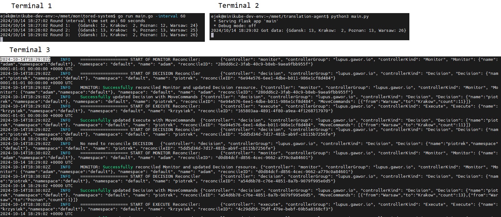

After several rounds we will be able to see that `monitored-system` keep the even distribution.

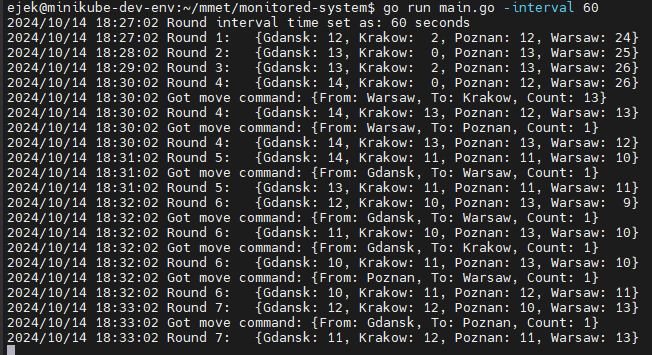

It is done by Lupus sending move commands

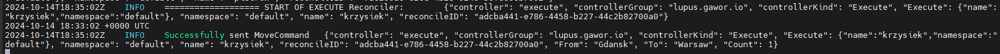

Also let's take a look at Lupus's Custom Resources statuses during runtime:


## What to improve

Recommendations for the next sprint/iteration/version.

- Introduce Root CR 
- One name for all object belonging to one loop
- Get rid of translation agent
- Monitored-System should rather be queried than pushing data itself
- Fix names of loop elements
- Abstract the data 
- (last step) employ the OPA

### Details

- Introduce Root CR 
	- Instead of manually applying all loop elements, let the Root CR instantiate and manage them
	- User writes just `k apply -f config/sample/root-adam.yaml`
	- Spec of Root CR includes spec of Loop Elements
	- Controller of Root CR instantiates the loop elements
- One name for all object belonging to one loop
	- It will be obtained by root CR spec, each child element will inherit the name from loop name
- Get rid of translation agent
	- It just forwards what it gets, if any normalisation, extraction etc. has to take place, it should be in `Monitor CR`
- Monitored-System should rather be queried than pushing data itself 
	- It is more close-to-the-real-life approach, lots of network elements expose their api for OSS systems
- Fix names of loop elements
	- Now the names "Monitor", "Decision", "Execute" are noun-vs-verb non-consistent
	- Names should be either verbs or nouns
	- Also let's rethink if ODA should not be used here: Observe, Decide, Act
- Abstract the data 
	- Now the controllers are ready for single case, what if the second one arises?
	- Create the second monitored system same as in https://github.com/dbursztynowski/cloopdemo1
- (last step) employ the OPA
	- Instead of the controller has the logic/function of reconcllation move it to the OPA
	- Go to Notion->Magisterka->23-10-14


# 2nd Sprint
## Blueprints of what to improve
### Abstract the data 
- Now the controllers are ready for single case, what if the second one arises?
- Create the second monitored system same as in https://github.com/dbursztynowski/cloopdemo1

I don't see the application of the example given there. Need to come up with some new one. Maybe let's monitor some app. Tha app runs on some cloud server. It uses its resource as disk as cpu and ram. Since this is cloud server we can freely allocate as much resources as we are using. 

Let the monitored system to report resources in use, and reserved capacity (license).
```json
{
	"cpu": {
		"in_use": 12,
		"license": 20
	}
	"ram": {
		"in_use": 8,
		"license": 8
	}
}
```
As you can see above. cpu is underused in contrast to bought license. We are overpaying much more that is needed. On the other hand, we are barely sticking with the ram. In case of accidental growth of client number, an inaccessibility can occur. 

`in_use` part changes randomly, `license` is something that we, operators of the system have under control.

Our loop will ensure that `license` has always a 20% cap above the `in_use`.

`monitored-system` here is able to receive a command that sets a license for cpu or ram.

### Fix names of loop elements
- Now the names "Monitor", "Decision", "Execute" are noun-vs-verb non-consistent
- Names should be either verbs or nouns
- Also let's rethink if ODA should not be used here: Observe, Decide, Act

Let's apply ODA naming (Observe, Decide, Act), but "Act" is to short in comparion to "Decide" and "Observe" so let's change it to "Execute".


### Introduce Root CR && One name for all object belonging to one loop
- Instead of manually applying all loop elements, let the Root CR instantiate and manage them
- User writes just `k apply -f config/sample/root-adam.yaml`
- Spec of Root CR includes spec of Loop Elements
- Controller of Root CR instantiates the loop elements

- One name for all object belonging to one loop
	- It will be obtained by root CR spec, each child element will inherit the name from loop name

Spec of Root is this:
```go
//all elements of loop and root itself will have this name
Name string 
// Loop elements (e.g. "Observe", "Decide", "Execute"). Root Controller will instantiate them one by one.
// Sequence matters here as the each element will have reference to the next elements on the list as its nextElement.
// Element is a struct that has two fields: Element kind and url that has to be written in spec.
Elements []Element  
// Active flag. If set to true, the loop elements are running, if not the controller will instantiate them
IsActive bool
```

### Get rid of translation agent
- It just forwards what it gets, if any normalisation, extraction etc. has to take place, it should be in `Observe CR`.

Observe CR in its spec has to have url where to hit periodically to fetch the data.
Also Execute CR in its spec has url where to send commands.

### Abstract the data 
- Now the controllers are ready for single case, what if the second one arises?
- Create the second monitored system same as in https://github.com/dbursztynowski/cloopdemo1

The Data field in Status should be of Go type:
```go
var data map[string]interface{}
```

Wait with creation of second monitored system as it can take a lot of time.

Make it the last step.

## New Architecture

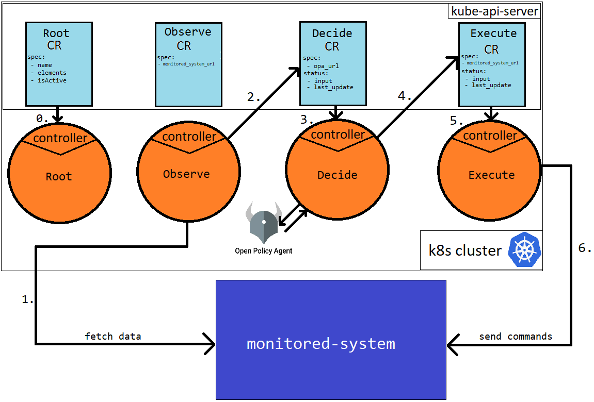
0. User applies Root CR and its controller instantiates all loop elements.
1. Observe controller periodically fetches data from `monitored-system`. Its reconcillation function always returns "reconcile again in one minute". The endpoints that has to be hit is in Observe CR spec. Controller have to ready for any kind of json response. 
2. Observe controller writes the response it got to Decide CR status as `input`. 
3. Decide controller wakes up, it takes the input and sends it to `opa_url` endoint. 
4. Decide controller receives response from opa and writes it to Execute CR status as `input`. 
5. Execute controller wakes up
6. Execute controller takes the input from status and sends it to `monitored-system`. The url is not the same as it was in Observe CR spec.

> url has to be struct of url and http method

## Steps in this sprint

1. [ ] Make monitored-system to expose API for fetching data
2. [ ] Prepare CRD of Observe CR.
3. [ ] Write controller of Observe CR. Integrate it with monitored-system.
4. [ ] Prepare CRD of Decide CR.
5. [ ] Write controller of Decide Cr (Do not call OPA at this point). Integrate it with Observe CR.
6. [ ] Prepare CRD of Execute CR.
7. [ ] Write controller of Execute CR. Intergrate it with monitored-system.
8. [ ] Prepare CRD of Root CR (name it Loop CR).
9. [ ] Write controller of Loop CR. Make it possible to instantiate Loop with one kubectl apply.
10. [ ] Integrate Loop with OPA.
11. [ ] Prepare second monitored system.
12. [ ] Prepare OPA for second monitored system. Run second loop instance.

Let's GO!

## Problems

You cannot use `map[string]interfface{}` in Kubebuilder. It prevents you from it.

# 2nd Sprint - end of implem

## Live demo

### Preps

Clone repo:
```sh
 git clone https://github.com/0x41gawor/mmet
```

Open 4 terminals and in each:
1. name it "OPA", set tab color to "gray", `cd .`
2. name it "make run", set tab color to "pink", `cd lupus`
3. name it "monitored-system", set tab color to "dark blue", `cd monitored-system`
4. name it "kubectl", set tabl color to "light blue", `cd .`

### Steps

#### 1. Prepare OPA
##### 1.1 Run OPA
On 1st terminal
```sh
docker run -p 8181:8181 openpolicyagent/opa     run --server --log-level debug
```

From now on you can use Postman or perform curl commands in terminal:
##### 1.2 Put policy
```sh
curl --location --request PUT 'http://192.168.56.111:8181/v1/policies/mmet' \
--header 'Content-Type: text/plain' \
--data 'package mmet

# Rule to calculate the total usage
total_usage := sum([v | city = input[_]; v = city])

# Rule to calculate the target usage for each city based on the desired percentages
target_usage[city] := target {
    percentage := data.percentages[city]
    target := total_usage * percentage / 100
}

# Rule to identify cities that are above their target usage
overloaded[city] := {
    "city": city,
    "excess": usage - target
} {
    usage := input[city]
    target := target_usage[city]
    usage > target
}

# Rule to identify cities that are below their target usage
underloaded[city] := {
    "city": city,
    "deficit": target - usage
} {
    usage := input[city]
    target := target_usage[city]
    usage < target
}

# Rule to generate move commands by pairing overloaded cities with underloaded cities
move_commands[command] {
    from := overloaded[_]
    to := underloaded[_]
    from_excess := from.excess
    to_deficit := to.deficit

    # Determine the move count based on the minimum of excess and deficit
    count := min([from_excess, to_deficit])

    # Round the count to an integer if necessary
    count_int := round(count)

    # Create the move command
    command := {
        "From": from.city,
        "To": to.city,
        "Count": count_int
    }
}'
```

You can check if it exists by:
```sh
curl --location 'http://192.168.56.111:8181/v1/policies/mmet'
```

##### 2.3 Put data
```sh
curl --location --request PUT 'http://192.168.56.111:8181/v1/data/percentages' \
--header 'Content-Type: application/json' \
--data '{
    	"Gdansk": 25,
		"Krakow": 25,
		"Poznan": 25,
		"Warsaw": 25
}'
```

You check if it exists by:
```sh
curl --location 'http://192.168.56.111:8181/v1/data/percentages' \
--data ''
```

##### 2.4 Perform test query
```sh
curl --location 'http://192.168.56.111:8181/v1/data/mmet/move_commands' \
--header 'Content-Type: application/json' \
--data '{
    "input":{
        "Gdansk": 12,
        "Krakow": 8,
        "Poznan": 10,
        "Warsaw": 13
    }
}'
```

#### 2. Install CRD in your cluster

Go to 2nd terminal

```sh
make generate
make install
```

To check if CRDs are installed you can run in 4th terminal `k get loops`. 

##### 3. Run monitored-system

Go to 3rd terminal
```sh
go run main.go -interval 30
```

##### 4. Run controllers

Go to 2nd terminal
```sh
make run
```

##### 5. Apply loop resource

Go to 4th terminal:

```sh
 k apply -f config/samples/adam.yaml
```

#### The test

After few loop iteration with errors in logs the states becomes "ustalony" and lupus starts to send move commands 

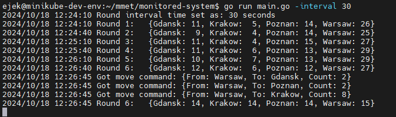

Remember that with Opa you can change the distribution:

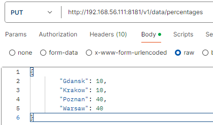

And observe the effects of such action 

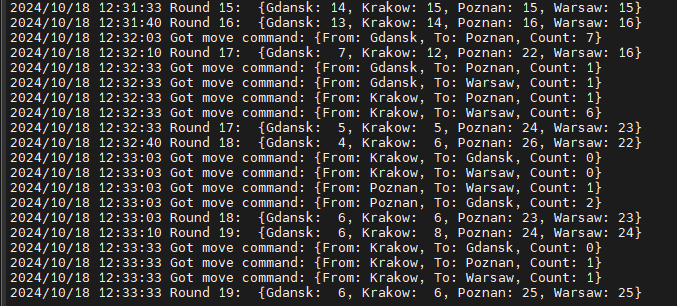


To tidy up after the test do not forget about 

```sh
k delete loop adam
``` 

in 4th terminal.

# 2nd Sprint - Summary

After meeting with thesis supervisor (24-10-18).

## What to improve?

- Example
	- About mmet. Load balancing of MME is done at S1-MME interface between eNodeB and MME. The decision to be done here requires real-time action. Kubernetes is not applicable for real-time. It is too slow. In k8s we can do management with success - not control plane. For real-time some fast dedicated programs in C, C++, Rust. 
	- So the topic of our management system has to be clearly of management. Especially it cannot be about deciding of serving MME for newly attached user to the network (it don't event work this way, specific gNodeB has specific MME assigned). 
	- E.g. we can balance the loads on gateways (e.g. UPF (get rid o 4G, focus on 5G)) afterwards. We can observe the load on UPF elements and rearrange them if needed. But this is happening after the fact of assigning given UE to given UPF instance.
	- Keep in mind that in the future it would be good to plug in some real system into Lupus, not only emulators. E.g. Free5GC or Open5GS would be a good idea.
	- Also every `monitored-system` has to have its architecture and short description. Lack of this failed my presentation for supervisior and made it difficult for him to understand my concept.
- Ingress and Egress agent
	- In 2nd Sprint I've got rid of Translation-Agent as this element seemed to be underutilized. But when the number of external system grows (need to come up with 3rd idea btw), we can observe the common part of Lupus. E.g. for Lupus to be data driven it needs certain criteria of Input or Output to be met. Now I need to adjust every system to meet them. But this should not be the case. The monitored system should not be modified in any way. This is the place for Ingress and Egress agents. On one side they have common, well-known Lupus-specified interface, at second end they communicate with monitored-system with its specific API. The user of Lupus need to develop Ingress and Egress agents on its own, with our guidelines and examples provided.
	> Change `monitored-system` to `managed-system`
- Define the user of Lupus and his actions. Define the target audience etc. What user is able to do, what will have to do if want to use our platform etc. Especially we will give the client/user CRDs that he has to install in his K8s cluster and set of instructions which he has to follow to first develop and then use Lupus as the control/management center for his desired loop.
- Support for non-linear loops.
	- Current impementation lets the user to create linear loops. With one thread and no forks. We need to enchance this part of framework. Define what has to be done with input (what action) and define the destination of each action's output. Escpecially one output can go to multiple destinations. We need to allow for fork. E.g. the element "Decide" can send its output to element "Execute" but also to element "Learn", whose goal is to send executed actions to some storage.
- Support of more complicated set of actions
	- Now the elements has one predefined (programmed into controller logic) action. The action is: read input from Status, send it to given enpoint, write output as Status of the next element,
	- What if we enhance this part of framework also? What if the element "Decide" can receive set of actions in some our-defined language and interprete it? E.g. we can provide actions set in a file or directly in the CR YAML MANIFEST FILE.

## What to keep?
- I want to preserve the data-driven approach. Lupus in only automata to smuggle data and is transparent to it, contains zero logic relating the data.
- I want to preserve that everything can be defined in Master/Root/Loop CR YAML MANIFEST FILE.

# 3rd Sprint
## Blueprints of what to improve
### Examples

First, we change the name `monitored-system` to `managed-system`. 

Second each we create directory managed-systems and here the subdirectory for each of them.

Each subdir contains:
- the Go program that emualtes the managed-system
- readme with full description of managed system
	- what it is (some drawings)
	- the problem for the Lupus to solve
	- the communication with Lupus in both directions
- ingress-agent application (a python script)
- egress-agent application (a python script)

### Ingress and Egress agents

Integration of each managed-system and Lupus requires pair of Ingress and Egress agents.

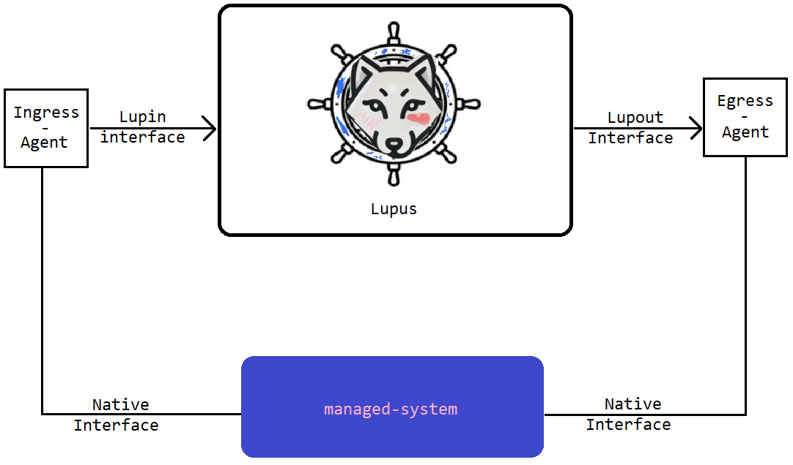

Interfaces Lupin and Lupout are well defined and specified. This is the way to talk with Lupus elements.

Lupin and Lupout are single-directed and have specific form of communication. They impose requirements on Ingress/Egress Agents which are developed by the Lupus client.

We could saw the imposed requirements in 2nd Sprint as the both managed-systems had to expose their API in certain way.

Lupin interface specifies that Ingress Agent has to update the `input` field of `status` of Lupus Observe CR. This will trigger the loop iteration.

Lpuout interface specifies that Egress Agent has to accept a HTTP request with json body with root field `commands` being the array of commands understood by Lupus which managed-system has to perform. Egress Agent mission is to translate these commands to be understandable for managed-system API and execute them.

### Define the user
The target audicence is an organisation that has to manage lots of systems and thrives for a place where multiple loops can be defined, managed and have their runtime environment. 

Each use of Lupus for management of some managed-system requires to:
- develop the Ingress and Egress Agents, that will stick to Lupin and Lupout interfaces specification* 
- design the loop workflow, prepare the loop elements
- express the designed logic in Root/Master/Loop CR YAML Manifest File

> *It could be done in any technology, but Lupus.io will use python for its examples as it has the easiest K8s client.

So as you can see it requires some programmistic work for the development of Ingress/Egress Agents. The second part can be done in some external tool, whatever is more convenient for someone. 3rd part requires to get familiar with our syntax and to uderstand the syntax of YAML files.


### Support for non-linear loops. 

Our current loop implement is linear.
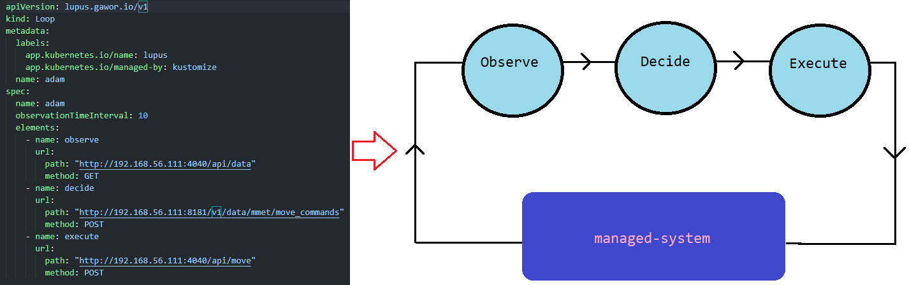

We need to come up with an idea that our loop can be build of more complicated relationships between elements e.g.

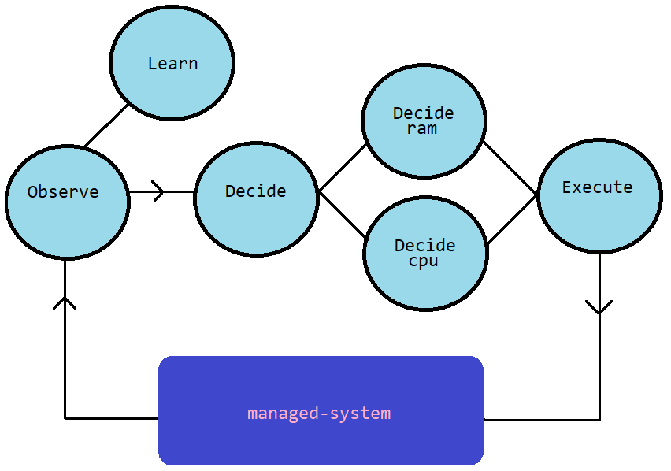

### More complex set of actions

Currently our elements perform one single action with 4 steps:
1. receive the input in form of Status update from previous element
2. hit the HTTP endpoint specified by Spec with input as json body
3. receive the reponse and save it as output
4. update the Status.Input of next element

How we can enhance that?
1. This is untouchable, it has to work that way, we cannot enhance it
2. Maybe add other protocols than HTTP. Maybe gRPC? Maybe GraphQL? Maybe local python file?
2, 3, 4. This actions can be chained and output of one can be the input for another? Maybe we can tag output and in this way inform our Spec what has to be forwarded where? But this has to have single thread, cannot be divided (Division and pararellity will be the subject of design of elements).

Single Action can have spec that says: "Your name is W (string). Take input with tag X (string), and send it to Y (external block spec), tag its output as Z (string)".

Then at the end the json with all active tags (that were not used as input for any action) is created (by combining all active outputs) and states as the Ouput of this Element.

> Go will handle this as `map[]interfaceP{}` to keep track of tags

e.g.

```yaml
Root CR
- elements
...
	- type: Decision
	- actions:
		- name: ram-handler
		  input_tag: ram  # this will take the json object named "ram" from the json object where root elements are "ram" and "cpu"
		  destination:
		  	- type: HTTP
		  	- path: http://192.168.56.111:8181/v1/data/netflix/new_license/ram
			- method: POST
		  output_tag: ram
		- name: cpu-handler
		  input_tag: cpu # anal. to above
		  destiantion:
		    - type: gRPC
		  	- url: http://pcrf.mnonet.pl:8181/netflix/new_license
		  output_tag: cpu
	- next:
		- name: execute # all tags will be sent as input
		  tags: *
		- name: learn
		  tags: cpu # only cpu tag will be sent as input of this element
```

Decide controller will have to has the interpreter for such actions.

## New Architecture


## Steps in 3rd sprint

- [ ] Prepare managed system directory (code them as the Lupus would not exist)
	- [ ] Code the upf-net managed system
	- [ ] Code the netflix-server managed system
- [ ] Prepare Ingress/Egress agents for both managed systems
	- [ ] Prepare specification for Lupin and Lupot interfaces (based on last sprint) (create docs/ dir)
	- [ ] Code the Ingress/Egress agents for upf-net 
	- [ ] Code the Ingress/Egress agents for netflix-server 
- [ ] Learn Go and Kubebuilder code
	- [ ] Analyze the code of controllers written so far
	- [ ] Make docs of most popular used functionalities
	- [ ] Rethink the idle run
- [ ] Code the Lupus
	- [ ] Prepare CRD of Observe CR, Decide CR, Learn CR and Execute CR
	- [ ] Prepare CRD of Master CR
	- [ ] Write controller of Master CR
	- [ ] Write controller of Observe CR
	- [ ] Write controller of Learn CR (let is save the input to the file)
	- [ ] Research of gRPC communication, so you will have two types od `destination`, create gRPC bouncer, skip NoSQL and GraphQL as for now
	- [ ] Write controller of Decide CR (along with actions interpreter)
	- [ ] Write controller of Execute CR
- [ ] Create User Guidelines (What user has to do to use our platform)
	- [ ] Draft 
	- [ ] Github docs

### Worth  to add
	In step 4 (Code the Lupus) as in every preeceding sprint I like to start with a greenfield project. I am deleting the whole kubebuilder project and creating a plain one:

	```sh
	# When in lupus main dir
	rm -rf lupus
	mkdir lupus
	cd lupus
	kubebuilder init --domain gawor.com --repo github.com/0x41gawor/lupus
	# then create apis with 
	kubebuilder create api --group lupus --version v1 --kind Execute
	```

### Let's go

Sample observe spec:
```yaml
spec:
  next:
    - name: decide
      tags: ["*"]
    - name: learn
      tags: ["*"]
```

Destination in yaml
```yaml
destination:
    type: "HTTP"
    http:
      path: "/api/v1/resource"
      method: "POST"
```
```yaml
destination:
    type: "FILE"
    file:
      path: "/tmp/output.txt"
```
```yaml
destination:
    type: "gRPC"
    grpc:
      host: "localhost:50051"
      service: "UserService"
      method: "GetUser"
```

Then, in Contoller code
```yaml
 dest := resource.Spec.Destination

    switch dest.Type {
    case "HTTP":
        if dest.HTTP == nil {
            return ctrl.Result{}, fmt.Errorf("HTTP destination type selected but HTTP fields are not set")
        }
        // Process HTTP Destination
        fmt.Printf("Processing HTTP Destination: Path=%s, Method=%s\n", dest.HTTP.Path, dest.HTTP.Method)
        // Add your HTTP processing logic here

    case "FILE":
        if dest.File == nil {
            return ctrl.Result{}, fmt.Errorf("FILE destination type selected but File fields are not set")
        }
        // Process File Destination
        fmt.Printf("Processing File Destination: Path=%s\n", dest.File.Path)
        // Add your File processing logic here

    case "gRPC":
        if dest.GRPC == nil {
            return ctrl.Result{}, fmt.Errorf("gRPC destination type selected but gRPC fields are not set")
        }
        // Process gRPC Destination
        fmt.Printf("Processing gRPC Destination: Host=%s, Service=%s, Method=%s\n", dest.GRPC.Host, dest.GRPC.Service, dest.GRPC.Method)
        // Add your gRPC processing logic here

    default:
        return ctrl.Result{}, fmt.Errorf("unknown destination type: %s", dest.Type)
    }
```

Sample Master CR spec:
```yaml
apiVersion: lupus.gawor.io/v1
kind: Master
metadata:
  labels:
    app.kubernetes.io/name: lupus
    app.kubernetes.io/managed-by: kustomize
  name: master-sample
spec:
  name: "example-master"
  elements:
    - name: "observe-1"
      type: "Observe"
      observeSpec:
        next:
          - name: "decide"
            tags: ["*"]
    - name: "decide-1"
      type: "Decide"
      decideSpec:
        actions:
          - name: "send-to-http"
            input_tag: "*"
            destination:
              type: "HTTP"
              http:
                path: "/api/decision"
                method: "POST"
        next:
          - name: "learn"
            tags: ["*"]
    - name: "learn-1"
      type: "Learn"
      learnSpec:
        destination:
          type: "FILE"
          file:
            path: "/data/output.json"
    - name: "execute-1"
      type: "Execute"
      executeSpec:
        destination:
          type: "HTTP"
          http:
            path: "/api/execute"
            method: "POST"
```

## 3rd Sprint - Live demo

Live demos are described in Live Demo sections of:
- [managed-system/upf-net/sample-loop/readme.md](managed-systems/upf-net/sample-loop/readme.md)
- [managed-system/mc-server/sample-loop/readme.md](managed-systems/mc-server/sample-loop/readme.md)