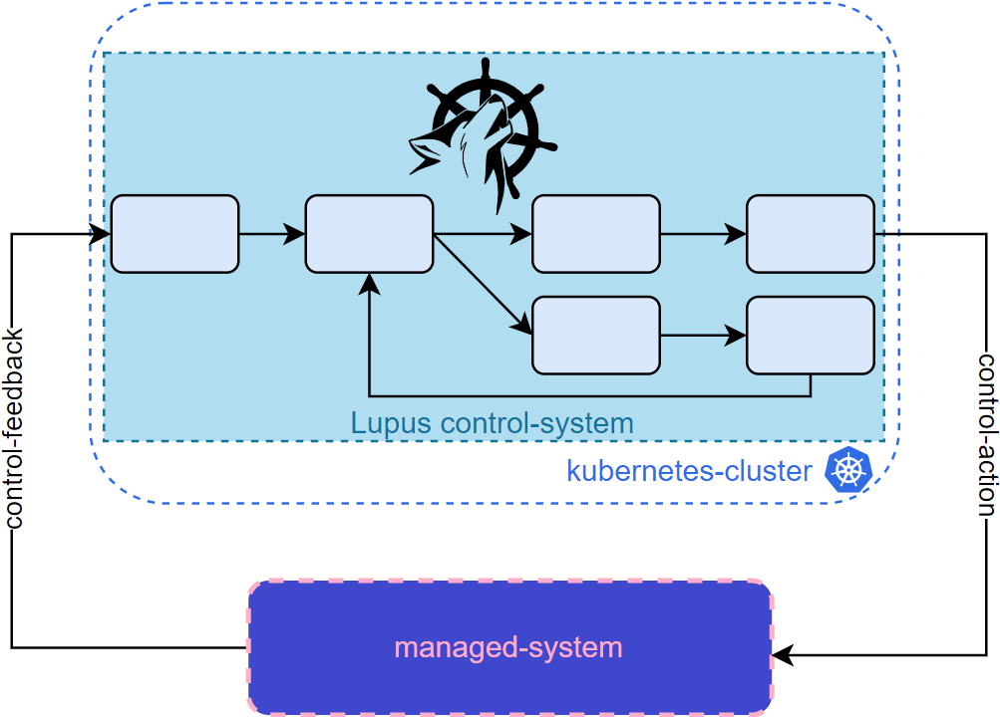
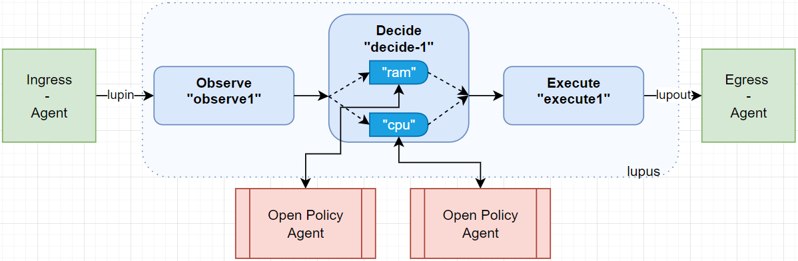
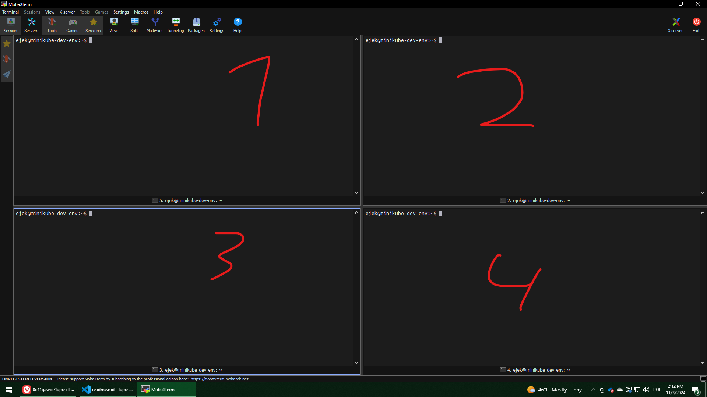

# Exemplary use of Lupus for `mc-server`

Let's bring back the general architecture for Lupus application:



First, you need to develop Ingress and Egress Agents:

- [Ingress Agent](ingress-agent.py)
- [Egress Agent](egress-agent.py)

Now, design the architecture of Loop:


Prepare the external elements of Loop:
- [open-policy-agent](opa.md)

# Live demo
## Prerequisities
- Minikube running
- CRD installed
- move to the root dir of this repo
## Steps
### 1. Prepare static external elements
#### 1.1 Opa
Run
```sh
docker run -p 8282:8181 openpolicyagent/opa     run --server --log-level debug
```
Setup
```sh
./setup_opa.sh
```
### 2. Run Egress-Agent
```sh
python3 managed-systems/mc-server/sample-loop/egress-agent.py 
```
### 3 Main part
Run 4 terminals and enable split mode


First, at 4 run the managed system
```sh
go run managed-systems/mc-server/main.go -interval 30
```
Then, in 2 run the controller
```sh
cd lupus
make run
```
In 1 run create the Lupus elements
```sh
k apply -f managed-systems/mc-server/sample-loop/master.yaml
```
And finally, in 2, run Ingress-Agent:
```sh
python3 managed-systems/mc-server/sample-loop/ingress-agent.py -interval 30
```
### 4 Debugging
Loop already runs. What you can do now is look into Lupus elements in terminal 1
```sh
k describe observe olek-observe1
k describe decide olek-decide1
k describe execute olek-execute1
k describe learn olek-learn1
```