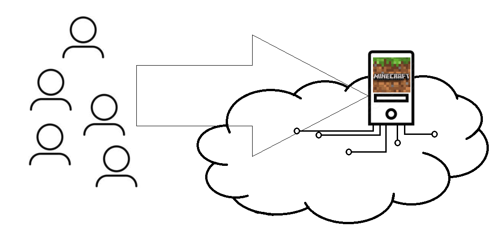
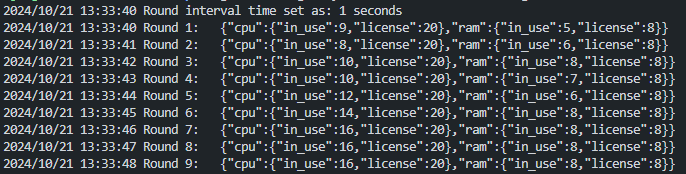
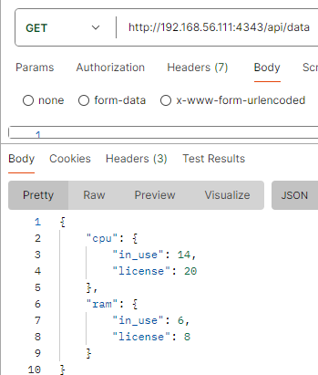
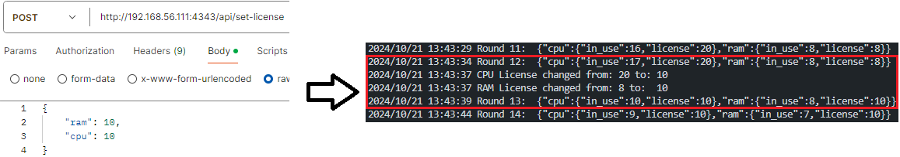

# minecraft-server
## Descr
The managed system here, is a single application server deployed as a virtual machine in a cloud environment.

Program emulates the utilization of ram and cpu resources by this application. Each round a number between -1 and 2 is added to the cpu and ram respectively.

 

Since we are in the cloud environment the assured resources by the infra provied for the app are managed thorugh the license. 

## Management problem

The utilziation is random and changes dynamically, the non-managed licenses would make the app to have not enough resources bought (and not serve some of it clients) or to overpay over for bought resoruces since the utilization is much less.

We would always want the license to be same as the utliziation with 20% margin for accidental peak.

## Exposed API
### `api/data`

### `api/set-license`

## Closed control loop mission

The purpose of control loop would be to keep the license value always 20% above the in_use value for each resource. 

`api/set-license` would be used as Action and `api/data` as Feedback.