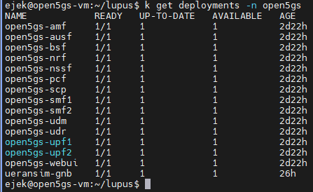
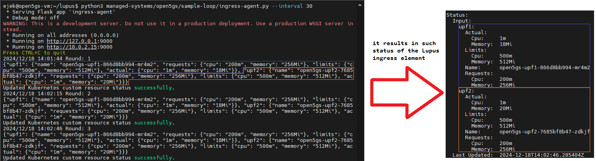
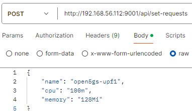
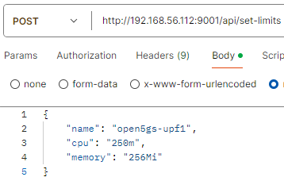

# Open5GS
## Descr
Open5gs requires no description as this managed-system is not developed by me. [The official page is here](https://open5gs.org).

In my case I've deployed Open5GS in a Kubernetes cluster following this repo: https://github.com/niloysh/open5gs-k8s of Niloy Saha.

It is important to note that I did not deployed UERANSIM in a cluster but rather directly on the host machine. In this way, the `uesimtun0` interface used for 5G traffic is created directly on the host. And since my host is Ubuntu 22.04, a way more tool-rich OS than Alpine linux distribution I have much more possiblity to generate traffic workload for UPF network functions.

## Management problem
What I am trying to do is to keep UPF requested resources values at a perfect level. Perfect means sufficient but not too high to avoid cloud lease costs.
We have several deployments in open5gs inluding UPF ones.

## Exposed API
### ingress-agent
`ingress-agent` will fetch the Kubernetes metrics to know the actual and live usage of resources by UPF pods.

### egress-agent
Exposes endpoints that are able to modify the k8s resources (i.e. requests and limits for UPF pods) 

#### `api/set-requests` 

#### `api/set-limits`
