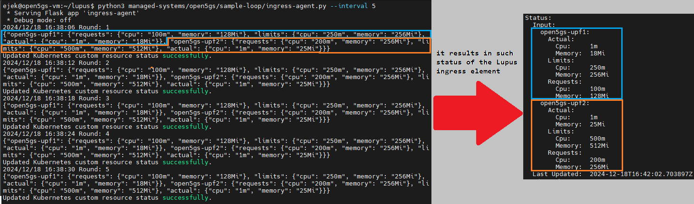

# Open5GS
## Descr
Open5GS requires no introduction, as this managed system was not developed by me. You can find [the official page here](https://open5gs.org).

In my case, I've deployed Open5GS in a Kubernetes cluster following this repo https://github.com/niloysh/open5gs-k8s maintained by Niloy Saha.

It is important to note that I did not deploy UERANSIM in the cluster. Instead, I deployed it directly on the host machine. This setup creates the `uesimtun0` interface, which is used for 5G traffic, directly on the host. Since my host runs Ubuntu 22.04—a significantly more feature-rich OS compared to the Alpine Linux* distribution—this approach provides far greater flexibility for generating traffic workloads for the UPF network functions.

> *Alpine Linux is used as base image for UERANSIM and it lacks lots of tools for traffic generation.

## Management problem
I aim to keep the requested resource values for the UPF (User Plane Function) at an optimal level. Optimal means sufficient for the workload but not excessive, to avoid unnecessary cloud lease costs.

We have several deployments in Open5GS, including UPF ones:


Each pod in a Kubernetes cluster has defined resource requests and limits:
- `requests` The CPU and memory (RAM) resources a pod requests from the cloud environment. Kubernetes ensures that the node has sufficient resources to meet these requests when scheduling the pod.
- `limits` The maximum resource usage allowed for a pod. If a pod exceeds these limits, it is terminated (e.g., killed to protect the environment).

Additionally, we can monitor the actual (current, momentary) usage of CPU and memory.

Kubernetes provides the following capabilities:
- Monitor the current usage of CPU and memory for a specific pod.
- Monitor the defined `requests` and `limits` for a specific pod.
- Update the `requests` and ``limits` values for a specific pod.

The deployment for UPF in [open5gs-k8s](https://github.com/niloysh/open5gs-k8s) uses the following resource values:
```yaml
resources:
  requests:
    memory: "256Mi"
    cpu: "200m"
  limits:
    memory: "512Mi"
    cpu: "500m"
```
Let's consider this configuration as our operating point, which we expect to be sufficient under normal conditions (e.g., 80% of the time).
However, when a UPF pod occasionally exceeds these values, we should increase our caution and allocate more resources. Additionally, the limits should be raised accordingly.

Let's assume that each time memory or CPU usage exceeds the operating point, we allocate an additional 20% for requests and set the limits to 2× the requested value.


For example:
- When the CPU usage reaches `270m`, we would:
    - Set the request to `270m × 1.2 = 324m`.
    - Set the limit to `324m × 2 = 648m`.
- Similarly, this approach applies to memory usage.

If usage is much less than operating point we don't care. It would cause too many unnecessary restarts of the Pods and would cause more costs than underusage causes.

## Exposed API
### ingress-agent
`ingress-agent` will fetch the Kubernetes metrics to obtain current usage of resources and defined requests and limits values



### egress-agent
Exposes endpoints that are able to modify the k8s resources (i.e. requests and limits for UPF pods) 

#### `api/set-requests` 


#### `api/set-limits`
