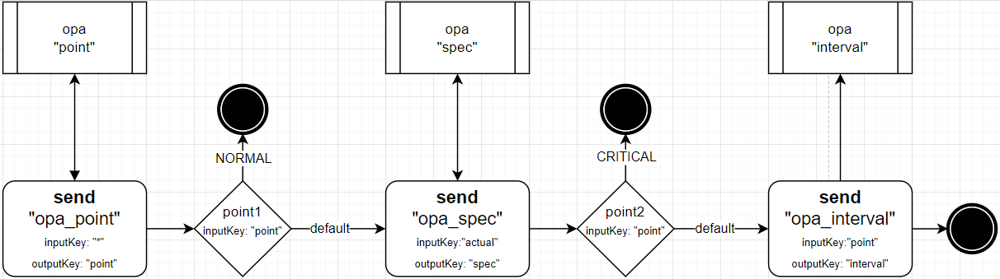
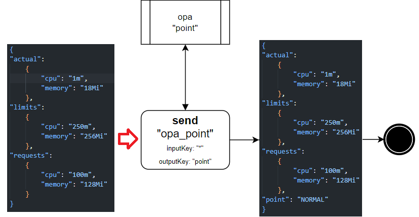
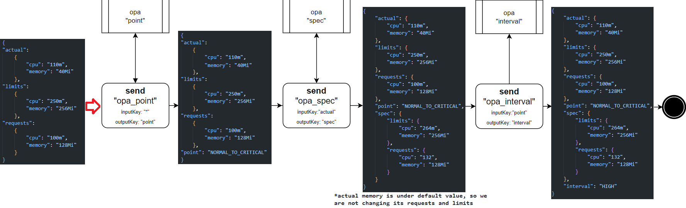
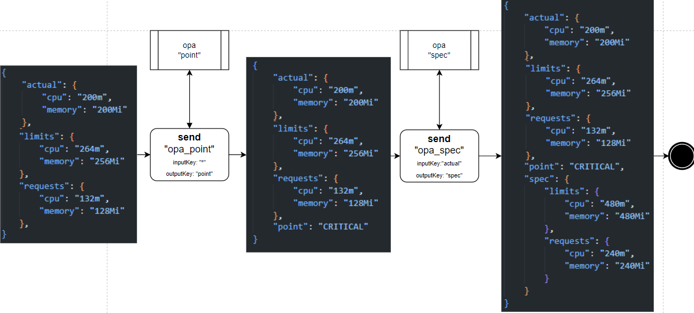
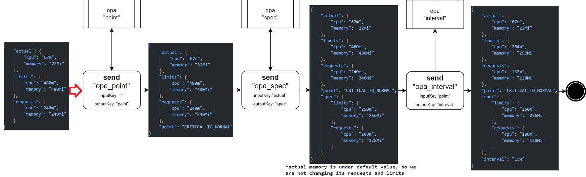

# Exemplary use of Lupus for Open5GS

# Loop design

First get familiar with [Management problem](../readme.md#management-problem). 

When the Data comes in such format:
```json
{
"actual":
	{
		"cpu": "1m"
		"memory": "18Mi"
	},
"limits":
	{
		"cpu": "250m",
		"memory": "256Mi"
	},
"requests":
	{
		"cpu": "100m",
		"memory": "128Mi"
	}
}
```
We can define 4 states in which the system can be, either:
- operational point: request and limits are set on default values, actual is under default values -> `NORMAL`
- switch from NORMAL to critical: requests and limits are still set on default, but actual is higher -> `NORMAL_TO_CRITICAL`
- ciritcal: requests and limits above default, actual above default -> `CRITICAL`
- switch from CRITICAL to NORMAL: requests and limits still above default, but actual is below default -> `CRITICAL_TO_NORMAL`

What should be done in each state:
- `NORMAL` - nothing, todos estas bien
- `NORMAL_TO_CRITICAL` - set requests and limits accordingly, set observe interval to HIGH
- `CRITICAL` - set requests and limits accordingly
- `CRITICAL_TO_NORMAL` - set requests and limits to default, set observe interval to LOW

We can derive 3 Open Policy Services from this description:
- `POINT` -> accepts "*" (all Data fields), sends back "point"
- `SPEC` -> accepts "actual", sends back "spec" with "reqests" and "limits" inside of it
- `INTERVAL` -> accepts "point", sends back "interval"



### Data flow
Let's analyze loop flow along with Data for 4 cases - one for each state.

#### Case 1 (NORMAL)

#### Case 2 (NORMAL_TO_CRITICAL)

#### Case 3 (CRITICAL)

#### Case 4 (CRITICAL_TO_NORMAL)


### Open Policy Agent
#### point
```rego
package policy

default point = "NORMAL"

default_values = {
    "requests": {
        "memory": "256Mi",
        "cpu": "200m"
    },
    "limits": {
        "memory": "512Mi",
        "cpu": "500m"
    }
}

cpu_in_millicores(cpu_str) = value {
    unit := substring(cpu_str, -1, -1)
    number := trim_suffix(cpu_str, unit)
    value := {
        "m": to_number(number),
        "": to_number(number) * 1000
    }[unit]
}

memory_in_megabytes(memory_str) = value {
    unit := substring(memory_str, -2, -1)
    number := trim_suffix(memory_str, unit)
    value := {
        "Ki": to_number(number) / 1024,
        "Mi": to_number(number),
        "Gi": to_number(number) * 1024,
        "": to_number(number)
    }[unit]
}

higher_than_default(category, resource) {
    actual_value := input[resource][category]
    default_value := default_values[resource][category]
    actual := {
        "cpu": cpu_in_millicores(actual_value),
        "memory": memory_in_megabytes(actual_value)
    }[category]
    
    default := {
        "cpu": cpu_in_millicores(default_value),
        "memory": memory_in_megabytes(default_value)
    }[category]
    
    actual > default
}

operational_point {
    not higher_than_default("memory", "requests")
    not higher_than_default("cpu", "requests")
    not higher_than_default("memory", "limits")
    not higher_than_default("cpu", "limits")
    not higher_than_default("memory", "actual")
    not higher_than_default("cpu", "actual")
}

switch_to_critical {
    not higher_than_default("memory", "requests")
    not higher_than_default("cpu", "requests")
    not higher_than_default("memory", "limits")
    not higher_than_default("cpu", "limits")
    higher_than_default("memory", "actual")
    higher_than_default("cpu", "actual")
}

critical {
    higher_than_default("memory", "requests")
    higher_than_default("cpu", "requests")
    higher_than_default("memory", "limits")
    higher_than_default("cpu", "limits")
    higher_than_default("memory", "actual")
    higher_than_default("cpu", "actual")
}

switch_to_normal {
    higher_than_default("memory", "requests")
    higher_than_default("cpu", "requests")
    higher_than_default("memory", "limits")
    higher_than_default("cpu", "limits")
    not higher_than_default("memory", "actual")
    not higher_than_default("cpu", "actual")
}

point = "NORMAL" {
    operational_point
}

point = "NORMAL_TO_CRITICAL" {
    switch_to_critical
}

point = "CRITICAL" {
    critical
}

point = "CRITICAL_TO_NORMAL" {
    switch_to_normal
}
```
#### spec
```rego
package policy

default_values := {
    "requests": {
        "memory": "256Mi",
        "cpu": "200m"
    },
    "limits": {
        "memory": "512Mi",
        "cpu": "500m"
    }
}

result := output {
    actual := input.actual
    output := {
        "limits": {
            "cpu": calculate_limit("cpu", actual.cpu),
            "memory": calculate_limit("memory", actual.memory)
        },
        "requests": {
            "cpu": calculate_request("cpu", actual.cpu),
            "memory": calculate_request("memory", actual.memory)
        }
    }
}

# Function to calculate requests based on actual values
calculate_request(resource, actual) = value {
    actual_num := convert_to_numeric(actual)
    default_num := convert_to_numeric(default_values.requests[resource])

    value := default_values.requests[resource] if actual_num <= default_num
    value := convert_to_unit(resource, actual_num * 1.2) if actual_num > default_num
}

# Function to calculate limits based on actual values
calculate_limit(resource, actual) = value {
    actual_num := convert_to_numeric(actual)
    default_num := convert_to_numeric(default_values.requests[resource])

    value := default_values.limits[resource] if actual_num <= default_num
    value := convert_to_unit(resource, actual_num * 2.4) if actual_num > default_num
}

# Helper function to convert CPU and memory strings to numeric values
convert_to_numeric(value) = num {
    endswith(value, "m")
    num := to_number(trim_suffix(value, "m")) / 1000
} else = num {
    endswith(value, "Mi")
    num := to_number(trim_suffix(value, "Mi")) * 1024 * 1024
} else = num {
    num := to_number(value)
}

# Helper function to convert numeric values back to units
convert_to_unit(resource, value) = str {
    resource == "cpu"
    str := sprintf("%dm", [round(value * 1000)])
} else = str {
    resource == "memory"
    str := sprintf("%dMi", [round(value / (1024 * 1024))])
}
```
#### interval
```rego
package policy

result := output {
    input_value := input
    output := "HIGH" if input_value == "NORMAL_TO_CRITICAL"
    output := "LOW" if input_value == "CRITICAL_TO_NORMAL"
}
```

## Live demo
### Prerequisties
- [open5gs-k8s](https://github.com/niloysh/open5gs-k8s) running
- CRD installed
- move to the root dir of this repo

### Steps
#### 1. Main part
Run 4 terminals on MobaXterm and enable split mode:


First, at 4 run egress-agent.
```sh
python3 managed-systems/open5gs/sample-loop/egress-agent.py
```

Then, in 2 run the controller:
```sh
cd lupus
make run
```

In 1, create the Lupus elements
```sh
k apply -f managed-systems/open5gs/sample-loop/master.yaml
```

And finally in 2 run ingress-agent:
```sh
python3 managed-systems/open5gs/sample-loop/ingress-agent.py --interval 30
```