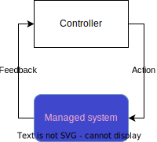

# Managed systems

Each managed system directory incldues:
- `main.go` program that emulates managed system
- `readme.md` that describes
    - the managed system itself
    - the management problem
    - exposed API
    - closed control loop mission
- `sample loop` directory that presents sample design of Lupus application as control loop for this managed-system.
It includes every component that is needed to be designed. Escpecially:
    - Readme that describes the whole process
    - Ingress Agent script
    - Egress Agent script 
    - Master yaml manifest file
    - Any external element used by the loop