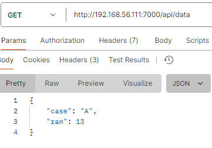
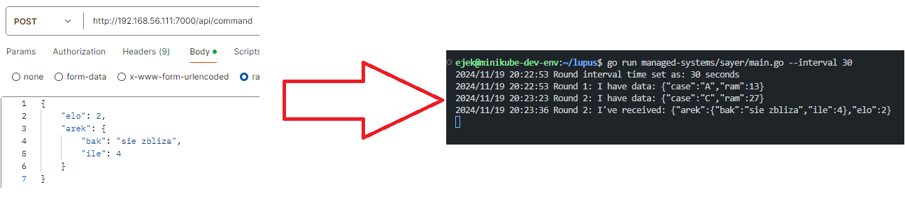

# Sayer
Sayer will work as great tool for testing loop workflow (actions, xors, Data modifitcations etc..)
## Descr

The managed system here is completely abstract and non-sense. It will only say "I have data: <json>" and "I've received: <json>", hence the name "Sayer". 

The json it sends is in such struct. 

```json
{
    "case": "A", #  possible values are "A", "B" and "C"
    "ram": 10    #  possible values are all ints between 0 and 50 
}
```

Values taken are totally random at each round.

You can query these values and Sayer will say "I've sent: <json>" or your can send any json to Sayer and he will say "I've received: <json>". 

## Management problem

There is no management problem.

## Exposed API

### `api/data`


### `api/command`



