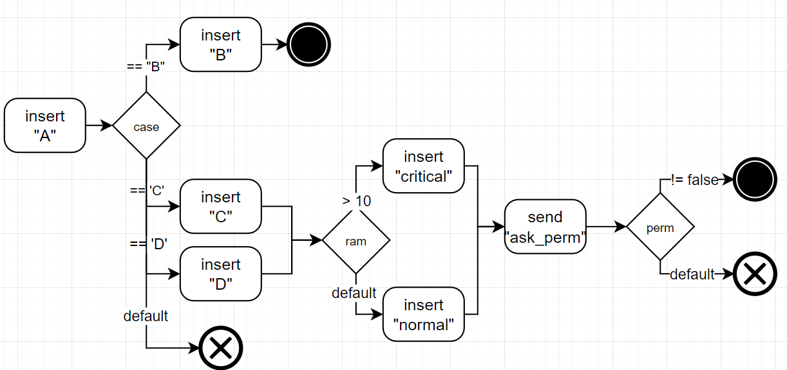
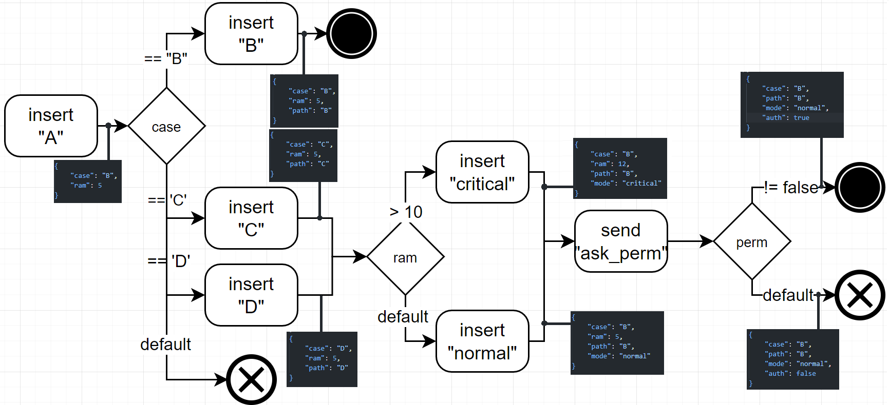

# Exemplary use of Lupus for `sayer`

## Loop elements


## Actions in Decide


## Sample flow with Data modifications


# Live demo

## Prerequisities
- Minikube running
- CRD installed
- move to the root dir of this repo
## Steps
### 1. Prepare static external elements
#### 1.1 Opa
Run
```sh
docker run -p 8383:8181 openpolicyagent/opa     run --server --log-level debug
```
Setup
```sh
.managed-systems/sayer/sample-loop/setup_opa.sh
```
### 2. Run Egress-Agent
```sh
python3 managed-systems/sayer/sample-loop/egress-agent.py 
```
### 3 Main part
Run 4 terminals and enable split mode


First, at 4 run the managed system
```sh
go run managed-systems/sayer/main.go -interval 30
```
Then, in 2 run the controller
```sh
cd lupus
make run
```
In 1, create the Lupus elements
```sh
k apply -f managed-systems/sayer/sample-loop/master.yaml
```
And finally, in 2, run Ingress-Agent:
```sh
python3 managed-systems/sayer/sample-loop/ingress-agent.py -interval 30
```