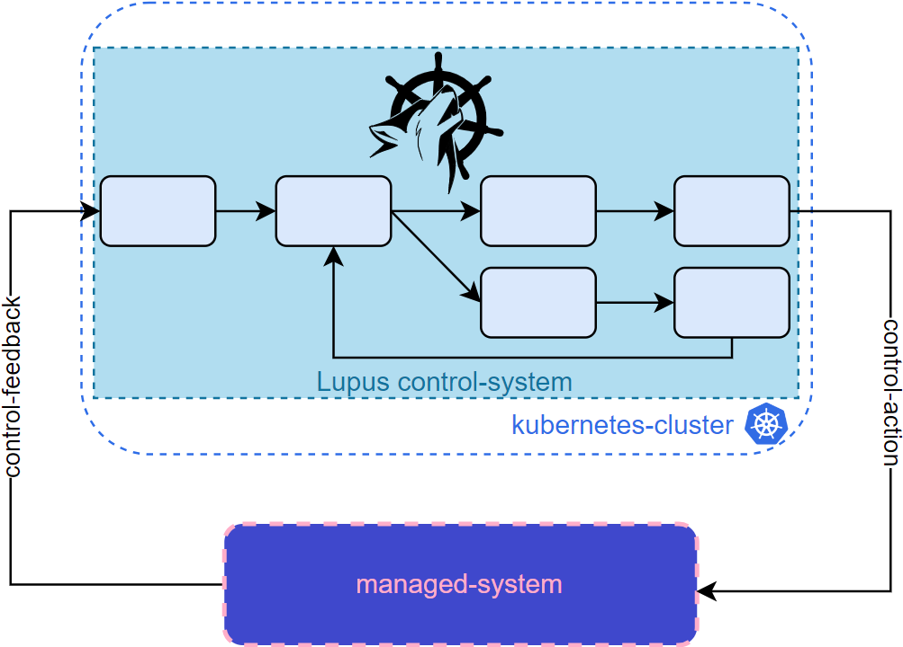
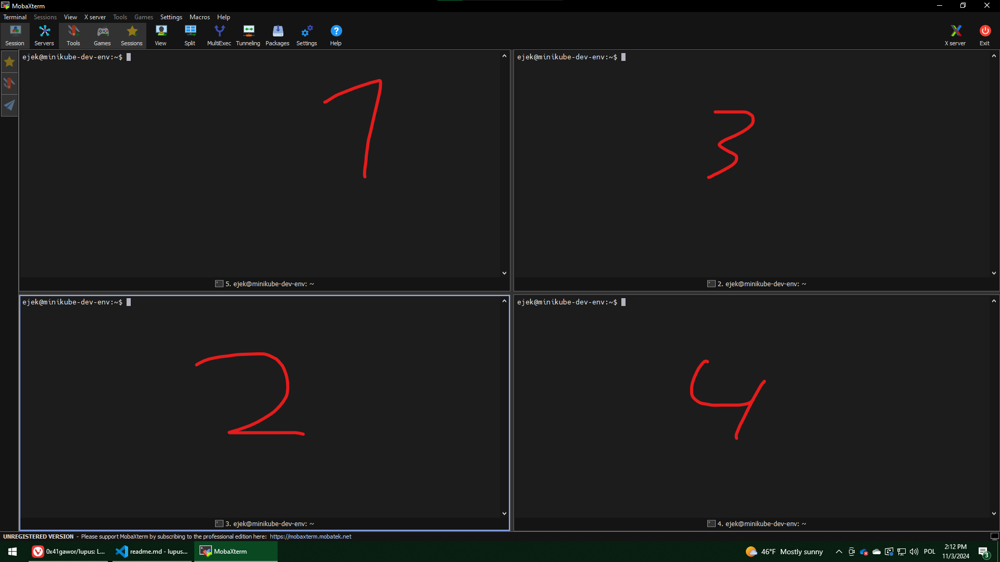

# Exemplary use of Lupus for `upf-net`

Let's bring back the general architecture for Lupus application:



First you need to develop Ingress and Egress Agents:

- [Ingress Agent](ingress-agent.py)
- [Egress Agent](egress-agent.py)

Now design the architecture of Loop:


Prepare the external elements of Loop:
- [http-bouncer](http-bouncer.go)
- [open-policy-agent](opa.md)

Express the Loop in yaml manifest file of master element.

- [master.yaml](master.yaml)

# Live demo

## Prerequisities

- Minikube running
- CRD installed

- move to the root dir of this repo

## Steps
### 1. Prepare static external elements
Static elements are http-bouncer and opa.
#### 1.1 http-bouncer
```sh
go run managed-systems/upf-net/sample-loop/http-bouncer.go
```
#### 1.2 OPA
Run
```sh
docker run -p 8181:8181 openpolicyagent/opa     run --server --log-level debug
```
Setup
```sh
./setup_opa.sh
```
### 2. Run Egress-Agent
```sh
python3 managed-systems/upf-net/sample-loop/egress-agent.py 
```

### 3. Main part
Run 4 terminals on MobaXterm and enable split mode:



First, at 4 run the managed-system:
```sh
go run managed-systems/upf-net/main.go -interval 30
```
Then, in 2 run the controller
```sh
cd lupus
make run
```
In 1 run create the Lupus elements
```sh
k apply -f managed-systems/upf-net/sample-loop/master.yaml
```
And finally in 2 run ingress-agent:
```sh
python3 managed-systems/upf-net/sample-loop/ingress-agent.py -interval 30
```

### 4. Debugging

Loop already runs. What you can do now is look into Lupus elements in terminal 1
```sh
k describe observe adam-observe1
k describe decide adam-decide1
k describe execute adam-execute1
k describe learn adam-learn1
```
Or you can check trace.txt filled by learn.

```sh
cat lupus/trace.txt
```

## What you should see
