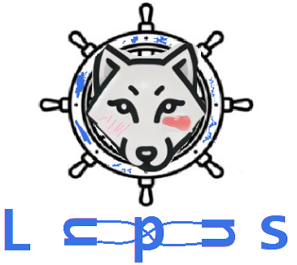

<h1 align="center">Lupus</h1>

  
   
  <i>Lupus - design and run loops in Kubernetes </i>
   

----

Lupus is an open-source platform that will let you design and run any closed control loop in Kubernetes cluster. Project aims into management of telco or mobile networks systems.

In robotics and automation, a control loop is a non-terminating loop that regulates the state of a system. Kubernetes in its root implements the [controller pattern](https://kubernetes.io/docs/concepts/architecture/controller/). We leverage that, and by combining Kubernetes extensions such as [Custom Resource Definitions](https://kubernetes.io/docs/tasks/extend-kubernetes/custom-resources/custom-resource-definitions/) and [Operator Pattern](https://kubernetes.io/docs/concepts/extend-kubernetes/operator/) we aim to develop a resusable architecture that lets its userS to design and run any kind of Closed Control Loop for management of their system. 

The direct inpiration and driving factor into raising such project is work done by one of [ETSI](https://www.etsi.org) comitee - ["ENI - Experiential Networked Intelligence"](https://www.etsi.org/technologies/experiential-networked-intelligence), the document ["Overview of Prominent Control Loop Architectures](https://www.etsi.org/deliver/etsi_gr/ENI/001_099/017/02.01.01_60/gr_ENI017v020101p.pdf) where several control loop architectures were discussed. Natural next step is to develop a way of running such loops. Kubernetes was choosen as the runtime since it is a well-known platform in telco community. 

# How to use it?

If you have any system that produces data that can be observed, and management actions can be taken based on it, you are in a perfect place. Lupus is a platform where your automation can begin.

  

All you will need to do is:
- develop the Ingress and Egress Agents, that will stick to Lupin and Lupout interfaces specification* 
- design the loop workflow (in some external tool, whatever is convenient for you)
- express the designed logic in Root/Master/Loop CR YAML Manifest File

Detailed documentation will appear here in the future.

# Project Status

This project is part of my Master Thesis supervised by - [Dariusz Bursztynowski, Ph.D., Eng.](https://repo.pw.edu.pl/info/author/WEITI-99bdf4cf-dec0-4770-baf2-80874a4d91a0/Profil+osoby+%E2%80%93+Dariusz+Bursztynowski+%E2%80%93+Politechnika+Warszawska) during my II'nd degree ICT and Cybersecurity course on [Warsaw University of Technology](https://eng.pw.edu.pl). 