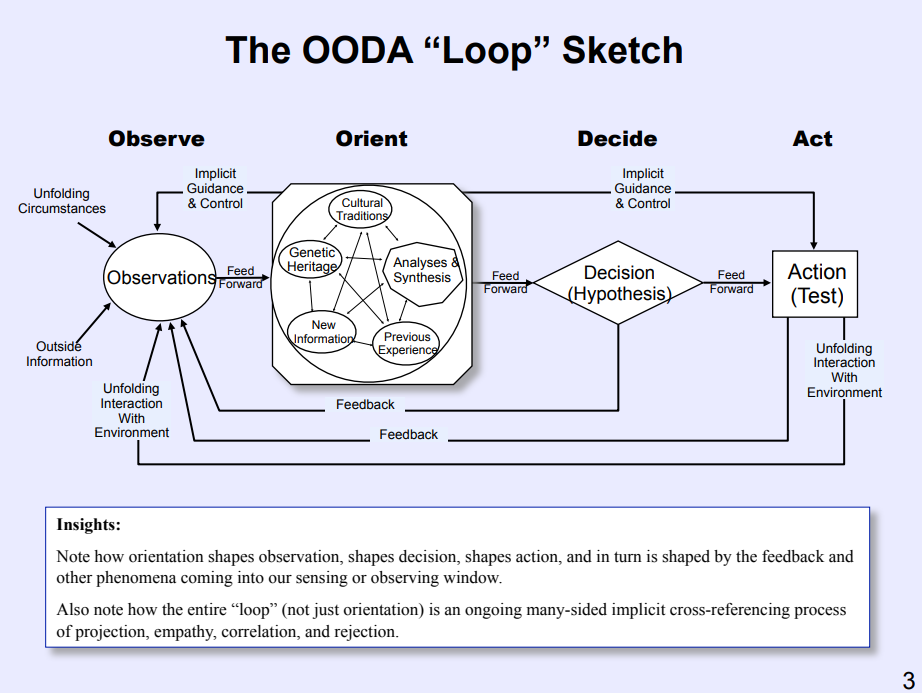
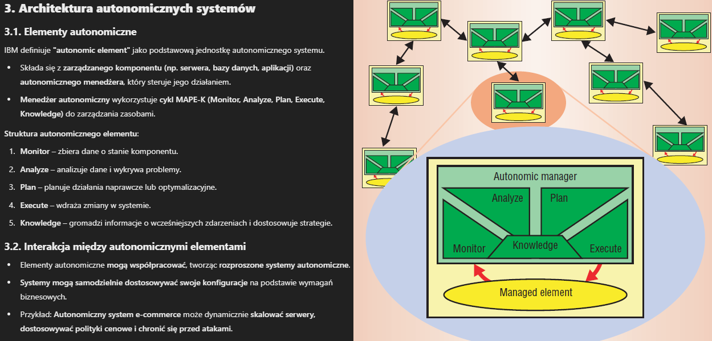
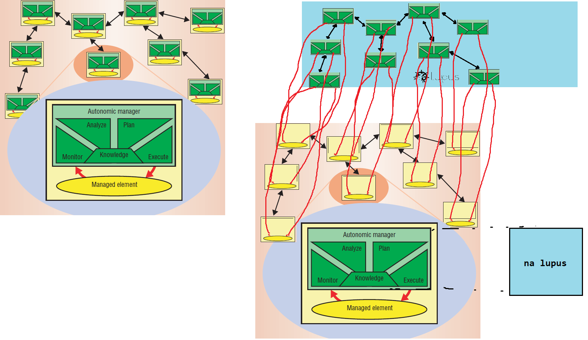
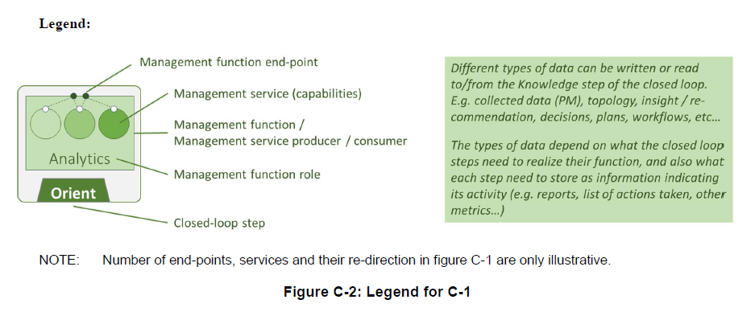
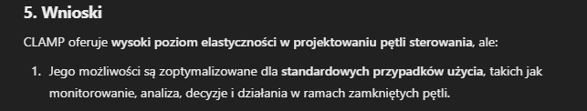
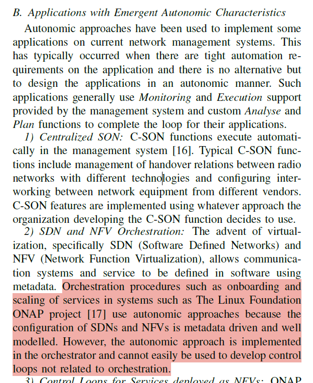
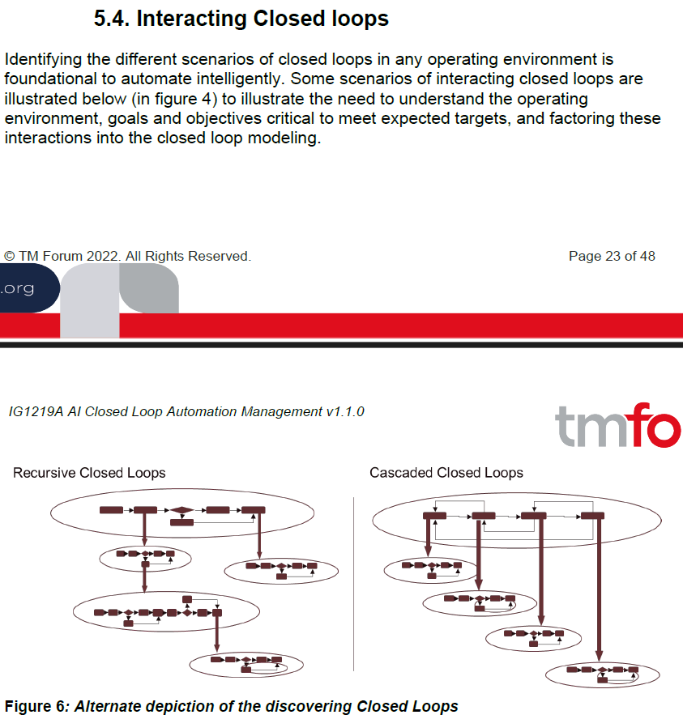

# 1995 John R. Boyd - The Essence of Winning and Losing

https://slightlyeastofnew.com/wp-content/uploads/2010/03/essence_of_winning_losing.pdf




# 2003 IBM - The Vision of Autonomic Computing


Idealne na punkt wyjścia w state of the art.


To zdanie o autonmic nervous system to idalna analogia.


To ten dokumnet definiuje self-CHOP, koncept który pojawia się potem w wielu pracach.


Generalnie artykuł opowiada o systemach IT, które są samo wystarczalne, robią self-CHOP, czyli przynajmniej te aspekty będą autonomiczne. Tak jak z nervous system, on zwalnia mózg z wielu operacji, ale nie pokrywa wszystkiego. Potem IBM opisuje jak można tworzyć takie systemy:



Mówi się tutaj też o social intelligence, która jak w kolonii mrówek rośnie wraz z liczbą interakcji pomiędzy szczególnymi mrówkami. Też jest tak, że jak nowy Autonomic Element dojdzie, to poprzez interakcje uczy się od reszty populacji norm kulturowych i takich tam.

My w pracy chcemy zrobić dla takich autonomic elementów platformę z tym, że autonomic manager każdego elementu jest wyniesiony na wspólną platformę, na której można sobie ich implementować. managed element może sb działać gdzie tam chce on.



> 

# 2014 Ericsson "Architecture evolution for automation and network programmability"


**1. Wprowadzenie**

Dokument opisuje ewolucję architektury sieci telekomunikacyjnych w kierunku większej automatyzacji i programowalności. Omawia kluczowe zasady, technologie i wyzwania związane z wdrażaniem nowoczesnych, programowalnych sieci.

**2. Ekosystem sieciowy**

- Przyszłe sieci będą zbudowane na zestawie **interdomenowych interfejsów**, które oddzielają różne warstwy i domeny funkcjonalne sieci.

- Główne domeny administracyjne

  :

  - Transportowa
  - Infrastrukturalna i platformowa
  - Dostępowa i funkcji sieciowych
  - Operacji biznesowych i międzydomenowych

- Każda domena będzie miała własne zasoby i interfejsy, umożliwiające **współdzielenie infrastruktury w modelu multi-tenant**.

**3. Kluczowe zasady architektoniczne**

- **Separacja odpowiedzialności** – każda domena zarządza własnymi zasobami niezależnie.
- **Ekspozycja i abstrakcja możliwości** – funkcje sieciowe są udostępniane jako usługi przez dobrze zdefiniowane API.
- **Multi-tenancy** – izolacja zasobów i usług dla różnych użytkowników.
- **Programowalność wewnątrzdomenowa** – każda domena może dynamicznie zarządzać swoimi funkcjami.
- **Programowalność międzydomenowa** – orkiestracja międzydomenowa pozwala na budowanie usług end-to-end.

**4. Zarządzanie i orkiestracja (COMPA)**

- **Control, Orchestration, Management, Policies, Analytics (COMPA)** – zestaw funkcji operacyjnych umożliwiających automatyzację.
- Każda domena posiada własne funkcje COMPA, które współpracują między sobą.
- Orkiestracja zapewnia **automatyzację konfiguracji i dynamiczne dostosowanie zasobów**.

**5. Warstwa polityk i analityki**

- **Polityki definiują zasady** działania systemu – określają warunki i akcje podejmowane w odpowiedzi na zdarzenia.
- **Analiza danych** wspiera automatyzację, przewidując potencjalne zmiany w sieci.
- **Zamknięte pętle sprzężenia zwrotnego** pozwalają na dynamiczne dostosowanie sieci do bieżących warunków.

**6. Przykłady zastosowania**

- **Domena transportowa**: SDN i wirtualizacja sieci transportowych umożliwia dynamiczne zarządzanie połączeniami.
- **Domena infrastrukturalna**: infrastruktura oparta na **wirtualnych centrach danych (vDC)** umożliwia elastyczne zarządzanie zasobami.
- **Funkcje sieciowe**: oddzielenie funkcji sieciowych od infrastruktury fizycznej pozwala na automatyzację operacji.

**7. Wnioski**

- Sieci przyszłości będą oparte na **programowalnych, zautomatyzowanych i elastycznych architekturach**.
- Kluczowym wyzwaniem pozostaje **integracja istniejących technologii** z nowymi rozwiązaniami.
- Proces transformacji będzie realizowany **etapowo**, a sieci 5G i kolejne generacje odegrają kluczową rolę w jego implementacji.

#  2016 Apex: An engine for dynamic adaptive policy execution


**Precompiled Knowledge** podoba mi się ten termin ^


To dobrze tłumaczy czym jest context. Tam dalej też to jest.


Ten engine działa tak ^

A na każdym kroku wybór taska jest taką funkcją:


Czyli w zależności od kontekstu


APEXowi brakuje AI.

# 2016 A Testbed For Policy Driven Closed Loop Network Management


Tu jest dobre wprowadzenie. 


Dobre na wstęp ^


Użyli KAFKA w swoim systemiku

Ich testbed:


Rozdział 4 Implementation jest ciekawy, pokazuje pewne flow. Czyli jak to na górze implementuje pętle zamkniętą. Ten Analytics Component pobiera dane z SDN tu musisz się wczytać w ten rozdział po prostu. 

Tu jest przykładowe przejście pętli MEDA


Oni tu jako Policy Engine użyli APEX i mają na to kolejny paper:

```
L. Fallon, S. van der Meer, and J. Keeney, “Apex: An engine for dynamic adaptive policy execution,” in NOMS 2016
```


# 2018 ETSI GS ZSM 002 Reference Architecture


Ten dokument definiuje architekturę referencyjną ZSM


Jedno z pryncypiów architektury ZSM to:

- Principle 01: Modularity
- Principle 02: Extensibility
- Principle 03: Scalability
- Principle 04: Model-driven, open interfaces
- **Principle 05: Closed-loop management automation**
- Principle 06: Support for stateless management functions
- Principle 07: Resilience
- Principle 08: Separation of concerns in management
- Principle 09: Service composability
- Principle 10: Intent-based interfaces
- Principle 11: Functional abstraction
- Principle 12: Simplicity
- Principle 13: Designed for automation


Architektura ta podąża za ogólnie przyjętym trendem wyznaczonym między innymi przez architekturę ODA zrobioną przez TM Forum.


To jest referencyjna architektura. Ale jaka jest rola zamkniętych pętli w tym?




Pętle w tej architekturze są zbudowane z building blocksów referencyjnej architektury. Czyli management service, management function itp.

Wgl to w tej arch też mamy albo OODA albo MAPE-K wiele paperów jest o tych dwóch (w sumie to to są dwa wynikowe główne rooty te dwie arch). 


Generalnie po prostu wniosek mamy taki, że architektura ZSM chce employować zamknięte pętle sterowania. Jej building blokami są rzeczy tu wyjaśnione tam wyżej oraz system może mieć uruchomionych wiele takich pętli. Dlatego nasza platforma fajnie tu się wpasowuje.


# 2018 Open Network Automation Platform (ONAP) - Architecture


**ChatGPT**

ONAP to **open-source’owa platforma** do **orkiestracji, zarządzania i automatyzacji usług sieciowych**, rozwijana przez Linux Foundation. Jest wykorzystywana głównie przez operatorów telekomunikacyjnych oraz dostawców usług chmurowych do zarządzania sieciami **5G, 6G oraz Next Generation Networks (NGN)**.

ONAP składa się z **wielu modułów i API**, które umożliwiają pełne **zarządzanie cyklem życia usług sieciowych**, od ich projektowania, poprzez wdrażanie, aż po operacje eksploatacyjne. Jego kluczowe elementy to:

- **Master Service Orchestrator (MSO)** – centralny komponent odpowiedzialny za orkiestrację.
- **SDN Controllers (APPC, SDNC, VFC)** – kontrolery zarządzające różnymi warstwami sieci.
- **A&AI (Active and Available Inventory)** – komponent do zarządzania inwentaryzacją zasobów sieciowych.
- **DCAE (Data Collection, Analytics and Events)** – moduł do analizy danych i obsługi pętli sterowania.
- **CLAMP (Control Loop Automation Management Platform)** – zarządza zamkniętymi pętlami sterowania.

ONAP **wspiera zarówno sieci fizyczne (PNF), jak i wirtualne (VNF, CNF)**, co czyni go elastycznym narzędziem do zarządzania nowoczesnymi systemami telekomunikacyjnymi.


**Document**

The platform provides the common functions (e.g., data collection, control loops, meta-data recipe creation, policy/recipe distribution, etc.) necessary to construct specific behaviors.


**2.1. Główne komponenty ONAP**

ONAP składa się z **trzech głównych warstw funkcjonalnych**:

1. **Warstwa projektowania (Design Framework)** – umożliwia definiowanie modeli usług, polityk i reguł zarządzania.
2. **Warstwa kontroli i orkiestracji (Orchestration & Control Framework)** – zarządza automatyzacją wdrażania i sterowania usługami.
3. **Warstwa analityczna (Analytics Framework)** – monitoruje usługi i generuje zamknięte pętle sterowania, które mogą automatycznie korygować działanie sieci.

**2.2. Kluczowe cechy architektury**

- **Modularność** – ONAP składa się z niezależnych modułów, które można wdrażać i aktualizować osobno.
- **Obsługa wielu domen (multi-site, multi-VIM)** – umożliwia zarządzanie sieciami rozproszonymi.
- **Obsługa standardów (YANG, TOSCA)** – pozwala na interoperacyjność z różnymi dostawcami sprzętu i oprogramowania.


**3. Warstwa projektowania ONAP (Design-Time Framework)**

Ta warstwa pozwala operatorom na **modelowanie usług i ich reguł zarządzania** przed ich wdrożeniem.

**3.1. Kluczowe funkcje**

- **Specyfikacja usług** – definiowanie zasobów i relacji między nimi.
- **Tworzenie polityk** – określanie reguł sterowania i zarządzania usługami.
- **Automatyzacja wdrażania** – usługi są wdrażane zgodnie z predefiniowanymi modelami.

**3.2. Systemy w tej warstwie**

- **Service Design and Creation (SDC)** – narzędzie do tworzenia i certyfikacji usług.
- **Policy Creation Component** – moduł do zarządzania politykami.
- **CLAMP (Closed Loop Automation Management Platform)** – platforma do definiowania zamkniętych pętli sterowania.

**4. Warstwa wykonawcza ONAP (Runtime Framework)**

**4.1. Kluczowe komponenty operacyjne**

- **Service Orchestrator (SO)** – główny moduł orkiestracji, który zarządza wdrażaniem usług.
- **DCAE (Data Collection, Analytics, and Events)** – moduł do zbierania danych i wykrywania anomalii.
- **A&AI (Active and Available Inventory)** – baza wiedzy o dostępnych zasobach sieciowych.
- **Policy Engine** – komponent egzekwujący reguły polityk.

**4.2. Kontrolery ONAP**

ONAP obsługuje różne typy kontrolerów:

1. **SDN Controller (SDNC)** – zarządza konfiguracją sieci SDN.
2. **Application Controller (App-C)** – zarządza cyklem życia aplikacji sieciowych.
3. **Virtual Function Controller (VF-C)** – kontroler zgodny z ETSI NFV MANO, zarządzający funkcjami wirtualnymi (VNFs).


**5. Automatyzacja i zamknięte pętle sterowania**

ONAP wykorzystuje **zamknięte pętle sterowania (Closed Loop Automation)** do automatycznego reagowania na zmiany w sieci.

**5.1. Jak działa zamknięta pętla sterowania w ONAP?**

1. **Monitorowanie** – zbieranie danych przez DCAE.
2. **Analiza** – wykrywanie anomalii i porównywanie danych z regułami polityk.
3. **Decyzja** – system polityk określa, jakie działania należy podjąć.
4. **Egzekucja** – kontrolery ONAP automatycznie wprowadzają zmiany w konfiguracji sieci.

Przykład: Jeśli ONAP wykryje, że serwer przekracza dopuszczalne obciążenie CPU, system może automatycznie **przenieść ruch na inny serwer lub zwiększyć zasoby**, bez interwencji człowieka.

YANG

**1. YANG – Modelowanie Konfiguracji i Zarządzania Siecią**

**YANG** to język modelowania danych używany głównie w zarządzaniu sieciami SDN/NFV oraz tradycyjnymi urządzeniami sieciowymi. Jest szeroko stosowany w **NETCONF (Network Configuration Protocol)** i **RESTCONF**, które pozwalają na programowalne zarządzanie urządzeniami sieciowymi.

**1.1. Kluczowe cechy YANG:**

- **Hierarchiczne modelowanie danych** – struktura przypominająca XML lub JSON.
- **Definiowanie konfiguracji urządzeń sieciowych** – routerów, przełączników, kontrolerów SDN.
- **Zastosowanie w NETCONF i RESTCONF** – zapewnia mechanizmy **czytania, zapisywania i modyfikowania konfiguracji**.
- **Obsługa polityk i operacji sieciowych** – wykorzystywany w ONAP do definiowania i egzekwowania polityk zarządzania.

**1.2. Przykładowe zastosowania YANG w ONAP:**

- Opis struktury urządzeń sieciowych w **Active and Available Inventory (A&AI)**.
- Definicja polityk konfiguracji sieci SDN zarządzanych przez **SDN-C (SDN Controller)**.
- Współpraca z ONAP **DCAE (Data Collection, Analytics and Events)** do zbierania danych telemetrycznych.

**1.3. Przykładowy model YANG:**

```yang
module example-network {
    namespace "urn:example:network";
    prefix net;
    
    container network {
        list device {
            key "id";
            leaf id {
                type string;
            }
            leaf name {
                type string;
            }
            leaf ip-address {
                type string;
            }
        }
    }
}
```

**Opis:** Powyższy model definiuje **listę urządzeń sieciowych**, gdzie każde urządzenie ma unikalny identyfikator, nazwę i adres IP.

TOSCA

**2. TOSCA – Modelowanie i Orkiestracja Usług Chmurowych**

**TOSCA (Topology and Orchestration Specification for Cloud Applications)** to język służący do **definiowania i orkiestracji aplikacji chmurowych** i usług sieciowych. Jest szeroko stosowany w **NFV (Network Function Virtualization)** i orkiestracji usług sieciowych w ONAP.

**2.1. Kluczowe cechy TOSCA:**

- **Deklaratywne podejście** – opisuje **co** ma zostać wdrożone, zamiast definiować, **jak** to zrobić.
- **Opisuje topologię usług** – definiuje **komponenty, relacje, polityki i zależności** między zasobami.
- **Obsługuje orkiestrację** – współpracuje z **ONAP Service Orchestrator (SO)** i innymi systemami zarządzania chmurą.
- **Zastosowanie w NFV i cloud computing** – modelowanie **VNF (Virtual Network Functions)**, **CNF (Cloud-Native Functions)** oraz sieci chmurowych.

**2.2. Przykładowe zastosowania TOSCA w ONAP:**

- Definicja topologii usług i ich komponentów w **Service Design and Creation (SDC)**.
- Automatyzacja wdrażania sieci NFV przez **ONAP SO (Service Orchestrator)**.
- Modelowanie zamkniętych pętli sterowania w **CLAMP (Closed Loop Automation Management Platform)**.

**2.3. Przykładowy model TOSCA:**

```yaml
tosca_definitions_version: tosca_simple_yaml_1_3

topology_template:
  node_templates:
    my_server:
      type: tosca.nodes.Compute
      properties:
        name: "Web Server"
        cpu: 2
        memory: 4 GB
      requirements:
        - network: my_network

    my_network:
      type: tosca.nodes.network.Network
      properties:
        network_name: "private_net"
        cidr: "192.168.1.0/24"
```

Plik CSAR

**CSAR (Cloud Service Archive)** to **standaryzowany format pakowania** zasobów i definicji usług w **TOSCA (Topology and Orchestration Specification for Cloud Applications)**. Jest to **archiwum zawierające wszystkie niezbędne pliki** do wdrożenia usługi w środowisku chmurowym lub NFV.

```sh
my-service.csar  (plik .zip)
│── Definitions/
│   ├── service-template.yaml  (główna definicja TOSCA)
│   ├── node-types.yaml        (typy węzłów)
│   ├── policies.yaml          (polityki)
│── Scripts/
│   ├── deploy.sh              (skrypt wdrażania)
│── Artifacts/
│   ├── image.qcow2            (obraz maszyny wirtualnej)
│── TOSCA-Metadata/
│   ├── TOSCA.meta             (manifest)
```

## CLAMP

https://docs.onap.org/projects/onap-policy-parent/en/istanbul/clamp/clamp/clamp.html

CLAMP is a function for designing and managing control loops and a UI to manage Policies. It is used to visualize a control loop, configure it with specific parameters for a particular network service, then deploying and undeploying it. Once deployed, the user can also update the loop with new parameters during runtime, as well as suspending and restarting it.

CLAMP GUI can also be used to create/read/update/delete/list policies outside of a control loop, and therefore CLAMP is also the front-end for Policies management in ONAP.

CLAMP interacts with other systems to deploy and execute the control loop. For example, it extracts the control loop blueprint from CSAR distributed by SDC.  CLAMP also calls the internal Policy framework API to get the Policy Models(Model Driven Control Loop). It requests from DCAE the instantiation of microservices to manage the control loop flow. Furthermore, it creates and updates multiple policies (for DCAE mS configuration and actual Control Operations) in the Policy Engine that define the closed loop flow.

> SDC - Service Design and Creation (SDC) – narzędzie do tworzenia i certyfikacji usług)
>
> DCAE - **(Data Collection, Analytics and Events)** – moduł do analizy danych i obsługi pętli sterowania.
>
> CSAR - Cloud Service Archive (plik TOSCA używany przez ONAP do opisu usług).


3. W SDC robisz CSAR czyli modelujesz pętle i przesyłasz to do CLAMP

4. CLAMP do DCAE_Inventory wysyła request, że chce zrobic mu nowe coś i żeby dać service Id

   1. > Bo to DCAE będzie miało tę pętle wdrożoną

5. CLAMP otrzymał od DCAE Service ID. Za pomocą tego ID DCAE rozpoznaje ten nowy byt

6. Od SDC pobieramy blueprint tego nowego bytu i jest un uploadowany do DCAE SCHEDULER. 

   1. > DCAE SCHEDULER zarządza, kiedy i jakie mikroserwisy DCAE mają zostać uruchomione do zbierania danych, analizy lub obsługi zdarzeń.
      >
      > Odpowiada za aktywację usług analitycznych w odpowiednich momentach.
      >
      > W kontekście zamkniętych pętli sterowania (Closed Loop Control), DCAE Scheduler może koordynować działanie komponentów analitycznych, które monitorują dane w czasie rzeczywistym i wykrywają anomalie.

7. Zapis blueprintu w DCAE

8. Teraz operator konfiguruje pętle sterowania dla tego bytu nowego

9. NWM XD


The design of a control loop and its management is represented by a workflow in which all relevant system interactions take place.

At a higher level, **CLAMP is about supporting and managing the broad operational life cycle of VNFs/VMs** and ultimately ONAP components itself. It offers the ability to design, test, deploy and update control loop automation - both closed and open. Automating these functions represents a significant saving on operational costs compared to traditional methods.

Czyli te pętle w ONAP są stricte do zarządzania VNF lub VM.

**User Guide: Control loop in Policy/CLAMP**

There are 2 control loop levels in Policy/CLAMP:

- Control loop template: This is created from the DCAE blueprint (designed in the DCAE designer), and distributed by SDC to CLAMP.
- Control loop instance: Based on the template, it represents a physical control loop in the platform related to a service and a VNF.

There is no way to design the microservice components of the control loop from scratch in CLAMP, you can only configure it and manage its life-cycle. For more info on how to design the service in SDC, check this: https://wiki.onap.org/display/DW/CLAMP+videos#CLAMPvideos-DesignpartinSDC


ONAP/CLAMP musi używać jednego z tych policy engine:


Generalnie to tak wygląda typowa pętla w CLAMP.




# 2019 Autonomic Closed Control Loops for Management, an idea whose time has


Artykuł zwraca uwagę na to, że dotychczasowe implementacje zamkniętych pętli sterowania są bardzo pragmatyczne i sztywne, zfocusowane jedynie na dowożeniu danego ficzera, bez dowożenia ogólnej elastycznej architektury dla zamkniętych pętli sterowania. 

> **pragmatic** - doing things in a practical and realistic way and not using only ideas
>
> **rigid** - **not** [able](https://dictionary.cambridge.org/dictionary/english-polish/able) **to** [change](https://dictionary.cambridge.org/dictionary/english-polish/change) **or be** [changed](https://dictionary.cambridge.org/dictionary/english-polish/change) [easily](https://dictionary.cambridge.org/dictionary/english-polish/easily)


IBM zaproponował opierając się na biologii nie monolit a wiele mniejszych systemów, które dopasowują się do otoczenia.


Spoko obrazek ^


To dobre na wstęp ^


Czego brakuje


W sumie to dobry point, żeby zrobić web interface.


Stąd ważne jest translacja


^^^

IBM opisuje system zrobiony z kolecji Autonomic Element, gdzie każdy implementuje swoją autonomiczną pętlę. 

//TODO obczaj ten paper od IBM


TO WAŻNE BO MY CHCEMY DAĆ TAKIEMU SYSTEMOWI PLATFORMĘ DO DZIAŁANIA.



^ Ten rodział opisje gdzie się wykorzystuje Autonomiczne Podejście, no i jest tu wspomniane o ONAP, który służy do definiowania zamkniętych pętli sterowania, **ale w SDN and NFV Orchestration**. Ciężko jest więc przenieść go na inne tematy.


Chwilkę później mamy znowu o ONAP heh ^


Challenge na koniec dokumentu wskazane ^


Tak je opisał Chat GPT ^

# 2019 ETSI GS ZSM 009 - Closed-Loop Automation Enablers

Czyli ten dokument bardziej określa nam jak nasza platforma ma wyglądać.

Część badawcza.


Wymaganie 2 idealnie się wpasowyje to opisu aspektu badawczego.

Wymaganie 8 zwraca  mi uwagę na to, że fajnie by było potem dodać logi.


Rzeczywiście są to serio mega well-known loops.


A dany stage może wymagać sztucznej inteligencji ale to już wewnątrz niego. 

Czyli ZSM jest oparte na Closed Control Looops a ta sztuczna inteligencja to jest w środku jej stage'ów.


W sumie to ważny aspekt tej architektury ZSM jest taki, że Closed Loops mogą występować w którejkolwiek Management Domains. Ta pętla to jest po prostu taki koncept, że tam gdzie trzeba to bierzesz. Dlatego dobrze mieć platformę, co po prostu na niej bierzesz i modelujesz. Taki single point of closed control loops management.


Czyli tamte 5 building blocksów arch


To jest pętla w ZSM:


Czyli tu jest tak, że workflow jest "wymyślane" przez Decision a Execution wykonuje na zewnętrznych building blocks architektury te workflowy. Te 5 building blocks są właśnie po to, żeby je uzbrajać w workflow i wykonywać.


Czyli te workflow co Execution wykona to ona jest "towards" jakiś managed entities. Czyli te workflow te odpytania funkcji i serwisów będą "na jego rzecz". 


8 sekcja to już takie rzeczy definiuje:

- Closed Loop Governance


- Closed Loop Coordination
- 


# 2020 AI-Driven Zero Touch Network and Service Management in 5G and Beyond:


To też dobre na wstęp.


Tu mamy fajny opis czym jest grupa ZSM w ETSI.

Dalej oni robią po prostu przegląd jak różni ludzie użyli AI i opisali w swoich badaniach lub jakie standardy z AI powstają.


O a tu mamy opis ETSI ENI.


Podsumowanie artykułu dobrze o nim świadczy xd Nic tu nie ma dla mnie.


# 2021 TM Forum "AI Closed Loop Automation - Anomaly Detection and Resolution"

Onie generalnie to tu proponują już jakąś konkretną architekturę do wykrywania anomalii w sieciach.


Czyli ten dokument skupia się na use-case pętli do wykrywania oraz resolutionowania anomalii w sieci.

Definiuje on takie pojęcia:

**Closed-loop Anomaly Detection (CLAD)** – systemy wykrywające anomalie na podstawie danych zwrotnych.

**Closed-loop Anomaly Detection and Resolution Automation (CLADRA)** – systemy, które nie tylko wykrywają, ale również automatycznie rozwiązują problemy.

**Closed-loop Automation Management (CLAM)** – zarządzanie automatyzacją w modelu zamkniętej pętli.


Tu mamy ważna defkę, rozróżnienie pomiędzy FAST and SLOW pętlą.


> Na tym można się wzorować tworzorząc arch.


Tu ^ jest architektura logiczna ich do wykrywania anomalii. Po lewej mamy odpowiedniki komponentów pętli OODA.


# 2021 TM Forum Closed Loop Automation Implementation Architectures v3.1.0

Ten też nie opisuje jakiegoś inteligentnego systemu a oparte o Closed Loop Automation wykrywanie i przecwidziałanie anomaliom. AI i ML używa do analizy. 

> ogólnie to prawie każdy doc ma w swoich references ten od IBM: An architectural blueprint for autonomic computing lub ten drugi.


Ten doc przedstawia CLADRA reference architecture.


Czyli ta architektura oparta o OODA (nazwana CLADRA).

> To dobrze będzie dać do state of the art, że TM Forum w ten sposób chce wprowadzić. Zamkniętą pętle sterowania. Czyli to jest konsorcjum połączenie wielu frim którzy iteracyjnie na zasadzie prób i błędów chcą ustandaryzować reference arch


O to ogólna architektura:


A te rodziały pokazują jej konkretne use-case implementacje zrobione przez firmy. Tylko, że tu te dwie firmy followują tę ogólną architekturę w budowaniu swoich rozwiązań. Nie jest to gotowa platforma do odpalania pętli. Taka referencyjna architektura według której budujesz rozwiązania. Komponenty użyte między firmami się różnią mega np.


Tu microsoft zrobił jakiś produkt w oparciu o tę arch. Ale tu wszystie interfejsy itp są priopretary microsoftu. Nie ma wspólnej platformy. To tylko guideline jak robić tego typu projekty.


# 2022 TM Forum - AI Closed Loop Automation Management


> Dobre na wstęp.


Tak, chcemy stworzyć arch, która jest niezależna od stosu technologicznego. To ważne. 


Czyli oni tu definiują generyczna Closed Loop Automation Management Platform. Ona jest oparta o framework transformacji cyfrowej przedsiębiorstwa o nazwie ODA.


No i teraz artykuł przechodzi do modelowania pętli. To już bardziej do części badawczej idzie.


Sekcja 5.1 opisuje workflow. My w części badawczej musimy oprzeć, że nasze pętle też muszą umieć takie workflow zrobić.

Sekcja 5.2 opisuje Policies


Są one nieco podobne do Business Rules. Stąd wgl będzie nasz wybór na Open Policy Agent.


A np taki aspekt już pomijamy w naszej platformie. To robi blok funkcjonalny nie platforma, infrastruktura.




To musimy też zapewnić.


To jest Chen notation dla relacji bytów związanych z pętlą. Ważne w częścia badawczej.

//TODO czytaj od 5.5.1, sekcja 7 mega ważna

Tu jest ciekawe odwołanie do frameworku Cynefin:

https://thecynefin.co/the-ooda-loop-cynefin/


Tu oni definiują funkcje jakie są potrzebne do zarządzania zamkniętymi pętlami sterowania

To będzie dobre do części badawczej na wywodzenie wymagań z tego

A jak to dokładnie wygląda?


| #     | Function                   | Descr                                                        |
| ----- | -------------------------- | ------------------------------------------------------------ |
| Fx.01 | Define Closed Loop         | This function provides the capability to define a closed loop based on a distinct name of the closed loop, goal of the closed loop and detailed requirements (policies, actions required, impact entities etc.) associated to the closed loop. |
| Fx.02 | Design Closed Loop         | This function provides the capability to input the workflows, actions, and control flows that configure and realize a named closed loop for defined goals. Design can be for existing or newly defined closed loop. |
| Fx.03 | Deploy Closed Loop         | This function provides the capability to register a closed loop in a closed loop manager so that it can be controlled by a closed loop controller (instantiate, terminate, monitor, remove and secure). |
| Fx.04 | Instantiate Closed Loops   | This function provides the capability to create another instance of an existing closed loop in run-time. It includes capabilities to initialize a copy of an existing Closed Loop and start it in run-time. |
| Fx.05 | Monitor closed loops       | This function provides the capability to track a closed loop over its lifecycle |
| Fx.06 | Terminate closed loops     | This function provides the capability to stop / terminate running instance of a closed loop abruptly and gracefully. The function includes the ability to report impact of a terminate request. |
| Fx.07 | Remove Closed Loop         | This function provides the capability to decommission a closed loop and null its existence in a closed loop management system or platform |
| Fx.08 | Discover Closed Loop       | This function provides the capability to identify automatically discover a closed loop in the scope of a closed loop management system or platform. |
| Fx.09 | Secure Closed Loop         | This function provides the capability to assign security restrictions, such as access control, as well as manage security concerns for a closed loop, such as vulnerability of a closed loop. |
| Fx.10 | Administer Closed Loop     | This function provides the capability to manage and apply changes to a closed loop, The function provides the capability to assign policies, apply changes or modifications, check and alter the state of closed loops. |
| Fx.11 | Validate Closed Loop       | This function checks or proves the validity or accuracy of the design, deployment and securing of closed loops by bringing real-life data and environment to closed Loops. |
| Fx.12 | Store Closed Loop          | This function stores closed loops to support Design Closed Loop and other functions. |
| Fx.13 | Control Closed Looop       | The function provides the capability to control closed loop. It includes the ability to call other functions and assume responsibility of the activities of such functions, including making or forcing closed loop segment changes, monitoring closed loops, troubleshooting closed loops and maintaining closed loops. |
| Fx.14 | Configure Closed Loop      | This function provides the capability to (re)configure parameters of a closed loop instance. |
| Fx.15 | Expose Closed Loop         | This function makes available the process of announcing closed loops with information about dependencies. |
| Fx.16 | Orchestrate Closed Loop(s) | This function plans and arranges the launch of closed loops. |
| Fx.17 | Pause Closed Loop          | This function allows a close loop function to be paused, either due to scheduling, troubleshooting, etc. |
| Fx.18 | Resume Closed Loop         | This function allows a close loop function to resume, after a scheduling conflict resolved or troubleshooting has completed etc. |

To zdecydowanie się przyda do części badawczej.


Jeszcze takie coś tutaj mamy, ale to mi tylko nasuwa pomysł, że fajnie by było napisać walidator do składni LupN.

Sekcje 8 i 9 są o wykorzystaniu AI do zarządzania pęltami XD kurwa to już kolejna incepcja.


# 2022 NGMN - Automation and Autonomous System Architecture Framework

**Self-CHOP** - Self-(Configuring, Healing, Optimizing, and Protecting)

**Automatic vs Autonomic** - The distinction between “automatic” and “autonomic” is that the former refers to a predefined and programmatic process, while the latter refers to the various aspects associated with self-management. Typically, an automatic process operates in a given environment, with no awareness for adaptation without human intervention, if the environment changes. On the other hand, an autonomic process dynamically adapts to a changing environment, without human intervention.

**emerging** - starting to exists or develop (rozwijąjący się, nowo powstały)

**Autonomic Function** – funkcja zarządzania o zdolnościach kognitywnych i adaptacyjnych.

**AI/ML Model** – model matematyczny, który uczy się na podstawie danych i dostosowuje decyzje w dynamicznych środowiskach.

**Self-CHOP (Self-Configuring, Healing, Optimizing, Protecting)** – kluczowe cechy autonomicznych systemów.

**Intent-Based Networking** – podejście oparte na deklaratywnym zarządzaniu siecią zamiast konfiguracji niskopoziomowej.Architektura referencyjna


Rozdział 5.2.1 opisuje dlaczego AI autonomiczny system przyda się do network slicingu.


To jest najważniejsze zdanie z tego dokumentu. Ono łączy nam zamnięte pętle sterowania z self-CHOP.

No ale sama taka zamknięta pętla sterowania też potrzebuje być zarządzana:


Czyli jest zapotrzebowanie na feedback control loop.


Tutaj mamy co to powinno umieć ^

Też fajny podział:


Knowledge Plane to też ważny aspekt każdego systemu.

No i zarządzanie wiedzą to też ważny aspekt.


W tych rodziałach ^ to mamy generalnie opisane o cloud, że najlepiej to takim systemem autonomicznym zarządzać z chmury. A nie jednak chodzi o to, że zarządzanie chmurą na której są NF też jest complex.

> To tak dodatkowo:
>
> 
>
> Kiedyś czytałem o tym cVNF, że to nie aplikuje do 12-factor application methodology, tylko jest monolitem przeniesionym na kontener.

Intent based też pewnym wymaganiem i driving factorem, żeby robić systemu z AI.


Tu są opisane techniki AI oraz przykłady do czego można użyć danego typu (żywe przykłady)


W rozdziale 7 jakie są Industry Gaps

 

Badania i nauka o charakterystkach zamkniętych pętli sterowania w autonomicznych systemach powinna zostać rozszerzona o definicje i specyfikacje funkcji zarządzających zamkniętymi pętlami sterowania i ich interfejsami. 

> Czyli w sumie de facto to co znalazłem później.

# 2024 Simplifying Network Orchestration using_Conversational AI


Widać tutaj taki błąd ONAP, że jego skomplikowane API utrudnia przyjęcie się w community.


​	


Mamy defke czym jest ONAP

Policy-driven czyli ze MNO definiuje polityki jak ma być coś zarządzane i software ma policy engine, który je interpretuje. To jest w kontraście do zhardocdowanych programów zarządzania.


Obczaj że ONAP jakiegoś tutaj BPMN używa

Oraz, że ONAPowe coś tam może ztriggerować Camunde.


This conversational AI solution will not only help increase
learning and adoption, but it will also help expand
the audience/user base of these MSO API’s which
currently includes technical domain experts to include <br>non-technical users. For non-technical users, the solution
offers a powerful abstraction of software complexities on
top of which they can interact with the ONAP deployment
functions in a friendlier way.

Czyli taki benefit też że non-technical users mogą być

# Komentarz

**State of the art** Polega na tym aby. Poczytać i wzajemnie pozycjonować wszystkie źródła, aby wyłuskać pewną nawet subiektywną "strukturę świata". Ma pokazać, że wiemy o czym mówimy, umiemy znależć dziurę w całym, lukę do wypełnienia i powiedzieć, że to właśnie chcemy zapełnić. Osadzenie pracy w szerszym kontekście.

**Część badawcza** to sformułowanie wymagań na platformę (za pomocą analizy pętli z "Overview of Prominent Closed Control Loop Architectures) oraz podjęcie różnych decyzji, też z analizy różnych dokumentów, zaczerpnięcie z nich konceptów itp.

## State of the art

Cała historia zaczyna się od autonoicznych zero touch systemów od IBM, a drugi koncept to pętle sterowania. W pewnym momencie trzeba te koncepcje ożenić (który paper to żeni? Który mówi, że żeby zrobić kognitywny systemu lub ZSM to musimy użyć pęli sterowania?). 

Który paper zaproponował, żeby zrobić w telco autonomiczne systemy?

Ten paper Ericsson to był krok pośredni, ewolucja w stronę automatyzacji to kierunek, a network programmability to enabler.

Który paper zaprononował, że to musi być zrobione z AI? Chafika

Który, że muszą być pętle sterowania w tym? NGMN

Też na pewno self-CHOP trzeba powiedzieć bo pojawia się często mega duzo

Historia pętli zamkniętych zaczyna się od BOYDA i od OODA Boyd, J.R.: "The Essence of Winning and Losing", June 1995. no bo na OODA opiera się najwięcej pętli.

No i też warto pokazać ten jeden rysunek z tego papera.


No i też warto wspomnieć o architekturze ETSI ZSM oraz o różnicy ETSI ZSM oraz ENI.

Należy powiedzieć o TM Forum na pewno i jego CLADRA.

Należy też powiedzieć o Testbedzie i Apex

W końcu an idea that time has come opisuje idee ogólnej architektury opartej na tym co IBM przedstawiał (że wiele współdziających) i mówi, że nie ma tego.

## Część badawcza

Mamy dwa apskety w stawianiu wymagań na platformę

- jakie pętle powinno dać się zamodelować
- jakie funkcje do zarządzania pętlami trzeba zapewnić (co można z tymi pętlami zrobić)

Tutaj odniesieniem są architektury ETSI ZSM oraz TM Forum oraz przegląd pętli dokonany przez ENI.


